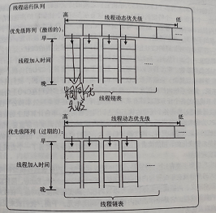
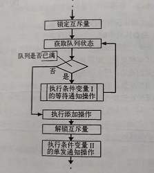

# 系统多线程介绍

## 一. 线程的基本概念

### 什么是线程

线程可以看做是某个进程中的一个控制流，一个进程至少会包括一个线程。并且线程是进程的复制品，但是线程是和进程进行共享内存的，这也就是线程比进程轻量的原因。

### 线程的状态

线程的状态有以下几种：

- 就绪状态：这时候系统可以让线程干任何事情。
- 运行状态：线程正在干活
- 休眠状态：系统没有分配给线程任何活，这时候线程就不活
- 僵尸状态：线程被终止，但是没有进程进行回收，这时候线程就是一个僵尸状态，会占用系统的资源，并且会减少线程所拥有的线程数。产生僵尸线程的原因有两个：1.线程刚创建还没初始化的时候进程就结束了 2.进程没有来得及处理线程。
- 分离状态：回收了的线程。

### 线程间的控制

- 创建线程：顾名思义，就是创建一个线程。
- 终止线程：利用id将目的线程进行终止。
- 连接可连接线程：当线程终止后，但是还没有分离的时候，可以再次连接。在终止后和分离前这段期间，叫做僵尸线程。
- 分离线程：清除线程，回收资源。

### 线程的调度

cpu对线程的调度是有优先级，优先级高的资源会比较先进行cpu计算。

首先我们讲一下cpu对线程控制中，所有将要执行的线程的存储空间的模型。

- 分组：所有执行线程分成激活组别和过期组别。其中激活组别和过期组别的结构是完全一致的。
- 组别内部：类似于一个hashMap，第一层是一个数组，数组的下标代表着是优先级（下标越小，优先级越高）。数组的元素存放的是一个链表，这个链表的元素都是优先级相同的线程。

下面是线程运行调度的数据结构表。

cpu在执行的时候，会遵循优先级从高到低、链表的顺序进行执行，并且cpu只会执行激活数组。cpu在执行一个线程后，调度器发现执行的时间已经执行了足够长时间（但是还没有执行完毕），此时会将这个线程放置到同等优先级的过期队列中进行休眠状态。

对于多核CPU，调度器会根据负载均衡算法进行调度队列的执行权。

## 二. 多线程并行操作出现的问题

### 1. 表现

多线程程序中，可能会在同一个时间段对某一个内存区域进行多次操作，如果这些操作都是对内存区域的数据进行改变，但是系统不加以控制的话，结果很大可能会超出我们的想象。这里举一个例子来说明一下这种情况的表现。

接下来是一个操作的流程：

- 从内存读取一个数据，如整型数据为0
- 进行加1操作
- 写回去内存中。

上面是一个很正常很简单的程序代码操作。如果同时有2个线程对这个内存区域进行操作的话，会因为cpu的调度问题而出现以下的情况。（先说明cpu的调度并不是将一个代码完全执行完毕后再执行下一个，而是有一个调度算法，能够在短时间内兼顾很多的操作请求，而且并没有要求需要完全执行完毕，可以执行一半，然后去执行下一个任务）

那么一种可能的执行顺序如下（其中A为线程1，B为线程2）：

- A获取整型数据0
- B获取整型数据0
- A++
- A写入，此时内存为1
- B++
- B写入
- 此时内存为1

我们的期望是结果得到的是2，但是按照目前来说的话，我们只能得到1这个结果，这个结果显然不是我们期望的结果。

### 2. 原因

​	在多线程进行操作的时候，如果没有一个共享变量或者通信机制的话，线程之间是不会知道彼此的存在的。因为不知道彼此的存在，很多情况下会发生信息不同步的问题。就会产生类似于上述的问题。多线程并行的发明，肯定会伴随着解决这些问题的一些方法的提出，其中可分为两种：互斥变量以及条件变量。

## 三. 如何解决操作冲突问题

### 1. 互斥变量

#### 基本概念

​	互斥变量也称作线程锁，它被定义为某一个内存区域之上，线程对这块内存区域进行操作的时候，会对这个线程锁进行锁定操作，并且在执行完毕的时候会进行解锁操作。在这两个操作之间的时间内，只有这个锁定的线程有权限对这块内存区域进行调度操作。

​	特别要注意的一点是，互斥变量特点是：不能对已经锁上的锁在进行锁操作、也不能对已经解锁的锁进行解锁操作，否则会返回一个错误信息。我们在写程序的时候会忽略这个返回的错误的信息。最后，解铃还须系铃人。只有锁住的线程有权限对这个所进行解锁。

​	上面最后一个说明也暗示着，如果这个系铃人没有及时或者说忘记进行解锁操作的时候，那么这时候这个锁就叫做死锁了。也就没有人能够进行其他操作。

#### 用法

​	我们还是以开头那个加法的例子来进行说明吧，这次我用点心，画图来进行说明怎么用锁进行操作

.png)

​	在A进行一系列操作的时候，B会不断试图对这个共享内存进行操作，但是发现不会成功，因为锁已经被A锁上了，如果没有办法进行锁互斥变量的话，B是无法对共享内存进行操作的。

​	规定一个共享内存区域，就要有一个**相应的互斥变量**来对这个区域进行管理，并且不同的内存区域边界不要进行交叉，这样会导致加大发生死锁的几率。这是因为一个锁可能会对另外的区域进行锁定操作，

### 2. 条件变量

#### 什么是条件变量

条件变量是在目标共享内存发生改变的时候，会进行变化并且会通知相应的线程进行操作的变量。

#### 为什么要用条件变量

​	有这么一种情况，假如有一条生产线，同时有很多生产者和消费者对这条生产线进行操作。在这群生产者或者消费者中，在同一段时间内有且只有一个人有权限对这条生产线进行操作，其他人只能进行轮询查看有没有人刚离开对这条生产线进行操作，这时候就会产生一个问题：如果生产者和消费者很多的时候，那么就有很多人同时对这条生产线进行轮询操作，这样会非常耗费资源的。

​	这时候聪明的人回想着不要把生产者或者消费者设置成一个很主动的人，而是设置成一个被动的人，变成休眠状态——当有消息说这条生产线过来的时候，才从休眠状态转为工作状态进行抢占这条生产线。

​	这就需要用到一个变量进行标志并且当变量变化的时候进行通知某一些线程进行相关操作。其中条件变量上面的操作有三种：

- 等待通知：等待通知就是某个生产者或者消费者的线程进行阻塞，当有通知过来的时候才进行抢占这条生长线
- 单发通知：当生产线的条件变量发生改变的时候，选择发送这个消息给某个人的操作。
- 广播通知：当生产线的条件变量改变的时候，广播给所有想要抢占这条生产线的工人说可以来进行抢占操作了。

#### 条件变量的例子

​	前面的生产线中的生产者和消费者就是条件变量的最好的例子，在这个例子当中，对这条生产线进行生产或者消费操作之一的时候，会将整一条生产线进行锁操作，因为这里涉及到数据同步问题，等待该操作结束后，才将这条生产线释放出来。

​	首先，我们先来理清楚对这条生产线的生产或者消费操作所需要的步骤：

1. 生产操作：
   - 进行锁操作
   - 判断队列是否满了，如果未满，则进行写入操作，如果满了，则进入下一个循环，并且释放锁。
2. 消费操作
   - 进行锁操作
   - 判断队列是否为空，如果不为空，则进行取出操作，如果为空，则进入下一个循环，并且释放锁。

上面是利用锁操作进行轮询，如果利用条件变量的话，那么会变成以下的情况：

1. 生产操作：
   - 进行锁操作
   - 判断队列是否满了，如果未满，则进行写入操作，写完后进行释放锁操作。
   - 如果队列满了，进入阻塞状态，等待未满的条件变量的通知。
2. 消费操作
   - 进行锁操作
   - 判断队列是否为空，如果不为空，则进行取出操作，取出后解锁。
   - 如果为空，则进入阻塞状态，等待队列不为空的条件变量的通知。

**注意**：进行锁操作是在很多个想要抢占这条生产线中，确定下一个进行占有这条生产线的消费者/生产者之后才进行锁操作的。可以看做只有一条生产线程或者消费线程进行互相通知。（有人可能会问了，如果生产者进行锁操作后，消费者不就无法对这条生产线进行操作了吗？对的，但是在这种生产线中一般有两个条件变量：是否为空、是否为满。是否为空是消费者端进行判断的依据、是否为满是生产者端进行判断的依据）。

以下则是生产者和消费者的进行操作的流程图：

首先是生产者操作的流程图：

 

生产线程会立马检测队列状态：

- 如果不为满，则进行写入操作
  - 写入完毕后解锁互斥量，并且通知条件变量2（即是否为满的通知）
- 如果满了，则进行变量1的等待通知操作，等到通知过来的时候，会先去判断队列状态，这是为了防止在这段时间内，有其他线程对这个生产线进行操作，如果有线程进行操作的时候，可能会改变队列状态，这样就能够防止这种情况的发生。

同理，消费线程的操作也是类似的。

## 四. 多线程线程安全

​	当执行一个代码块或者函数的时候，多次并行执行的结果是我们预期的，就说这个线程是安全的。这个函数是可重入的。也就是说只要这个代码块对内存只有读的功能，没有更改的功能，就说这个代码块是线程安全的。