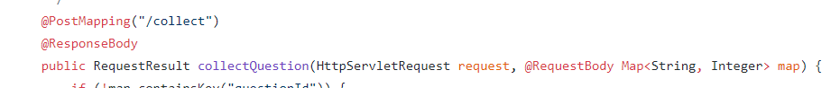

# 如何用Node和TypeScript配置Router

## Router简介

​	`Router`，即路由。路由的作用是存储与转发。如果你是一个前端开发者、或者了解过前端的人，那么你可能会听说过前端框架中的`Router`，前端框架的`Router`的作用就是在单页面应用中实现多页面的功能，根据url的指向来选择性渲染页面（但是会使用某种共享状态变量，如`Vuex`等），是一种指向作用的功能。

​	而后端的`Router`的作用也是相似的。现在假如我们有了一定的网络编程，那么我们知道，web端发送一个请求，想要进行访问服务器的时候。这个请求会先去解析主机ip，然后发送到一个抽象的网络上（可以理解所有用户都在网络的边缘，而中间是由路由器构成网络），这个网络会通过层层的路由转发后到达目标主机。接下来主机会匹配相应的端口号，并由传输给相应的进程，进程通过解析请求，找到想要进行操作的`Controller`层。那么，在请求传输到进程后，进程凭什么依据去找到相应的`Controller`类（方法）呢？靠的就是`Router`进行指引方向。

​	一个请求想要访问对应的`Controller`类，那么就要通过匹配得到，一般的匹配方式就是一对一匹配，用一个类似于散列表的数据进行匹配，一个请求路径只能匹配一个类。接下来我讲解一下通用的解决方法。

## 通用的解决办法

### 一对一映射

- `Servlet`：有过tomcat原生开发java web 项目的，对请求映射一定很熟悉。请求想要访问某个`Controller`方法，就要从配置里面进行读取并且访问，在原生`tomcat`上有一个专门用于路由的配置的东西，是一个`xml`（类似于`html`）类型的文件，在那个文件进行配置。所有的请求（无论`get`还是其他请求方法）都会通过这个文件来进行映射。然后对应的`Controller`类会有多种请求方法，可以根据不同的请求进行不同的操作（支持`restful`模式）。

  

- `装饰器`：如果在`xml`文件中一个一个进行配置，那么每当增加一个`servlet`的时候需要在xml文件上进行添加请求的映射。并且进行校错的时候也要通过`xml`进行查询，这样会比较麻烦，于是`java`有了通过注解来进行绑定映射的方法，其中的例子如下：

  
  一般而言，装饰器的作用是对类进行混入操作的，利用的是混入模式，但是在这里并不是。这里通过给相应的类进行装饰，通过获取类的路径从而保存到`router`中，这样的好处是不用一个一个像`servlet`进行配置，直接在需要的地方进行注入。

### 自然路由映射

先给出一段请求路径：

```js
http://xxxx:xxxxx/server/upsoftware
```

然后看一下文件结构的路径

```js
C:\Users\Administrator\Desktop\学习笔记\PersonNote\Typescript学习
```

是不是觉得两者很像，（斜杠可以等同于反斜杠）。如果我们通过某种方式，将后台的文件结构与url的结构相同，那么我们可以直接通过url的路径来代表想要访问的`Controller`层的路径，这样开发者就可以省去构造路由的时间。

但是这种方法一般是动态语言所拥有的，因为动态语言可以在需要的时候进行加载文件动态访问文件，而静态语言需要经过编译。很少会用到。

那么用哪种会比较好呢？听听我的路由改造史吧！

## TypeScript的解决办法

### 使用自然路由映射

由于`JavaScript`是动态弱类型语言，那么我一开始就想到了使用自然路由映射，那么项目的结构就要特别明确。话不多说，直接上代码吧！

```ts
//由路径来动态解析路由
export interface MatchResult {
  action: string,
  module: any
}

export class Router {
  controllerPath: string;

  static controllerMap: any = {};  // 使用静态属性，用来缓存访问过的路径，这个mao是后台在进行运行的时候构建起来的，没有运行的时候是不会进行构建

  constructor(controllerPath: string) {
    this.controllerPath = controllerPath;
  }

  public match(url: string) {
    let pathName: any = parse(url) || '',
        paths = pathName.split('/'),
        controller: string = paths[1] || 'index';  // 获取路由的第一个下标

    // 进行缓存策略，只要找到一次就会进行缓存，下次再有相同的路径的时候就无需进行遍历
    if (Router.controllerMap[controller]) return Router.controllerMap[controller];
    
    let action: string = paths[2] || 'index',  // 获取路由的第二个下标
        args: Array<string> = paths.slice(3),  // 获取路由其他下标作为参数
        controllerName: string = '',
        Controller: any,
        result: MatchResult = {
          action: action,
          module: null
        }

    try {
      controllerName = controller[0].toLocaleUpperCase() + controller.slice(1) + 'ControllerImpl';
      Controller = require('./'+ this.controllerPath + controllerName + '/impl/');
      result.module = Controller;
      // 对该类的指向进行缓存，下次方便下次请求相同的路径的时候直接获取。
      Router.controllerMap[controller] = Controller;
    } catch (e) {
      console.log(e);
    }
    
    return result;
  }
}
```

如果路由的目录是: `/user/login`

那么我的目录要严格按照这样来布局：

```js
─user
    │  LoginController.ts
    │
    └─impl
            LoginControllerImpl.ts
```

以上的路径能够进行访问的缺点是：

- 请求路径一定要和项目目录相同：`/user/login`的请求路径，一定要配上`/user/login`的项目路径
- 散列表`controllerMap`的内容是通过请求进行获取后不断的建立起来的。每个路径的第一次请求会进行读取并加载js文件，需要耗费一定量的时间。后续进行访问已经缓存的路径则花费时间较少。会在比较靠前的时候对请求的反应时间延长。
- 每次都对请求的路径进行解析并且查询（虽然有了缓存的机制，但是还是避免不了一定量的计算量）。

### 使用1对1映射方式

#### 通过配置方式

在没有了解过`JavaScript`（`TypeScript`）装饰器之前，我是使用思路类似于`Servlet`的方法进行路由配置的，但是并不是使用`xml`进行配置，而是通过散列表进行配置的（因为散列表一个键值只能对一个结果，可以去除重复）。并且在后台刚启动的时候就运行进行解析路由配置并且保存到内存中（保存路径对应的类和方法），后续有请求进来的时候就进行匹配，如果匹配成功，则进行获取类方法进行新建对象，如果不成功的话，则拒绝请求。以下就是我的代码。

```js
// 构建Router的文件
import * as options from 'index'
export const router = new Map();

export interface ClassRouter {
  module: Function,
  funcName: string
}

/**
 * @description 这个函数是在服务器启动的时候，将后台的所有的router进行解析获取文件
 * 并且存放到router内存当中去，后面请求进来的时候，直接在router进行获取数据
 * @version 1.0.1
 * @author Weybn
 * @param options 所有已经配置好的路由
 */
let resolveRouter = (options: any) => {
  let keys: Array<any> = Reflect.ownKeys(options),
      len: number = keys.length;

  // 遍历属性，将router提取出来
  while(len--) {
    // 在options中的每一个router的每一个属性的键值，这个键值就是请求的路径
    let childRouter = options[keys[len]];
    let routerPaths: Array<any> = Object.keys(childRouter),
        pathsLen = routerPaths.length;

    while(pathsLen--) {
      router.set(routerPaths[pathsLen], getClassByPath(childRouter[routerPaths[pathsLen]]));
    }
  }

  console.log('Router is loaded!')
  // 处理完毕后，将这个函数以及getClassByPath从内存删除，因为不会再使用到了。
  resolveRouter = null;
  getClassByPath = null;
}

let getClassByPath = (path): ClassRouter | null => {
  let bashPath: string = './controller/',
      modules: any = null,
      paths = path.split('/'),
      classPath = paths.slice(0, -1).join('/'),
      controllerName: string = paths[paths.length - 2];
  try {
    modules = require(bashPath + classPath)[controllerName];  // 获取目标类名
  } catch (e) {
    console.log(`路径${ path } 找不到对应的类，请检查对应路径`);
    return null;
  }

  if (!modules) {
    throw new Error(`找不到类名，请确定您输入的路径${ path }是否正确`)
  }

  // 返回的结果为：模块的类的指向，以及这个controller需要执行的方法
  return {
    module: modules,
    funcName: paths[paths.length - 1]  // 新建一个类后，需要调用这个类的方法，比如说 User/UserController/login ： 先获取User/UserController 这个类，新建实例对象后调用login方法
  };
}

// 将所有的路由配置写入内存中
resolveRouter(options)

export function parseUrl(url: string): ClassRouter | null {
  let { pathname }: any = parse(url) || '';

  let result: ClassRouter | undefined = router.get(pathname);
  return result;
}
```

上面是通过路由配置来进行生成路由散列表，并且保存到内存中

```js
// articleRouter
export const articleRouter = {
  '/article/add': 'Article/ArticleController/addArticle'
}

// UserRouter
// 这里是将用户的路径转为本系统的文件路径，键为访问的路径，值为在本系统的路径（相对于controller的路径），并且最后一个斜杆后面的内容为controller所要调用的方法。

export const userRouter = {
  '/user/login': 'User/UserController/login'
}

// index Router
export * from './userRouter'
export * from './articleRouter'

```

Router函数在程序启动的时候将`index`文件内容进行读取， 并且通过遍历内容进行构建路由表。构建一个`Map`形式的表，后续有请求进来的时候，直接在这个表进行查询，如果不存在的话，那么就终止，如果存在的话，那么就执行相应的`Controller`。

以上的方法在进行生成路由表的时候，过程是这样子的：

- 先将所有路由配置进行获取，路由的配置实际上也是一个散列表，键为外界访问的路径，值为内部路径。
- 对内部路径进行拆分，最后一个斜杠的后面是想要访问的方法，前面则是`Controller`类的路径
- 进行访问这个路径，加载文件后，将类和想要访问的方法进行存储（用外界访问的路径作为键），以便路由通过外界访问的路径直接获取结果。

- 删除构造函数，因为以后都不会用到。

这样使用1对1映射的方法最大的好处是计算的时间都放到了服务器启动的时候，后续直接通过散列表进行获取类和方法就行了。

#### 通过装饰器进行构建路由表

##### 装饰器使用例子

```js
// 请求路径为/user/login
import {GetMapping, RequestMapping} from "../../Router";

@RequestMapping('/user')
export class UserController {
  a: any;

  constructor(ctx) {
    this.a = ctx;
  }

  @GetMapping('/login')
  login() {
    console.log('登陆了')
  }
}
```

##### 装饰器引入

我在写第二个方法进行构建路由表的时候。一直很嫌弃第二种有点小麻烦，不大想用。并且看到java web是用装饰器进行映射的。（我那时候也知道typescript有用装饰器）。我不去想着怎么用装饰器使用的原因是我觉得不大可能去用，因为我一直觉得装饰器是在新建类的时候才会进行执行的，在建立之前是不会调用的。。。

直到某一天翻到了阮一峰大佬的《ES6标准入门》这本书的一句话。


这句话是什么意思呢？先说代码编译是什么时候，js是解释型语言，没有经过编译就可以直接使用，这并不代表JavaScript不用编译，而是在需要的时候将文件进行导入到内存并且编译，也就是动态编译。在编译时候发生对类的行为的修改，就是导入这个文件后，编译完成就立刻对类或者方法或者参数进行装饰。特别要注意的一点如下：

- 装饰器对于类和方法的装饰顺序是先进行方法的装饰再进行类的装饰

如果是这样子的话，那么就可以用装饰器进行构建路由表了，我使用的是类的方法装饰器，没有用类装饰器。如果有兴趣的话可以去查看类的装饰器怎么用。

这里还是要推荐一下`《ES6标准入门》`里面有专门对装饰器进行介绍。

**补充**：装饰器分为类装饰器和方法装饰器，用我这种方法的时候，在类上面一定要有类的装饰器，并且传进来的路径是方法装饰器内部参数路径的基础路径，这个必须要有，并且也合乎情理（类的作用是把所有相同的操作聚集到一起，自然请求路径也会有相同的，用类路径装饰器作为方法装饰器的基础路径，可以省下方法路径的很多冗余的代码）。

##### 如何构建router装饰器

Router装饰器的整体思路：

- 服务器启动的时候，将所有的`Controller`读入内存，触发当中的装饰器
- 装饰器通过反射原因，将装饰器传入的路径以及目标方法名以及**类的引用**，记住是引用放到`Map`中
- 请求进来的时候，通过路径以及方法来判断是否存在目标C层，进行调用。

那么`TypeScript`如何构建路由表呢？跟着我一步一步做。

首先要确定存储结构，我对于路由器的理解是这样子的：

​	一个请求进来，获取路径和请求方式后，根据请求方式可以直接在一个数据结构中进行查询，如果有，则说明请求路径正确，并且指导一定不会有重复的`Controller`（即一对一）；如果没有，则说明路径或者方法错误。在整个步骤中，最好不要用到遍历等需要长时间操作的东西，希望能一步到位。那么用什么数据结构既能够避免一对多并且能够快速定位呢？当然是`hashMap`，我使用的是`ES6`的`Map`对象进行构建。下面是我的数据结构表：

```js
└─RequestMap  // 总的存储映射
    ├─DeleteMap  // 存储所有Delete映射
    ├─GetMap     // 存储get映射
    ├─PostMap		 // 存储post
    └─PutMap		 // 存储put
```

这样子的好处在于：我既可以使用`Restful`形式进行设置`API`，也可以用非`Restful`形式的接口。在后面演示的时候会进行说明。

首先是构建数据结构的代码：

```js
// 定义接口
export interface RouterMap{
  module: any,
  funcName: string
}

// 定义数据结构并且绑定
const requestMap: Map<string, Map<string, RouterMap>> = new Map();
const postMap: Map<string, RouterMap> = new Map();
const getMap: Map<string, RouterMap> = new Map();
const putMap: Map<string, RouterMap> = new Map();
const deleteMap: Map<string, RouterMap> = new Map();
requestMap.set('post', postMap);
requestMap.set('get', getMap);
requestMap.set('put', putMap);
requestMap.set('delete', deleteMap);
```

我们先在已经了解了这个结构是怎么组成的了，那么就要定义方法装饰器：

```js
const methodsModel: Array<String> = [
  'post',
  'get',
  'delete',
  'put'
];  // 定义允许的请求方法

/**
 * @description 对方法进行装饰注入，这是一个创建方法Mapping装饰器的函数，返回的就是一个装饰器，传入的是想要创建的装饰器的请求方法
 * @param methods
 */
const setRouter = methods => {
  // 这是在自定义请求Mapping的时候进行定义
  if (!methodsModel.includes(methods)) {
    throw new Error(`The request method is not in ${ [...methodsModel] }, please add the method item or change method`)
  }

  return (path) => {
    let methodsMap = requestMap.get(methods);  // 获得对应请求方式的Map
    if (methodsMap.get(path)) {
      throw new Error(`${ methods } request url ${ path } in router map is repeat, check your router`);
    }

    return (target: any, funcName: string) => {
      methodsMap.set(path, {
        module: target,  // 这个是Controller类的原型，不能直接new，要后期通过类装饰器转为类才能用
        funcName: funcName
      })
    }
  }
}

// 创建各种请求方法的装饰器
export const GetMapping = setRouter('get');
export const PostMapping = setRouter('post');
export const PutMapping = setRouter('put');
export const DeleteMapping = setRouter('delete');
```

上面是装饰器的定义代码，特别要注意的是，在最里面的函数中，`target`是装饰的方法所在类的**原型**，不能直接使用`new`进行创建对象，需要后续在类方法上定义请求`base`路径的时候进行处理。

上面就是方法装饰器的定义，首先会进行查重，如果查重通过的话会在相应的方法`Map`进行添加一个对象，这个对象包含着类的原型以及绑定的方法。

下面是类进行装饰：

```js
export const RequestMapping = bashPath => target => {
  for (let [method] of requestMap) {
    let tempMap: Map<string, RouterMap> = requestMap.get(method);

    for (let [path, value] of tempMap) {
      // 找到与当前类的方法定义好的路由映射,由于方法中只能获得原型，那么要在类里面进行原型的比较
      if (target.prototype === value.module) {
        let relovedPath: string = bashPath + path;  // 将路径前面添加类的基础路径
        value.module = target;
        tempMap.set(relovedPath, value);   // 设置处理后的结果
        tempMap.delete(path);  // 删除处理前的结果
      }
    }
  }
}
```

这是对类进行装饰的方法。因为类的装饰器总会比方法的装饰器晚一步执行。当对类进行装饰的时候，会先去判断类的方法有没有被注入，如果有的话，那么会将类的引用放到`Map`的`module`当中，方便请求进来直接调用。

下面就是`Router`对象的主体。

```js
export class Router {
  targetPath: string;
  private isInit: boolean = false;

  constructor(targetPath: string) {
    this.targetPath = targetPath;  // controller的路径
  }

  init() {
    glob.sync(resolve(__dirname.replace(/\\/g, '/') + this.targetPath + '/**/*.ts')).forEach(require);  // 进行引用目标文件夹中的所有子ts文件，全部导入内存的同时会进行装饰，对请求Map进行填充
    this.isInit = true;
  }

  // 让这个分发函数指向router的原因是为了判断router是否初始化，如果没有初始化的时候则进行初始化，
  // 并且初始化结束后将这个方法指向router方法，避免以后每次请求的分发都要进行判断是否初始化
  async getRouter(path: string, method: string): Promise<RouterMap> {
    if (!this.isInit) {
      this.init();
    }
    let result: RouterMap = await this.router(path, method);
    this.getRouter = this.router;
    return result;
  }

  private async router(path: string, method: string): Promise<RouterMap> {
    method = method.toLocaleLowerCase();  // 小写化
    if (!methodsModel.includes(method)) {
      throw new Error(`The request method is not in ${ [...methodsModel] }`)
    }
    let { pathname }: any = parse(path) || '';
    return requestMap.get(method).get(pathname);
  }
}
```

##### 总结

以上就是装饰器配置Router的全过程，如果你想要自定义一个类的装饰器的话，可以按以下步骤来：

- 确定存储结构，需要考虑好兼容性（Restful和非Restful）
- 制作方法装饰器，记住方法装饰器的第一个参数是方法所在类的原型
- 制作类装饰器。
- 很重要的一点是要将`Controller`内所有的文件写入内存中

虽然有点啰嗦，但是要说一下装饰器的思路：

- 服务器启动的时候，将所有的`Controller`读入内存，触发当中的装饰器
- 装饰器通过反射原因，将装饰器传入的路径以及目标方法名以及**类的引用**，记住是引用放到`Map`中
- 请求进来的时候，通过路径以及方法来判断是否存在目标C层，进行调用。

通过使用装饰器相比于通过配置的方式的话，有以下的好处：

- 简单易修改：如果想要修改对应的路径的话，只需要在相应的方法上进行修改路径就可以了，无需进行其他操作
- 可移植性好，后期可以写成一个模块单独出来。

##### 全部代码

```js
import { parse } from "url";
import {resolve} from 'path';
const glob = require('glob');

const methodsModel: Array<String> = [
  'post',
  'get',
  'delete',
  'put'
];

export interface RouterMap{
  module: any,
  funcName: string
}

export class Router {
  targetPath: string;
  private isInit: boolean = false;

  constructor(targetPath: string) {
    this.targetPath = targetPath;
  }

  init() {
    glob.sync(resolve(__dirname.replace(/\\/g, '/') + this.targetPath + '/**/*.*')).forEach(require);  // 使用glob插件进行去读
    this.isInit = true;
  }

  // 让这个分发函数指向router的原因是为了判断router是否初始化，如果没有初始化的时候则进行初始化，
  // 并且初始化结束后将这个方法指向router方法，避免以后每次请求的分发都要进行判断是否初始化
  async getRouter(path: string, method: string): Promise<RouterMap> {
    if (!this.isInit) {
      this.init();
    }
    let result: RouterMap = await this.router(path, method);
    this.getRouter = this.router;
    return result;
  }

  private async router(path: string, method: string): Promise<RouterMap> {
    method = method.toLocaleLowerCase();  // 小写化
    if (!methodsModel.includes(method)) {
      throw new Error(`The request method is not in ${ [...methodsModel] }`)
    }
    let { pathname }: any = parse(path) || '';
    return requestMap.get(method).get(pathname);
  }
}
/**
 *
 * @param url
 * @param methods
 */
export function parseUrl(url: string, methods: string): RouterMap {
  if (!methodsModel.includes(methods)) {
    throw new Error(`The request method is not in ${ [...methodsModel] }`)
  }
  let { pathname }: any = parse(url) || '';
  return requestMap.get(methods).get(pathname);
}

const requestMap: Map<string, Map<string, RouterMap>> = new Map();
const postMap: Map<string, RouterMap> = new Map();
const getMap: Map<string, RouterMap> = new Map();
const putMap: Map<string, RouterMap> = new Map();
const deleteMap: Map<string, RouterMap> = new Map();
requestMap.set('post', postMap);
requestMap.set('get', getMap);
requestMap.set('put', putMap);
requestMap.set('delete', deleteMap);

export const RequestMapping = bashPath => target => {
  for (let [method] of requestMap) {
    let tempMap: Map<string, RouterMap> = requestMap.get(method);

    for (let [path, value] of tempMap) {

      // 找到与当前类的方法定义好的路由映射,由于方法中只能获得原型，那么要在类里面进行原型的比较
      if (target.prototype === value.module) {
        let relovedPath: string = bashPath + path;  // 将路径前面添加类的基础路径
        value.module = target;
        tempMap.set(relovedPath, value);   // 设置处理后的结果
        tempMap.delete(path);  // 删除处理前的结果
      }
    }
  }
}

/**
 * @description 对方法进行装饰注入
 * @param methods
 */
const setRouter = methods => {
  // 这是在自定义请求Mapping的时候进行定义
  if (!methodsModel.includes(methods)) {
    throw new Error(`The request method is not in ${ [...methodsModel] }, please add the method item or change method`)
  }

  return (path) => {
    let methodsMap = requestMap.get(methods);  // 获得对应请求方式的Map
    if (methodsMap.get(path)) {
      throw new Error(`${ methods } request url ${ path } in router map is repeat, check your router`);
    }

    return (target: any, funcName: string) => {
      methodsMap.set(path, {
        module: target,  // 这个是Controller类的原型，到后面再类里面进行映射的时候，就会换成类
        funcName: funcName
      })
    }
  }
}

// 构建各种方式的装饰器
export const GetMapping = setRouter('get');
export const PostMapping = setRouter('post');
export const PutMapping = setRouter('put');
export const DeleteMapping = setRouter('delete');
```

