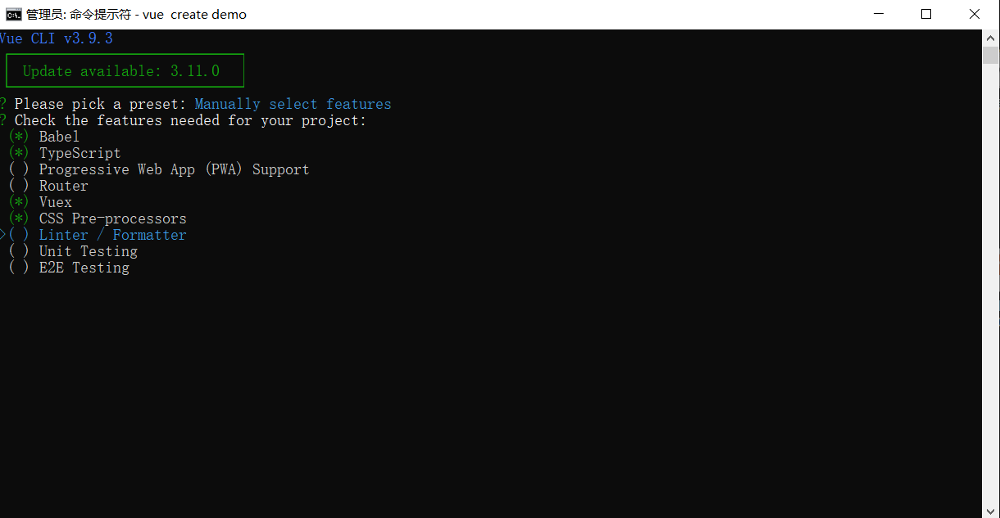
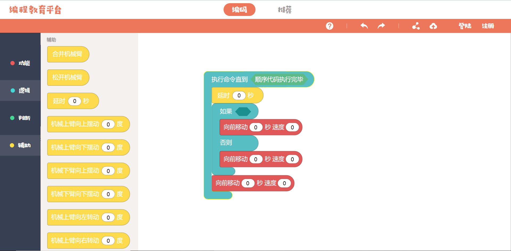

[TOC]

# Vue+TypeScript底层实现Scratch框架（1）

## 1.环境配置

### Vue安装

假设已经安装完NodeJS最新版了，那么需要进行如下内容的安装：

- npm install vue  // 安装vue
- npm install vue-cli  // 安装vue-cli脚手架

### 项目生成

在cmd页面下选择想要生成项目的地址，然后通过以下命令进行创建项目

- vue create demo

会出现如下的页面：

选择Babel、TypeScript、Vuex、Scss这几项进行安装。

安装完成后，我们需要进行安装TypeScript的装饰器，输入以下命令

- npm install vue-class-component
- npm install vue-property-decorator  // 安装装饰器
- npm install vuex-class  // 在vue文件中使用类用法

至此，我们的环境已经安装成功了。

## 2.总体介绍

### 效果图展示

用户可以用鼠标通过拖拽将积木块拖拽出来进行组合，从而构建自己想要的编程模块。

### Scratch图展示

​	scratch是使用blockly.js框架进行开发，这个框架内部包含了积木拖拽的功能代码以及完整的逻辑。我可以这么讲，市面上所有的编程教育平台都是用blockly作为核心进行开发的。（缺点很明显，就是只能使用这个blockly的模块形状，只能修改颜色而不能使用另外一种形状（具体的原因后面会说到））

​	而我们本次项目的目的是从底层来实现blockly这个框架。