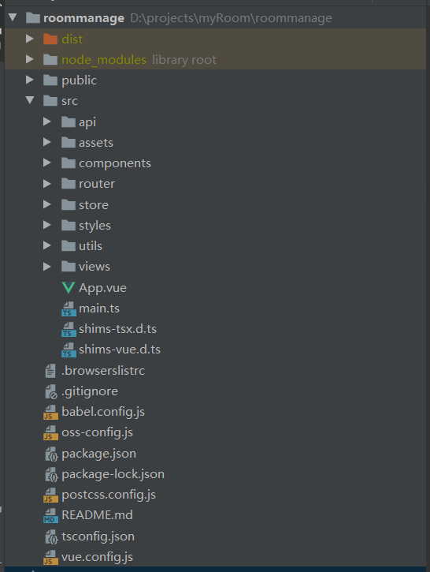
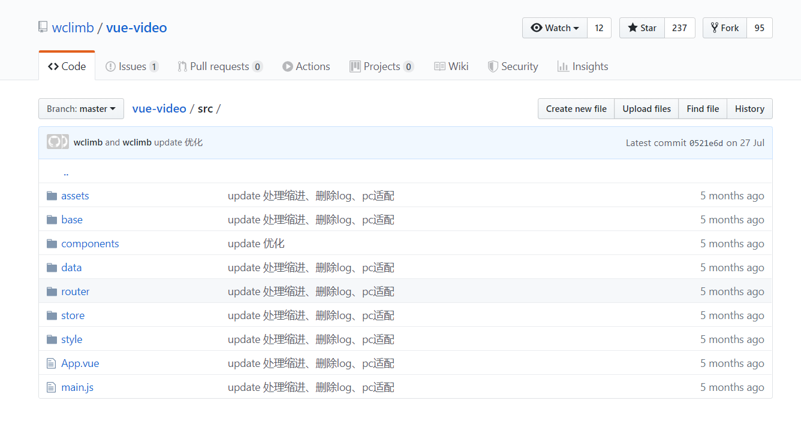
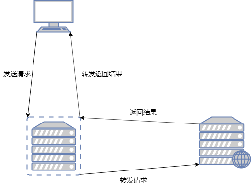

# 在TypeScript下，Vue项目如何写出更可维护性代码？

## 一、目录

[TOC]

## 二、总体分析

### 1.为什么要用TypeScript来构建我们的项目？

​	`JavaScript`是一个门弱类型、动态类型语言。怎么表现呢？可能一个变量它上一秒是一个数字，下一秒就变成了一个字符串，再下一秒它就是成了一个对象的引用，这就是动态类型，而动态类型的基础就是弱类型，或者说无类型。

​	弱类型的语言写起来非常舒服，完全不需要考虑到它的类型，需要的时候就声明一个来用，不需要的时候也不用去管他（垃圾自动回收机制）。这样就导致了很多编程爱好者或者说开发者在使用的时候并不会考虑到编程的严谨性，会很随意去使用变量（表现是实现变量的复用，可能用同一个变量去指向对象、指向数字等等）。这样开发的时候很随意，但是维护起来的话，可能需要去看一堆注释或者重构。可以这么说，这种是非常不负责任的行为。那么如何去避免这种情况的发生呢？当然是给变量加个类型，这个类型就限定变量只能从一类型而终，而不会中途变成其他类型。那么就引入了一个叫做`TypeScript`的东西（下称`TS`），`TS`并不是一门语言，而是一个`JS`的超集，也就是说它可以完全写成`JS`，但是也可以比`JS`写更多的东西，并且它最后编译成为JS，和普通的JS没有什么区别。

### 2.为什么TypeScript它就更可维护了？

​	`TS`可以自定义类型，如果你想要一个变量始终指向一个字符串，那就把它定义成为一个`String`类型，如果想要它始终是一个数字，那就定义成一个`Number`，这样如果在开发的时候，错误地赋值为一个不想要的类型的数据的时候它会报错。这样在某种程度上可以减少`bug`的产生。

​	上面只是`TS`的一个小小的应用，它在`Vue`中更好用的地方则在于请求的接口的编写上面（除了`Vue`之外，`React`, `Angular`中也是这样子的）。好处是在于请求数据的定制上面，我们可以根据接口写出这个项目调用的`API`，然后定制请求这个`API`的请求数据的类型，这样我们在写请求接口的时候，会很少发生`400BadRequest（参数类型错误）`这个错误，我们就会很省心。

​	`TS`的类型提示以及纠错的功能让整个项目在开发维护过程中更加方便，让类型检测的任务交给机器来检测而不是人工检测。这样出错率可以看做降到了0%，从而降低了开发维护的成本。并且如果你使用了`TypeScript`，那么意味着你可以使用全部的`JS`的`ES2018`附近版本的特性，很多语法糖能够加速我们的开发速度。这是非常好的一件事情。

### 3.在TypeScript下，Vue项目和在JavaScript下的Vue项目有什么不同？

​	首先看一下使用`TS`的时候的目录情况吧，这个是我最近的一个项目的项目目录：



然后我上了我的github上找到一个有`237star`的一个项目的目录

大家很明显可以看出两个项目的目录的区别，首先`views`目录和`component`这两个目录不看，我们很明显能够看到我的项目有一个`api`目录。这个目录就是存放所有的接口文件，所有在接口文档上存放的、与这个项目有关的接口，都会在这个`api`目录下面存在，这个目录的只写`api`，不做任何处理，暂且我们把它叫做`接口调用层`，这里我们就不谈具体细节，后面会细细讲述。

## 三、具体实现

### 1.api层（接口调用层）

​	趁热打铁，刚刚讲到了我们的接口调用层，那我们的顺序就从最底层的接口层开始讲起。在接口的话，我们使用的工具包没有变化，就是`axios`这个工具包，安装方法的话如下:

```
npm install axios --save-dev
```

​	安装完`axios`，怎么使用呢？首先我们先进行配置我们的网络请求配置，在`api`目录下面创建一个`config.ts`文件，这个文件就用来存放我们的所有配置。

```typescript
import axios from 'axios';
import router from '@/router/router';
import {getToken} from "@/utils/shared/localStorage";
import {isUndef} from "@/utils/shared";

let baseUrl: string;

if (process.env.NODE_ENV === 'production') {
  // 生产环境下使用真实路径
  baseUrl = 'xxxx';
} else {
  // 非生产环境下，都使用代理服务器
  baseUrl = '/api/admin';
}

// @ts-ignore
const _Request = axios.create({
  baseURL: baseUrl,
  timeout: 50000,
  headers: {
    'Content-Type': 'application/json'
  }
});
```

这串代码读下来我们第一眼就看到了一个判断语句，这个判断语句的话就是来区分不同的环境下面的请求基础地址，分为`生产模式`和`非生产模式`下的基础地址，为什么不同呢？大家请去看一下跨域问题....

在生产模式下使用的是一个真实路径，在非生产模式下使用的是代理服务器，`vue cli`脚手架提供一个通过配置能够得到的代理服务器（代理服务器的作用仅仅是解决跨域问题）。这里我顺便讲一下跨域和代理服务器解决跨域问题的原理吧。

- 什么是跨域问题？

  - 跨域问题是浏览器为了用户安全而设定的一个规则：这个规则就是只要访问的地址不是`同个域（主机地址）`，`同个端口`、`同一种协议`，那么就会被后台服务器拦截（只要服务器没有设定允许某个域的主机访问的话）。

- 如何解决跨域问题？

  - 前面说到是浏览器设定的一个规则，那么我们只能乖乖遵守这个规则，传统的话是后端开全域或者把项目放到后端的静态资源上。
  - 前面那一种解决办法明显不合理也不方便。跨域只是是浏览器设定的一个规则，而服务器与服务器之间的对话是没有跨域这一说法（只要不传请求头的某个字段，那么就不会产生这个问题）。那这个问题的解决思路是在本地开一个服务器，作为一个中介者，然后开发环境下的页面通过这个中介者去访问目标服务器，那么就解决了跨域问题，具体的图片如下：

  

  很明显代理服务器的作用只是转发的作用。

在`vue.config.js`里面可以进行配置代理服务器，如何配置代理服务器，请看

[vue.config.js的配置项以及解释传送门](https://cli.vuejs.org/zh/config/)

​	我们解决了跨域问题，接下来是对请求的统一处理，先上代码：

```typescript

/**
 * 统一对请求进行处理
 */
_Request.interceptors.request.use((config: any): any => {
  // 当存在token的时候，将token加到请求头上面
  let token = getToken();
  // @ts-ignore
  if (!isUndef(token) && token.length != 0) {
    if (config.url.indexOf('?') == -1) {
      // 如果没有问号的话，那么就直接在后面添加下面内容
      config.url += '?tokens=' + token;
    } else if (config.url.indexOf('?') == config.url.length - 1) {
      // 如果问号是最后一个的话
      config.url += 'tokens=' + token;
    } else {
      config.url += '&tokens=' + token;
    }
  }

  return config;
}, error => {});
```

在这个项目中，由于后端的`token`不是从请求头拿的，而是从请求参数拿的，所以我是这么来写的。这个东西是对请求发出去前进行处理，如果一个请求需要添加权限码等等东西，我们可以在这里进行处理。

​	接下来我们对请求返回结果进行统一处理：

```typescript
/**
 * 统一对返回的数据进行过滤
 */
_Request.interceptors.response.use((result: any): any => {
  let data = result.data;

  if (data.status == -1) {
    failOperationMessage('登陆状态过期，请重新登陆');
    router.replace('/login');
  }
  
  return result.data;

}, (error: any) => {
  if (isUndef(error.response)) {
    return {
      status: -2,
      data: {},
      message: '请求发不出去，请检查您的网络。如果您的网络正常，请联系服务器管理人员'
    }
  }

  let status = error.response.status;

  switch (status) {
    case 404: {
      return {
        status: -2,
        data: error,
        message: '服务器请求地址出错，请联系服务器管理人员'
      };
    }

    case 500: {
      return {
        status: -2,
        data: error,
        message: '服务器出现异常，请联系服务器管理人员'
      };
    }

    default: {
      return {
        status: -2,
        data: error,
        message: '请求发生错误，请重新刷新页面'
      };
    }
  }
});
```

请求返回结果总有一些是相同的，那么我们可以把这些相同的情况进行过滤，这样确保业务逻辑拿到手的数据**要么是成功的，要么是失败的（这个失败是因为用户传输的数据不正确导致的，而不是其它原因，比如说修改密码，原来的密码错误，或者登陆密码错误）**。没有什么服务器出现异常这种情况。因为服务器出现一异常、登陆过期这些状态并不是在业务逻辑层来进行处理的，我们可以把它放到接口调用层进行处理。这样**下面一层对于上一面来说是透明的**，这样会减少很多不必要的麻烦。

​	由于使用了异步语法糖函数`async`，这个可以用同步的方式编写异步的代码，无论成功与否它都返回东西，所以在`error`的情况下，我们要对请求结果根据接口进行封装，并且自定义状态码。

​	接口配置项写好了，接下来就要写请求的父类，写之前我们先想好我们要写什么？请求一共有几类？

​	`get`、`post`、`put`、`delete`。一共有这四类，那么这个父类就要写四项咯，但是要想清楚，是不是有一个`post`请求是很特别的，使用它的时候要单独为它设定请求头对吧？那么这个父类就需要写5项了。

```typescript
interface ReturnData {
  status: number;
  message: string;
  data?: any;
}

export class Request {
  public get(url: string): Promise<ReturnData> {
    return _Request.get(url);
  }

  public post(url: string, data: any): Promise<ReturnData> {
    return _Request.post(url, data);
  }

  public upload(url: string, data: any): Promise<ReturnData> {
    return _Request.post(url, data, {
      headers:{'Content-Type':'multipart/form-data'}
    });
  }

  public put(url: string, data: any): Promise<ReturnData> {
    return _Request.put(url, data);
  }

  public delete(url: string, data: any): Promise<ReturnData> {
    return _Request.delete(url);
  }
}
```

这样我们的父类就写好了，接下来就是写请求的子类来继承这个父类了，写子类的时候要对请求进行分类。下面我就给出一个简单的例子来说明子类怎么写吧。

```typescript
import {Request} from "@/api/config";

class UserRequest extends Request {
  login(data: {
    username: string;
    psw: string;
  }) {
    return this.post('/user/login', data);
  }

  exit() {
    return this.post('/user/exit', {});
  }
}

// 导出一个单例对象
export const userRequest = new UserRequest();
```

###  2.store层（数据存储层）

​	在我的设计中，api层不会跟业务逻辑有任何瓜葛的，仅仅跟`store`层有联系，`store`层通过调用`api层`来获取数据，然后进行存储或者封装给业务逻辑层，然后业务逻辑层再来展示给用户看。`store`采用的是`vuex`，并且使用了`vuex-module-decorators`这个插件来使用。

```
npm install vuex-module-decorators --save-dev
```

安装完毕后，怎么来使用呢？

```typescript
@Module({
  dynamic: true,
  store,
  name: 'UserManage',
})
class UserManage extends VuexModule {
  public userName: string = '管理员';

  public token: string = getToken() || '';

  @Mutation
  public setUserName(newName: string) {
    this.userName = newName;
  }

  @Mutation
  public setToken(token: string) {
    this.token = token;
  }

  @Action
  public async login(data: {
    username: string;
    psw: string;
  }) {
    let result = getResultResData(await userRequest.login(data));
    if (result.isSuccess) {
      this.setToken(result.data);
      setToken(result.data);
    }

    return result;
  }

  @Action
  public async exit() {
    return getResultResData(await userRequest.exit());
  }
}

export const userManage = getModule(UserManage);
```

在使用之前一定要看好`vuex`的使用说明书，我简单介绍一些几项规定：

- state只读
- mutation只放同步函数，并且是对state进行修改
- action可以存放异步函数，但是不能直接对state进行修改，需要调用mutation

在这里的话，这个模块通过装饰器的使用，避免了违反上述规定的情况，但是要注意一下这个模块使用的时候会出现的那种找不到原因的bug：

- Module装饰器内的`name`属性不能相同。
- Action方法名不能相同（不同的类也是不允许存在相同的方法名的）。
- Mutation这个没有验证过，等待大家的验证。

如果出现不可解决的bug，并且能够定位到它在这一层的话，很可能是以上的bug。

在store层不仅仅是对数据进行存储，还能对请求结果进行语义化封装。也就是上面的`getResultResData`方法的用法。直接上代码吧！

```typescript
/**
 * @description 处理请求返回值的数据，这里是请求成功的时候的返回值
 * @param res
 */
function getSuccessResData(res: any): {
  isSuccess: boolean;
  msg: string;
  data: any;
}  {
  return {
    isSuccess: true,
    data: res.data ? res.data : {},
    msg: res.message ? res.message : ''
  }
}

function getFailResData(res: any): {
  isSuccess: boolean;
  msg: string;
  data: any;
} {
  return {
    isSuccess: false,
    data: res.data ? res.data : {},
    msg: res.message ? res.message : ''
  }
}

export function getResultResData(res: {
  status: number;
  message: string;
  data?: any;
}): {
  isSuccess: boolean;
  msg: string;
  data: any;
} {
  if (res.status == 1) {
    return getSuccessResData(res);
  }

  return getFailResData(res);
}

```

这样业务逻辑层可以直接判断是否成功，从而直接进行执行代码。

### 3.业务逻辑层

现在到了`Vue`文件内容的使用了，使用到`typescript`的话，有两种写法，一种是用继承的方式来写，一种是用类的方式来写。然而我个人比较喜欢用类的方式来写，那么就要来介绍一下用类的风格来写每个组件吧。需要引进的包为：`vue-property-decorator`

```
npm install vue-property-decorator --save-dev
```

用类的方式来写的话，最重要的是装饰器的使用，有一篇文章对装饰器的用法说得很清楚明白了，我这边就不想要造轮子了。。。

[装饰器的使用传送门](https://zhuanlan.zhihu.com/p/60952007)

这里就讲一点特别重要的，就是每个类一定要有一个`Component`装饰器，否则会出现一些问题。

## 四、总结

- 分层思想：分为三个层，下面的一层对于上面一层来说是透明的，自己解决自己所需要解决的问题，不进行交叉解决，从而使整个项目的代码结构清晰，便于维护
- 尽量使用类型，这样便于整个项目的维护，同时也有代码的提示功能，利人利己。
- 注意分类思想。