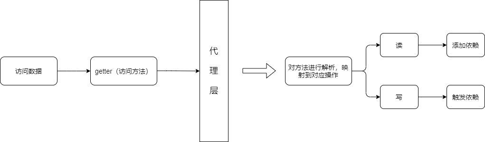
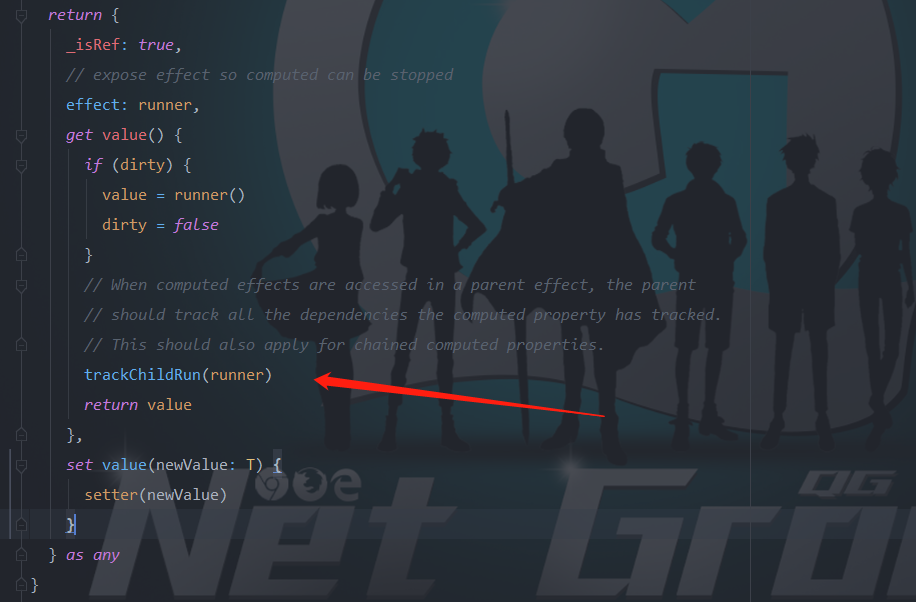

# 带你阅读Vue3.0响应式系统源码3-响应型数据诞生

## 主题：响应型数据诞生（不考虑ReadOnly响应数据）

### 1.哪些类型的数据会被设置成响应型数据？

​	**Vue2.0**中能够被设置成响应型数据的无非就两种：纯对象（说白了就是**new Object()**或者**{}**或者**Object.create(null)**等定义的键值对对象）、数组。而**Vue3.0**中能够被设置成响应型数据的多了容器型对象：

```typescript
// makeMap方法是将字符串用String.prototype.split(",")（逗号隔开变成数组）
// 然后创建一个空对象，键就是上面的数组形成的Set，所以返回的方法相当于set.has(any)这个方法
const isObservableType = /*#__PURE__*/ makeMap(
  'Object,Array,Map,Set,WeakMap,WeakSet'
)

const canObserve = (value: any): boolean => {
  return (
    !value._isVue &&													 // 不是Vue对象
    !value._isVNode &&												 // 不是VNode对象
    isObservableType(toRawType(value)) &&
    !nonReactiveValues.has(value)              // 不设置成响应数据的例外
  )
}

// toRawType  是将得到的对象类型进行切割
// {} 用 Object.prototype.toString.call({})   结果是  [object Object]
// 然后toRawType返回的是 Object
export const objectToString = Object.prototype.toString

export function toRawType(value: unknown): string {
  return toTypeString(value).slice(8, -1)
}
```

上面的代码很清楚了，能够被观察的数据有：

- 普通对象
- 数组
- **ES6**容器型对象：**Map、Set、WeakMap、WeakSet**

### 2.响应型数据的分类

​	**Vue3.0**对于响应型数据是根据实现响应型数据的方式进行分类，也就是代理的**Handler**的不同进行分类，在这里笔者根据自己的理解分成两类：基础型对象、容器型对象。

​	是依照什么进行分类的呢？是**依照能不能直接通过getter方法直接获得数据和setter方法进行修改数据。**下面的代码就进行解释：

```js
// 基础型对象，可以对数据直接进行操作
let obj = {
  name: 'Weybn'
};

obj.name;  // getter Weybn
obj.name = 'Other'  // setter Other

// 容器型对象，只能通过方法访问数据
let map = new Map();

obj.set('name', 'Weybn');
obj.name;  // undefined

obj.name = 'Other';
obj.get('name');  // Weybn
```

#### 1）基础型对象

- 基础型数据有：普通对象、数组。

- 访问每个属性都是直接访问的，所以需要在拦截层对代理**handler**设定**get、set、deleteProperty**等拦截处理方法，所以它的**handler**长这样子：

  ```typescript
  const mutableHandlers: ProxyHandler<object> = {
    get,
    set,
    deleteProperty,
    has,
    ownKeys
  }
  ```

  当访问对象的属性（数组可以理解为属性为数字的对象），会根据是读取属性还是修改属性还是删除属性操作等调用相应的方法。下面是访问对象属性的流程图：

  .png)

#### 2）容器型对象

- 容器型数据：**Map、Set、WeakMap、WeakSet**

- 容器型数据是不能直接对数据进行获取或者修改的（因为封装成方法了），只能通过访问方法来进行修改。也就是要读或者写数据都要经过一层方法，所以代理的时候只能代理方法的**getter**，然后在**getter**拦截方法里面进行判断方法的类型然后进行分配。所以容器型的**handler**只需要处理**getter**代理就可以。

  ```typescript
  const mutableCollectionHandlers: ProxyHandler<CollectionTypes> = {
    get: createInstrumentationGetter(mutableInstrumentations)
  }
  ```

  操作的流程图如下（**访问方法也是调用了getter**）：

  

  解释一下其中的读和写吧，以**Map**为例子：

  - 读操作：**get、has、迭代、size等**
  - 写操作：**add、set、delete、clear等**

### 3.响应数据代理的实现

#### 1）数据响应的实现原理

​	在进行讲解如何通过代理实现数据转为响应型数据之前，我们先来讲一下**Vue**的数据响应系统实现的思路是怎么样的。不过在阅读接下来的文章之前，至少要知道订阅、发布（观察者）这种设计模式。

​	为了更好地帮助大家理解，我们把场景设置在渲染函数观察者上面，也就是最终会进行显示在网页上的数据：

- 什么样的数据才需要被观察？

- 什么时候才会进行更新视图层？

答案很简单：

- 在视图上显示的数据才需要被观察，其他数据不需要被观察，在渲染的时候，要想显示数据，那么就要经过数据的**getter**方法，所以可想而知我们需要把数据与渲染函数观察者绑定起来。
- 在对数据进行更新操作的时候才需要对视图层进行更新，所以是在**setter**方法中，数据所绑定的所有渲染函数观察者都需要进行更新。

知道了**Vue**是如何实现数据响应后，我们比较一下2.0实现方式和3.0实现方式的区别。

- **Vue2.0**：
  - 使用**Object.defineProperty**进行重新定义对象的某个属性的**getter**和**setter**进行依赖的添加和依赖的触发。所以是**会修改到响应对象的原生对象**。
  - 在**Vue2.0**是没有针对于**ES6**的容器类型，但是不代表不能对容器对象里面的数据进行数据监听，笔者阅读完3.0预览版的数据响应系统后，根据自己的理解写了代码：
  - 需要定义对象属性的描述符，并且最终会添加到对象的属性上，并且需要对**对象的每个属性**都添加上**getter**和**setter**访问描述，这样无疑是很大的开销。
  - 修改数据的值需要用到闭包缓存（因为**getter**和**setter**被改写了，如果在**getter**里面再通过**obj[property]**访问数据，会造成栈溢出，只能通过闭包缓存数据的方式来进行获取值）。
- **Vue3.0**:
  - 使用代理模式，是在目标对象的访问层加了一层拦截层。这层拦截层实现了数据响应。（用户在使用的时候，操作的是拦截层。），**不会修改原生对象**。
  - 能够很好的支持容器类型的数据响应。
  - 代理拦截层是对对象执行所有的**getter**和**setter**等方法进行统一处理，而不是针对于某个属性，所以一次对象**只需要处理一次**就够了，相比于2.0减少了很大的开支。
  - 使用**Reflect**直接访问到原生数据，而原生数据的**getter**和**setter**没有被改写，所以不需要用到额外的闭包数据缓存。

#### 2）数据响应的实现代码

​	在**Vue2.0**中**getter**是搜集依赖，而**setter**是触发依赖，这是狭义的理解，而广义的理解是**读数据的时候进行依赖的绑定、写数据的时候进行依赖的触发**。所以**Vue3.0**中将依赖的绑定和触发函数抽离出来，分别叫做**track（追踪，即添加依赖）**和**trigger（触发依赖）**。这里我就不进行说明里面的代码了。

​	那么依赖添加和触发是在什么时候执行呢？我们还是按照基础型对象和容器型对象进行分类：

- 基础型对象：

  - 添加：访问属性（下标）
  - 触发：修改属性（下标）

- 容器型对象：由于容器有四种类型，下面是所有的方法，它们分成两类，一类是绑定依赖、一类是触发依赖。

  | 方法    | 绑定依赖或者触发依赖 |
  | ------- | -------------------- |
  | get     | 绑定依赖             |
  | size    | 绑定依赖             |
  | has     | 绑定依赖             |
  | add     | 触发依赖             |
  | set     | 触发依赖             |
  | delete  | 触发依赖             |
  | clear   | 触发依赖             |
  | forEach | 绑定依赖             |

  从上面表格我们也可以验证这句话：**读数据的时候进行依赖的绑定、写数据的时候进行依赖的触发**

- 特殊处理：那么对于数组方法进行访问的时候，是怎么进行处理的呢？**Vue2.0**和**Vue3.0**处理是有区别的。

  - **Vue2.0**：由于2.0修改数组下标的内容是不会触发依赖的，框架使用了另外的方式来触发依赖，就是针对于数组自带方法即**pop、push、shift、unshift**等方法进行变异，当数组执行该方法的时候进行触发依赖的执行，从而更新 数据。
  - **Vue3.0**：能够通过代理，在修改数组下标的时候能够触发依赖。并且默认能够支持数组的所以原生操作。（为什么会默认支持呢？这是**由于代理后使用数组的操作方法会触发多个属性的拦截器**！），详细情况可以查看一下我的另外一篇文章[Vue3.0代理如何对数组的原生方法进行观察]()。

### 4.特殊的响应型数据

#### 1）computed类型数据

​	**computed**选项最后会处理成一个**Ref**类型的数据，所以我们把**computed**看成一个数据。**computed**属性的实现思路如下（与**Vue2.0**实现思路完全一致）：

**lazy**型观察者在**Vue**中表现为**computed**属性，一般这个属性是一个函数，以下是一个例子：

```js
computed: {
  // getCount最后处理成一个属性，然后这个方法被存储在Watcher的某个属性中
  getCount() {
    return this.a + this.b;
  }
}
```

**lazy**观察者里面有一个**dirty**属性，也就是一个开关作用，只有它为**true**的时候使用**getCount**的**getter**方法的时候，才会进行调用这个函数。

如果**lazy**观察者所引用的数据（**a**或者**b**属性）发生改变后，会将这个放到观察者执行队列中，然后执行这个观察者的时候把**dirty**赋值为**true**（代表下次访问**getter**方法的时候会执行一遍**lazy**的求值方法（求值后会将**dirty**赋值为**false**））。等到下一次需要获取这个数据的时候才进行求值，所以它叫做惰性求值。这种方式能够节省不必要执行函数的开支。

讲**computed**属性的是想要讲在**computed.ts**文件最后面的**trackChildRun方法**的代码，拿比较重要的代码出来讲讲：

```typescript
function trackChildRun(childRunner: ReactiveEffect) {
  if (activeEffect === undefined) {
    return
  }
  for (let i = 0; i < childRunner.deps.length; i++) {
    const dep = childRunner.deps[i]
    if (!dep.has(activeEffect)) {
      dep.add(activeEffect)
      activeEffect.deps.push(dep)
    }
  }
}
```

它是在**computed**对象被添加依赖的时候调用的：



- 问：怎么理解这个方法呢？

  答：代码一看就是**dep**和**effect**的互相绑定，所以是依赖的绑定。

- 问：前面执行的时候已经添加了依赖，那么这里是有什么用处吗？

  可以看到全局变量有个**activeEffect**和**effectStack**，使用栈就是为了在嵌套观察者中实现父**effect**绑定子**effect**的数据。比如渲染函数观察者中，使用到**getCount**,那么给**a**属性赋值的时候会执行渲染函数观察者的方法，从而实现数据的更新。

### 5.小结

- 能够变成响应型数据的对象类型有：**Object、Array、Map、Set、WeakMap、WeakSet**
- 响应数据类型有两种：基础型对象、容器型对象：
  - 基础型对象：**Object、Array**
  - 容器型对象：**Map、Set、WeakMap、WeakSet**
- 基础型对象实现代理可以对对象进行代理。
- 容器型对象实现数据代理需要经过一层方法。
- 数组下标可以看作对象的属性，但是**数组的原生方法直接代理实现数据响应并不简单**
- 数据响应系统实现的思路是：在**Vue2.0**中**getter**是搜集依赖，而**setter**是触发依赖，这是狭义的理解，而广义的理解是**读数据的时候进行依赖的绑定、写数据的时候进行依赖的触发**。
- 计算方法要注意到如何解决**effect**的嵌套问题