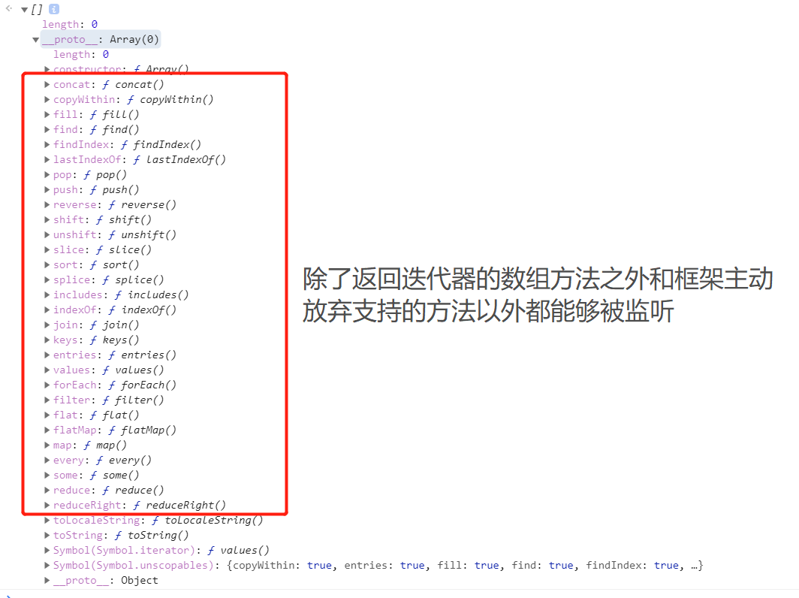
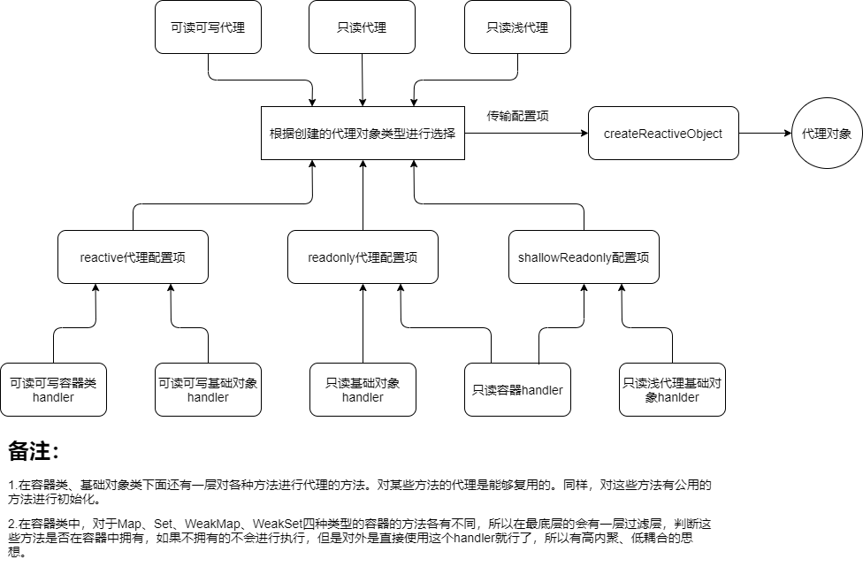

# 带你阅读Vue3.0响应式系统源码3-响应型数据诞生

## 主题：响应型数据诞生（不考虑ReadOnly响应数据）

### 1.哪些类型的数据会被设置成响应型数据？

​	**Vue2.0**中能够被设置成响应型数据的无非就两种：纯对象（说白了就是**new Object()**或者**{}**或者**Object.create(null)**等定义的键值对对象）、数组。而**Vue3.0**中能够被设置成响应型数据的多了容器型对象：

```typescript
// makeMap方法是将字符串用String.prototype.split(",")（逗号隔开变成数组）
// 然后创建一个空对象，键就是上面的数组形成的Set，所以返回的方法相当于set.has(any)这个方法
const isObservableType = /*#__PURE__*/ makeMap(
  'Object,Array,Map,Set,WeakMap,WeakSet'
)

const canObserve = (value: any): boolean => {
  return (
    !value._isVue &&													 // 不是Vue对象
    !value._isVNode &&												 // 不是VNode对象
    isObservableType(toRawType(value)) &&
    !nonReactiveValues.has(value)              // 不设置成响应数据的例外
  )
}

// toRawType  是将得到的对象类型进行切割
// {} 用 Object.prototype.toString.call({})   结果是  [object Object]
// 然后toRawType返回的是 Object
export const objectToString = Object.prototype.toString

export function toRawType(value: unknown): string {
  return toTypeString(value).slice(8, -1)
}
```

上面的代码很清楚了，能够被观察的数据有：

- 普通对象
- 数组
- **ES6**容器型对象：**Map、Set、WeakMap、WeakSet**

### 2.响应型数据的分类

​	**Vue3.0**对于响应型数据是根据实现响应型数据的方式进行分类，也就是代理的**Handler**的不同进行分类，在这里笔者根据自己的理解分成两类：基础型对象、容器型对象。

​	是依照什么进行分类的呢？是**依照能不能直接通过getter方法直接获得数据和setter方法进行修改数据。**下面的代码就进行解释：

```js
// 基础型对象，可以对数据直接进行操作
let obj = {
  name: 'Weybn'
};

obj.name;  // getter Weybn
obj.name = 'Other'  // setter Other

// 容器型对象，只能通过方法访问数据
let map = new Map();

obj.set('name', 'Weybn');
obj.name;  // undefined

obj.name = 'Other';
obj.get('name');  // Weybn
```

为什么要这么分类呢？是因为它们的**ProxyHandler**的处理方式不相同，下面进行讲解：

#### 1）基础型对象

- 基础型数据有：普通对象、数组。

- 访问每个属性都是直接访问的，所以需要在拦截层对代理**handler**设定**get、set、deleteProperty**等拦截处理方法，所以它的**handler**长这样子：

  ```typescript
  const mutableHandlers: ProxyHandler<object> = {
    get,
    set,
    deleteProperty,
    has,
    ownKeys
  }
  ```

  当访问对象的属性（数组可以理解为属性为数字的对象），会根据是读取属性还是修改属性还是删除属性操作等调用相应的方法。下面是访问对象属性的流程图：

  .png)

上面图中的中间的大箭头其实画的不是很准确，应该要分成5个小箭头。这是因为五种方式是没有交集的，各自有各自的拦截层方法拦截。

#### 2）容器型对象

- 容器型数据：**Map、Set、WeakMap、WeakSet**

- 容器型数据是不能直接对数据进行获取或者修改的（因为封装成方法了），只能通过访问方法来进行修改。也就是要读或者写数据都要经过一层方法，所以代理的时候只能代理方法的**getter**，然后在**getter**拦截方法里面进行判断方法的类型然后进行分配。所以容器型的**handler**只需要处理**getter**代理就可以（代理调用方法的时候相当于访问属性，所以会拦截**getter**）。

  ```typescript
  const mutableCollectionHandlers: ProxyHandler<CollectionTypes> = {
    get: createInstrumentationGetter(mutableInstrumentations)
  }
  ```

  操作的流程图如下（**访问方法也是调用了getter**）：

  

  解释一下其中的读和写吧，以**Map**为例子：

  - 读操作：**get、has、迭代、size等**
  - 写操作：**add、set、delete、clear等**

  可以很清楚的发现，读操作就相当于**getter**，也就是添加依赖，而写的时候相当于**setter**，也就是触发依赖。

### 3.响应数据代理的实现

#### 1）数据响应的实现原理

​	在进行讲解如何通过代理实现数据转为响应型数据之前，我们先来讲一下**Vue**的数据响应系统实现的思路是怎么样的。不过在阅读接下来的文章之前，至少要知道订阅、发布（观察者）这种设计模式，如果不知道这种设计模式，那么请点击右上角的“+”，然后搜索。

​	为了更好地帮助大家理解，我们把场景具体化，设定在渲染函数观察者上面，执行渲染函数观察者后会更新**View**层，现在有两个问题：

- 什么样的数据才需要被观察？

- 什么时候才会进行更新视图层？

答案很简单：

- 在视图上显示的数据才需要被观察，其他数据不需要被观察。在渲染的时候，要想显示数据，就需要拿到数据，也就是说要经过数据的**getter**方法，所以可想而知我们需要把数据与渲染函数观察者绑定起来。
- 在对数据进行更新操作的时候才需要对视图层进行更新，所以是在**setter**方法中。更新数据后，要将数据所绑定的所有渲染函数观察者进行执行，以便更新**View**层。

#### 2）数据响应的实现

​	在**Vue2.0**中**getter**是搜集依赖，而**setter**是触发依赖，这是狭义的理解，而广义的理解是**读数据的时候进行依赖的绑定、写数据的时候进行依赖的触发**。所以**Vue3.0**中将依赖的绑定和触发函数抽离出来，分别叫做**track（追踪，即添加依赖）**和**trigger（触发依赖）**。整一个依赖的添加流程和依赖的触发流程我放到下一章节再进行讲解，这里只讲在什么时候进行依赖的添加、在什么时候进行依赖的触发。

​	那么依赖添加和触发是在什么时候执行呢？我们还是按照基础型对象和容器型对象进行分类：

- 基础型对象：

  - 添加依赖：访问属性（下标）
  - 触发依赖：修改属性（下标）

- 容器型对象：由于容器有四种类型，下面是所有的方法，它们分成两类，一类是绑定依赖、一类是触发依赖。

  | 方法    | 绑定依赖或者触发依赖 |
  | ------- | -------------------- |
  | get     | 绑定依赖             |
  | size    | 绑定依赖             |
  | has     | 绑定依赖             |
  | add     | 触发依赖             |
  | set     | 触发依赖             |
  | delete  | 触发依赖             |
  | clear   | 触发依赖             |
  | forEach | 绑定依赖             |

  从上面表格我们也可以验证这句话：**读数据的时候进行依赖的绑定、写数据的时候进行依赖的触发**

- 特殊处理：那么对于数组方法进行访问的时候，是怎么进行处理的呢？**Vue2.0**和**Vue3.0**处理是有区别的。

  - **Vue2.0**：

    - 由于2.0修改数组下标的内容是不会触发依赖的。不是不能做，而是没必要，因为如果针对于数组每个下标都监听的话，开销会很大。
    - 框架使用了另外的方式来触发依赖，就是针对于数组自带方法即**pop、push、shift、unshift**等方法进行变异，当数组执行该方法的时候进行触发依赖的执行，从而更新数据。所以**框架需要自定义方法来监听访问的数组属性**

  - **Vue3.0**：

    - 能够通过代理，在修改数组下标的时候能够触发依赖。

    - 默认能够支持数组的所以原生操作。（为什么会默认支持呢？这是**由于代理后使用数组的操作方法会触发多个属性的拦截器**！），详细情况可以查看一下我的另外一篇文章[Vue3.0代理如何对数组的原生方法进行观察]()。并且支持的数组方法很多！

      

### 4.特殊的响应型数据

#### 1）computed类型数据

​	**computed**选项最后会处理成一个**Ref**类型的数据，所以我们把**computed**看成一个数据。**computed**属性的实现思路如下（与**Vue2.0**实现思路完全一致）：

**lazy**型观察者在**Vue**中表现为**computed**属性，一般这个属性是一个函数，以下是一个例子：

```js
computed: {
  // getCount最后处理成一个属性，然后这个方法被存储在Watcher的某个属性中
  getCount() {
    return this.a + this.b;
  }
}
```

**lazy**观察者里面有一个**dirty**属性，也就是一个开关作用，只有它为**true**的时候使用**getCount**的**getter**方法的时候，才会进行调用这个函数。

如果**lazy**观察者所引用的数据（**a**或者**b**属性）发生改变后，会将这个放到观察者执行队列中，然后执行这个观察者的时候把**dirty**赋值为**true**（代表下次访问**getter**方法的时候会执行一遍**lazy**的求值方法（求值后会将**dirty**赋值为**false**））。等到下一次需要获取这个数据的时候才进行求值，所以它叫做惰性求值。这种方式能够节省不必要执行函数的开支。

讲**computed**属性的是想要讲在**computed.ts**文件最后面的**trackChildRun方法**的代码，拿比较重要的代码出来讲讲：

```typescript
function trackChildRun(childRunner: ReactiveEffect) {
  if (activeEffect === undefined) {
    return
  }
  for (let i = 0; i < childRunner.deps.length; i++) {
    const dep = childRunner.deps[i]
    if (!dep.has(activeEffect)) {
      dep.add(activeEffect)
      activeEffect.deps.push(dep)
    }
  }
}
```

它是在**computed**对象被添加依赖的时候调用的：


- 问：怎么理解这个方法呢？

  答：代码一看就是**dep**和**effect**的互相绑定，所以是依赖的绑定。

- 问：前面执行的时候已经添加了依赖，那么这里是有什么用处吗？

  可以看到全局变量有个**activeEffect**和**effectStack**，使用栈就是为了在嵌套观察者中实现父**effect**绑定子**effect**的数据。比如渲染函数观察者中，使用到**getCount**,那么给**a**属性赋值的时候会执行渲染函数观察者的方法，从而实现数据的更新。

#### 2）Ref类型对象

​	这是**Vue3.0**提供的一种数据类型，有个数据域`value`，`value`是一个代理对象，所以`ref`是**Vue3.0**对用户开放的代理接口，能够产生`value`为响应式代理对象的`Ref`类型的对象。`setup`函数里面进行创建，然后作为返回的时候会进行解包操作，变成`data`数据。它有两种生命方式：

1. 传入原生对象时候，创建一个单一的`ref`。
2. 传入一个响应式代理对象的时候，返回一个原生对象，但是这个原生对象的属性返回响应式代理的属性。也就是说将响应式对象转为原生对象，但是保持里面的属性的监听状态。

### 5.Vue3.0和Vue2.0将数据变成响应型数据的区别（重点）

上面就是**Vue**实现数据响应的原理，接下来我们将2.0和3.0逐点进行分析区别：

1. 是否修改到原生对象？

   - 2.0：使用**Object.defineProperty**进行重新定义对象的某个属性的**getter**和**setter**进行依赖的添加和依赖的触发。所以是**会修改到响应对象的原生对象**。

   - 3.0：使用代理模式，是在目标对象的访问层加了一层拦截层。这层拦截层实现了数据响应。（用户在使用的时候，操作的是拦截层。），**不会修改原生对象**。

     

2. 对于**ES6**容器类型对象的支持

   - 2.0：在**Vue2.0**是没有针对于**ES6**的容器类型，但是不代表不能对容器对象里面的数据进行数据监听，笔者阅读完3.0预览版的数据响应系统后，根据自己的理解写了代码，并且放到了我的**GIthub**：[Object.defineProperty怎么观察容器类型](<https://github.com/gayyou/vue-next-read/blob/master/myCode/CollectionDefineProperty.js>)
   - 3.0：能够很好的支持容器类型的数据响应，通过对代理层的**getter**再加一层拦截层进行处理原生的容器方法。

3. 性能、占用资源对比：

   - 2.0：需要定义对象属性的描述符，并且最终会添加到对象的属性上，并且需要对**对象的每个属性**都添加上**getter**和**setter**访问描述，开销会比较大。
   - 3.0：代理拦截层是对对象执行所有的**getter**和**setter**等方法进行统一处理，而不是针对于某个属性，所以一次对象**只需要处理一次**就够了，相比于2.0减少了很大的开支，所有的依赖关系存放于全局对象，统一处理。但是会比2.0多出一个代理对象（占用空间不大）。

4. 如何存储数据？

   - 2.0：修改数据的值需要用到闭包缓存（因为**getter**和**setter**被改写了，如果在**getter**里面再通过**obj[property]**访问数据，会造成栈溢出，只能通过闭包缓存数据的方式来进行获取值）。
   - 3.0：使用**Reflect**直接访问到原生数据，而原生数据的**getter**和**setter**没有被改写，所以不需要用到额外的闭包数据缓存。

5. 安全性：

   - 2.0：在**Vue2.0**处理完数据后，会自动加在对象的属性上，用户（程序员）能够进行修改，不够安全。
   - 3.0：放在闭包中，除非去内存堆里面一个一个找，否则是找不到的，比较安全。

6. 观察策略：

   - 2.0：将数据变成响应数据采取的策略是将**数据变成响应型数据和依赖添加分隔开来执行的**。所以在初始化数据的时候会进行深度遍历监听。
   - 3.0：采用**懒代理**模式，只在**第一次访问数据的时候进行代理**，在访问数据的时候可能是正在进行依赖的绑定，所以跟2.0的不同点在于它是在整个生命周期中都会进行代理。所以依赖关系也是动态进行构建的，可以看一下附录2：[Vue3.0响应数据存储对象的构建过程（必读）]()

### 6.小结

- 能够变成响应型数据的对象类型有：**Object、Array、Map、Set、WeakMap、WeakSet**
- 响应数据类型有两种：基础型对象、容器型对象：
  - 基础型对象：**Object、Array**
  - 容器型对象：**Map、Set、WeakMap、WeakSet**
- 基础型对象实现代理可以对对象进行代理。
- 容器型对象实现数据代理需要经过一层方法。
- 数组下标可以看作对象的属性，但是**数组的原生方法直接代理实现数据响应并不简单**
- 数据响应系统实现的思路是：在**Vue2.0**中**getter**是搜集依赖，而**setter**是触发依赖，这是狭义的理解，而广义的理解是**读数据的时候进行依赖的绑定、写数据的时候进行依赖的触发**。
- 计算方法要注意到如何解决**effect**的嵌套问题

### 7.思考：在进行制作成响应型数据的时候，代码的组织架构是怎么样子呢？

​	说实话，我在拿到这份代码的时候，过一遍响应式系统的代码的时候。第一感觉它的代码解耦做得很好，并且使用了**策略模式**。怎么讲呢？先用一张图表示整个**reactive**如何构建层次。



策略模式用在哪里呢？

- **createReactiveObject**方法中，这个方法会对传进来的配置的不同进行处理，会根据传进来的配置项返回三种类型的代理对象，因为创建三种对象的历程及其相似，没必要分别设定不同的方法，所以使用了策略模式。
- 对于基础类或者容器类对象的创建**getter**方法的方法，如`baseHandler.ts`文件中的**createGetter**方法等等。

从上面的图中，我们还可以得到什么启发呢？

- 代码的**高内聚低耦合**，很多方法对外只有寥寥几个参数，但是内部能够针对不同的情况进行处理，所以符合高内聚低耦合的代码思想。
- 分层思想：分层思想很重要，下层对上层是透明的，每一层只需要考虑本层的工作是什么。比如：**reactive**代理配置项那一层只需要考虑到用户对代理对象访问了**getter**还是**setter**还是其他，然后进行拦截，而不需要考虑到**getter**内部到底是怎么针对不同的容器进行处理的。

问题：如果是你用**Class**风格来设计响应式数据诞生的代码，你会怎么进行设计呢？

