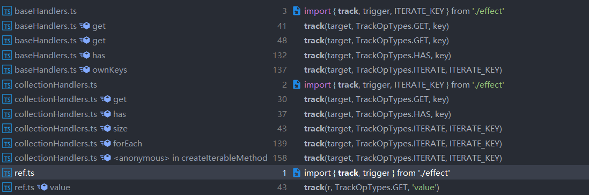
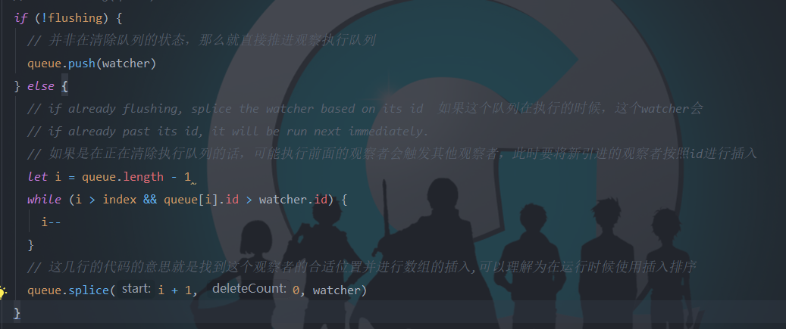

# 带你阅读Vue3.0响应式系统源码4-依赖绑定以及触发依赖的执行策略

## 主题：依赖绑定以及触发依赖的执行策略

ps：多代码预警，本节因为涉及到的流程重要代码比较多，所以贴出了核心代码。

### 1.代理对象和影响因子effect如何绑定？

​	上一篇文章讲的是响应型数据的诞生。而前面说过，响应数据的诞生和它绑定观察者是两回事。那么响应型对象和影响因子`effect`是如何进行绑定依赖的呢？下面来进行讲解：

#### 1）依赖添加（track函数）

1. 什么时候进行调用`track`方法？

   

   可以看到基本上都在`handlers`中进行调用，笔者对这些调用的方法进行追踪，发现调用者都在这里：

   - **baseHandlers.ts**：`get`、`has`、`ownKeys`代理拦截方法里面进行追踪。
   - **collectionHandlers.ts**：`get`、`has`、`size`、`forEach`、`iterator`方法里面进行追踪。
   - **ref.ts**：在`value`方法中，也就是求值方法。

   所以可以验证其那面的一句话：**在获取数据的地方进行依赖的绑定**。

2. 在`track`方法中做了什么事情呢？下面我们会对整个流程所有必要代码进行解释，前面说过不会是以所有代码来进行讲解，只会讲解关键代码。

   ```typescript
   /**
    * @description 追踪就是依赖的添加过程，相当于2.0的observer过程
    * @param target 代理对象
    * @param type 观察的类型，在开发环境中使用
    * @param key 想要被观察的属性，也就是effect函数中访问的对象的属性
    */
   export function track(target: object, type: TrackOpTypes, key: unknown) {
     // 如果不是在观察依赖添加时期或者当前没有活跃的effect的时候，不进行任何处理
     if (!shouldTrack || activeEffect === undefined) {
       return
     }
     // 接下来是进行构建targetMap的过程，详情可以查看附录2
     let depsMap = targetMap.get(target)
     if (depsMap === void 0) {
       targetMap.set(target, (depsMap = new Map()))
     }
     let dep = depsMap.get(key)
     if (dep === void 0) {
       depsMap.set(key, (dep = new Set()))
     }
   
     // 进行响应数据和effect的互相绑定，dep是一个Set数据结构，这个是进行去重操作
     if (!dep.has(activeEffect)) {
       dep.add(activeEffect)
       activeEffect.deps.push(dep)
       if (__DEV__ && activeEffect.options.onTrack) {
         activeEffect.options.onTrack({
           effect: activeEffect,
           target,
           type,
           key
         })
       }
     }
   }
   ```

   看完上面代码，我们会想要知道`shouldTrack`和`activeEffect`到底在什么时候进行：

   - `shouldTrack`：使用`pauseTrack`和`resumeTrack`进行修改`shouldTrack`，而这两个方法在哪里进行调用呢？

     ```typescript
     if (target.isUnmounted) {
         return
       }
       // disable tracking inside all lifecycle hooks
       // since they can potentially be called inside effects.
       pauseTracking()       // 退出观测模式模式
       // Set currentInstance during hook invocation.
       // This assumes the hook does not synchronously trigger other hooks, which
       // can only be false when the user does something really funky.
       setCurrentInstance(target)
       const res = callWithAsyncErrorHandling(hook, target, type, args)
       setCurrentInstance(null)
       resumeTracking()			// 进入观测模式
       return res
     })
     ```

     我们可以从代码和注释中了解到，在除了`Unmounted`生命周期钩子之外，在其他声明周期钩子函数调用期间不进行追踪操作。

   - `activeEffect`：在执行`effect`函数之前，会进行`effect`赋值给`activeEffect`（`effect`是一个带有属性的方法实例），在执行期间会进行依赖的绑定。

     ```typescript
     function run(effect: ReactiveEffect, fn: Function, args: unknown[]): unknown {
       if (!effect.active) {
         return fn(...args)
       }
       if (!effectStack.includes(effect)) {
         // 每次执行的时候会进行清空effect所包含的所有依赖，等到执行的时候会重新添加依赖，所以依赖的绑定是动态的
         cleanup(effect)
         try {
           // 进栈的原因是可能观察者之间的嵌套，可能一个计算属性有另外的计算属性，这里进行父子观察者之间的绑定
           effectStack.push(effect)
           activeEffect = effect
           return fn(...args)
         } finally {
           effectStack.pop()
           activeEffect = effectStack[effectStack.length - 1]
         }
       }
     }
     ```

   - 最后就进行依赖的`dep`和`activeEffect`的互相绑定。

3. 特殊情况：

   ​	计算属性最终是会处理成为数据属性，计算属性有两种定义方式：代理其他属性（不是`Proxy`，仅仅是引用其他属性）、一个方法。

   ​	对于代理其他属性我们不进行讨论，我们主要来讲一下当计算属性是一个方法时候是怎么进行处理的。而这个计算方法会处理成为一个`effect`函数，所以笔者将计算方法纳入观察者的类型中也是这个原因。

   ​	笔者想要讲的是当一个计算方法引用另外一个计算方法的时候，会怎么进行处理呢？具体可以看一下章节3的4.1部分的`trackChildRun`方法

### 2.影响因子effect的触发流程（trigger）

​	在前面进行讲解依赖的添加，现在进行讲解依赖的触发过程，触发影响因子的流程。

1. 什么时候触发执行？

   

   同样，都是在修改数据的时候进行触发。

2. 起点：一切影响因子的触发起点都是数据进行改变，在`trigger`函数里面进行搜集然后触发，下面是`trigger`函数的方法：

   ```typescript
   function trigger(
     target: object,
     type: TriggerOpTypes,
     key?: unknown,
     extraInfo?: DebuggerEventExtraInfo
   ) {
     const depsMap = targetMap.get(target)
     if (depsMap === void 0) {
       // never been tracked
       return
     }
     // 搜集要执行的影响因子，分开搜集是因为计算属性要先执行
     const effects = new Set<ReactiveEffect>()
     const computedRunners = new Set<ReactiveEffect>()
     if (type === TriggerOpTypes.CLEAR) {
       // collection being cleared, trigger all effects for target
       // 是清除操作的时候，先把所有属性添加在runner中，然后在执行runner前会清除KeyToDepSet里面的项，也就是进行解绑操作。整个流程后面会说
       depsMap.forEach(dep => {
         addRunners(effects, computedRunners, dep)
       })
     } else {
       // schedule runs for SET | ADD | DELETE
       if (key !== void 0) {
         addRunners(effects, computedRunners, depsMap.get(key))
       }
       // also run for iteration key on ADD | DELETE
       if (type === TriggerOpTypes.ADD || type === TriggerOpTypes.DELETE) {
   			// 在进行属性添加的时候，分成两种情况
         // 数组：数组的迭代、slice等其他方法都会在这个数组所对应的KeyToDepSet中的length属性的Set上添加依赖，修改到数组长度的时候会进行触发。
         // 容器：容器类型的迭代器是框架源码制定的，修改长度也会进行触发迭代的依赖
         const iterationKey = isArray(target) ? 'length' : ITERATE_KEY
         addRunners(effects, computedRunners, depsMap.get(iterationKey))
       }
     }
     const run = (effect: ReactiveEffect) => {
       scheduleRun(effect, target, type, key, extraInfo)
     }
     // Important: computed effects must be run first so that computed getters can be invalidated before any normal effects that depend on them are run.
     // 重要提示：必须先运行计算的效果，以便在运行依赖于它们的任何普通效果之前，使计算的dirty无效
     // 记住，js的forEach是个特例，是一个同步执行代码。
     computedRunners.forEach(run)
     effects.forEach(run)
   }
   ```

   `trigger`函数是进行跟数据绑定的所有依赖的搜集，搜集完毕直接执行依赖。初次看到这里，笔者也会疑惑：**Vue3.0**不准备使用队列来进行性能的提升了吗？其实不是，这是因为**Vue3.0**将观察者拆散了，重新定义了`effect`，是`Watcher`的精简版，执行策略是由创建者规定的，针对于三种观察者有三种执行策略，下一部分会进行讲解。阅读代码的时候会产生如下的问题：

   - 为什么会先进行计算因子的执行，然后再执行其他方法呢？

     这是因为在其他观察者中可能会对计算属性进行访问，也就是访问`getter`方法，如果计算属性在最后执行的话，会产生**数据与视图不一致问题**，也就是说读到脏数据。

     **Vue3.0**两个策略来防止读到脏数据：

     1. `computed`选项先行执行。
     2. `computed`使用**同步代码**进行执行：如果在`watch`选项中修改到`computed`数据，那么搜集完后会同步执行，所以下一个观察者进行执行的时候拿到了最新数据。

     

   - **Vue2.0**如何避免上述问题呢？

   - 按这么说，那**Vue2.0**是如何处理来避免读到脏数据呢？可以先阅读一下这篇文章：[从源码上看，Vue2.0每个生命周期钩子函数前都做了什么？](<https://juejin.im/post/5e243c826fb9a02fdc3a508b>) 中`created`生命周期钩子前处理选项的顺序。

     首先确定一下一共有几种观察者：

     - `computed`：在`created`生命周期钩子前，在`watch`之前处理。
     - `watch`：在`created`生命周期钩子前，但是在`computed`之后处理。
     - `render`函数：在`mounted`之前。

     那么处理顺序为`computed`->`watch`->`render`。那么这么做有什么意图吗？

     要知道`watcher`实例是有一个属性，叫做`id`（自增），有两种作用：

     - 显示区别不同`watcher`
     - **在观察者执行队列的时候按id顺序从小到大执行**！

     

     这是在执行队列前进行排序，如果执行队列的时候又触发了修改`watcher`，又是如何处理的呢？如下图

     

     在运行前和运行时候这两个策略，能够有效防止读到脏数据。

3. 依赖绑定的更新：

   在触发依赖的终点是用`effect`构建时候传进来的`scheduler`策略来执行`effect`，不过在之前会进行依赖的重新绑定操作。我们可以看到`effect.ts`中的`createReactiveEffect`方法：

   

   ```typescript
   function createReactiveEffect<T = any>(
     fn: () => T,
     options: ReactiveEffectOptions
   ): ReactiveEffect<T> {
     const effect = function reactiveEffect(...args: unknown[]): unknown {
       return run(effect, fn, args)  // 转到run函数，我们进行查看run函数
     } as ReactiveEffect
   	// code...
     return effect
   }
   
   function run(effect: ReactiveEffect, fn: Function, args: unknown[]): unknown {
     if (!effect.active) {
       return fn(...args)
     }
     if (!effectStack.includes(effect)) {
       // 每次执行的时候会进行清空effect所包含的所有依赖，等到执行的时候会重新添加依赖，所以这就是运行时候的动态修改依赖
       cleanup(effect)
       try {
         // 进栈的原因是可能这个观察者调用的时候会使用到另外一个观察者，也就是观察者的嵌套
         effectStack.push(effect)
         activeEffect = effect
         return fn(...args)
       } finally {
         effectStack.pop()
         activeEffect = effectStack[effectStack.length - 1]
       }
     }
   }
   ```

   ​	在执行观察者的回调前，需要先进行消除掉观察者的所有依赖，然后再进行执行`effect`函数进行重新绑定依赖。这是因为每次执行观察者的回调函数的时候，可能显示的数据属性修改了，那么就要**对不需要绑定的依赖进行解绑，对新的依赖进行绑定**。按照老规矩，我们将**Vue3.0**和**Vue2.0**进行对比：

   是否支持新增加属性的监听（未定义的）？

   - 2.0：不支持，是由机制决定的，一开始初始化选项的时候已经将所有数据进行变成响应式数据了。之后不会进行观测数据了，所以直接对对象进行添加新的下标的话，是不会进行绑定依赖操作的。不过2.0提供`vm.$set`这个API进行动态添加观测数据。

   - 3.0：支持，这是因为代理是对对象的所有属性进行统一处理（包括已定义和未定义的属性）。我们还是设定一个场景吧，在`data`选项中定义以下数据：

     ```typescript
     data() {
       return {
         a: {}
       };
     }
     ```

     但是我们在渲染函数访问了`a.b`属性，我们知道在2.0中就算给`a.b`属性进行赋值，也不会触发视图层响应的，但是在3.0是可以的。这是为什么呢？因为**2.0响应目标是对象的属性，而3.0响应目标是对象**。

     这么来想：我们可以把对象的**所有可能的并且未定义的**属性看做`undefined`，渲染函数访问了一个未定义的属性，此时会在全局的`KeyToDepSet`对象上添加了该属性的`Set`并且进行了依赖的绑定。

### 3.三种观察者的执行策略

​	**Vue**有三种观察者：`computed`、`watch`、`render`。触发三者的回调函数执行的策略是不同的。这是在创建`effect`的时候使用了**工厂模式和策略模式**，根据传进来的策略来决定执行策略。触发依赖进行执行函数的代码说明了：

```typescript
function scheduleRun(
  effect: ReactiveEffect,                 // 相当于watcher
  target: object,                         // 目标对象
  type: TriggerOpTypes,                   // 触发类型
  key: unknown,                           // 键值
  extraInfo?: DebuggerEventExtraInfo
) {
	// code...
  if (effect.options.scheduler !== void 0) {
    effect.options.scheduler(effect)
  } else {
    effect()
  }
}
```

那么这些`scheduler`有哪些呢？

1. 首先最接近的莫过于同目录下的`computed.ts`文件：

   ```typescript
   const runner = effect(getter, {
     lazy: true,
     // mark effect as computed so that it gets priority during trigger
     computed: true,
     scheduler: () => {
       dirty = true
     }
   })
   ```

   很容易理解，`dirty`相当于一个开关作用，下次访问数据的时候进行更新值。

2. `render`函数的策略是什么呢？在`runtime-core/renderer.ts`文件的`setupRenderEffect`这个方法中的执执行`effect`的第二个参数：`prodEffectOptions`，很简单一句代码：

   ```typescript
   const prodEffectOptions = {
     scheduler: queueJob
   }
   ```

   所以对于渲染函数采用的是**Vue2.0**的执行队列模式，而执行队列的话是跟**Vue2.0**一致，不过它并没有考虑不兼容`Promise`对象的浏览器。

3. 接下来比较重要的一点是对`watch`选项的处理方式的讲解：

   我们长话短说，还是贴出关键代码，我们先看一下`watch`选项的接口声明：

   ```typescript
   export interface WatchOptions {
     lazy?: boolean
     flush?: 'pre' | 'post' | 'sync'   // 定义了三种类型的执行方式
     deep?: boolean
     onTrack?: ReactiveEffectOptions['onTrack']
     onTrigger?: ReactiveEffectOptions['onTrigger']
   }
   ```

   我们可以知道`watch`有三种执行方式，接下来对这三种方式进行讲解，首先贴出代码：

   ```typescript
   const invoke = (fn: Function) => fn()
   // code
   
   let scheduler: (job: () => any) => void
   if (flush === 'sync') {
     scheduler = invoke
   } else if (flush === 'pre') {
     scheduler = job => {
       if (!instance || instance.vnode.el != null) {
         queueJob(job)
       } else {
         // with 'pre' option, the first call must happen before
         // the component is mounted so it is called synchronously.
         job()
       }
     }
   } else {
     scheduler = job => {
       queuePostRenderEffect(job, suspense)
     }
   }
   ```

   - `sync`：同步，也就是和`computed`处理方式一致，触发依赖后直接同步执行。
   - `pre`：

### 4.小结