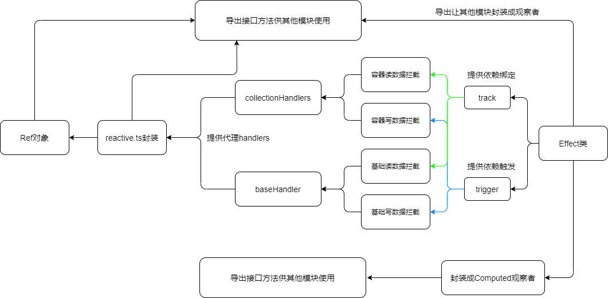

# 带你阅读Vue3.0响应式系统源码5-总结

### 1.整个响应式系统的架构

#### 1）整体的文件结构

```json
baseHandlers.ts         		// 基础型对象代理handlers
collectionHandlers.ts				// 容器型对象代理handlers
computed.ts									// 计算选项处理，由于computed选项最后会处理成为一个响应式数据
effect.ts										// 影响因子处理文件
index.ts									
lock.ts											// 锁操作
operations.ts								// 定义getter、setter操作枚举类
reactive.ts									// 响应式接口封装文件
ref.ts											// ref对象
```

#### 2）在代码组织上是怎么样的？

1. 辅助类代码：`operations.ts`、`lock.ts`并没有业务逻辑，一些常量或者状态的存储，主要是为`handlers`服务。
2. 影响因子`Effect`：`effect.ts`，提供`Effect`实例，`effect`实例观察者和数据之间互相绑定的桥梁。
3. 响应对象的代理方法处理：`baseHandlers.ts`（处理`Object`、`Array`）、`collectionHandlers.ts`(处理容器`Map`、`WeakMap`、`Set`、`WeakSet`)，这两个文件为`reactive.ts`里面的构建响应型对象提供`handler`。
4. 响应型对象的生成：`reactive.ts`提供可读可写、只读、浅代理只读三种代理方式的接口。
5. `ref`对象是在`reactive`方法上面封装的一层，给用户接口定义响应型数据。
6. `computed`是在`effect`的基础上进行构建的一类观察者，最后处理成数据。



### 2.整个系统的注意点

#### 1）数据代理

1. `Proxy`代理是不会对原生数据进行任何处理，处理数据的时候需要用到`Reflect`反射。
2. 用户拿到的数据永远是代理后的数据，但是框架内部有时候需要用到原生数据，所以需要有`WeakMap`结构去维持关系；实际上代理数据父子关系之间的转换需要通过对象的数据来进行转换，但是一般代码上不会提现到。
3. 对数据的代理是利用懒代理方式，这样能够把数据代理的负担分配到`Vue`实例对象整个生命周期中，可以减少初始化时间。
4. 代理关系以及原生对象和代理对象的转换`Map`是使用闭包进行存储，用户访问不到。

#### 2）响应过程

1. `Effect`在初始化的时候，如果不是`lazy`类型的话，会顺便进行执行，此时的目的是进行依赖的添加。
2. `Effect`实例在进行执行的时候，会先将该实例所绑定的数据进行解绑，再在执行的时候进行绑定。这样做的目的就是为了对**新添加进来的属性进行监听，对已经除去的属性进行解绑**。
3. `Effect`的执行不再只是使用微观队列进行执行，而有更多的选择，可以由创建实例者进行决定。

#### 3）依赖关系存储结构

1. 依赖关系的构建是在全局中不断构建起来的，这是由懒代理决定的。
2. 具体的构建过程请查看附录2