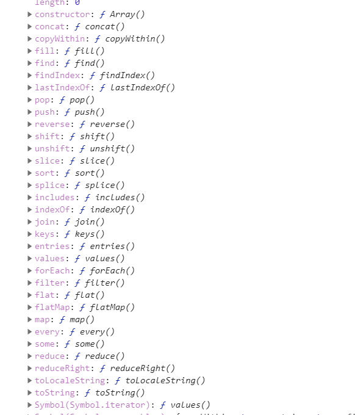

# Vue3.0代理如何对数组的原生方法进行观察（选读）

### 前言

在本文章学习之前，你需要掌握的内容有：

- `Proxy`
- `Reflect`

### 1.ES6数组的原生方法有哪些？

**ES6**数组的操作的原生方法有如下：



**Vue3.0**相比于**Vue2.0**支持的观察的数组的原生方法更多，并且不需要通过写特定的方法来进行支持，对数组原生方法的观测可以合并到对数组下标、对象属性的响应代码里面。这是什么原理呢？这篇文章就来给你们揭秘！

### 2.数组的代理对象一些有趣的现象

首先，我们要明确两个点：

- 对数组的操作的拦截一共要拦截两个操作：`getter`操作和`setter`操作。
- 访问数组的方法在代理中需要拦截什么操作？答案是`getter`，因为方法也是对象的一个属性，对对象属性进行获取的时候，就是触发`getter`操作。

下面我写一个特别简单的对数组进行代理的`handler`。

```javascript
let handler = {
  get(target, key, receiver) {
  	console.log('get操作', key);
    return Reflect.get(target, key);
  },
  set(target, key, value, receiver) {
  	console.log('set操作', key, value);
    return Reflect.set(target, key, value);
  }
};
```

然后我们创建一个数组的代理对象，并且调用`push`方法：

```js
let proxyArray = new Proxy([1, 2, 3], handler);
proxyArray.push(4);

// get操作 push
// get操作 length
// set操作 3 4
// set操作 length 4
```

从上面可以看出以下几个点：

- `push`操作是引用了当前对象的上下文，即`this`或者代理对象`proxyArray`，而不是引用原生对象的上下文。
- 代理的对象是有上下文的，并且和原生对象不同，所以它也是一个实例类型，只不过内容是代理了原生对象。

会出现上面打印的内容的原因很简单，下面进行解释：

调用`push`的时候，`push`方法会执行以下步骤

1. 首先要知道下一个下标，所以需要拿到`proxyArray.length`(访问了`getter`)
2. 将下一个下标进行设定值`proxyArray[proxyArray.length] = 4`
3. `proxyArray.length`自增

以上就是**`push`**代码里面执行的步骤，如果使用原生数组来用`push`方法的时候也是这么操作的，虽然`push`代码是`native code`，但是这些是可以推导出来的。

### 3.以一个例子来说明Vue3.0是如何进行数组原生对象的数据绑定（重点）

​	我们还是要设定一个具体的场景：在一个渲染函数中，使用了`forEach`这个方法，整一个依赖的添加和数据响应的流程是怎么样子的呢？

​	我们先抛开源码，先思考下面的问题

#### 1）明确使用forEach的目的

一般使用`forEach`就是为了遍历数组，进行显示数组的所有值。触发的时机就有以下情况：

- 对数组已有的内容进行写操作，修改了显示的内容，需要进行重新渲染
- 对数组进行扩容或者缩小，即修改了数组的`length`属性，需要进行渲染

#### 2）依赖添加以及触发的条件

我们还是用上面的代理数组执行以下`forEach`方法看看结果：

```js
proxyArray.forEach(item => item);

// get操作 forEach
// get操作 length
// get操作 0
// get操作 1
// get操作 2
```

可以看出在使用`forEach`的时候会进行添加三种属性的依赖：

- `forEach`：一般是不会用`setter`方法进行添加的，但是能不能过滤掉呢？当然是不行的，要是用户重写了代理数据的`forEach`方法，那么就会触发渲染函数重新执行新的`forEach`方法。
- `length`：当用户对数组进行多种操作的时候，比如`push`、`pop`等都会修改到`length`属性，那么就会进行触发渲染函数重新渲染。
- 修改`index`：这个不用多说，这也就是`Vue3.0`支持修改下标后响应数据的实现。

#### 3）框架源码测试代码进行测试想法

为了验证我们的想法，我们在**reactivity**目录下编写测试代码（如下），通过了测试：

```js
it('Test Array forEach func', function() {
    const rawArray = [1, 2, 3];
    // @ts-ignore
    const proxyArray = reactive(rawArray);
    resumeTracking();
    const runner = effect(() => {
      proxyArray.forEach(item => item);
    });

    const isUndef = (tar) => {
      return typeof tar === 'undefined' || tar === null;
    }

    const isDef = (tar) => !isUndef(tar);

    expect(targetMap.get(rawArray).size === 5).toBeTruthy();

    expect(isDef(targetMap.get(rawArray).get('forEach'))).toBeTruthy();

    expect(isDef(targetMap.get(rawArray).get('length'))).toBeTruthy();

    expect(isDef(targetMap.get(rawArray).get('0'))).toBeTruthy();

    expect(isDef(targetMap.get(rawArray).get('1'))).toBeTruthy();

    expect(isDef(targetMap.get(rawArray).get('2'))).toBeTruthy();

    expect(targetMap.get(rawArray).get('forEach').has(runner)).toBeTruthy();

    expect(targetMap.get(rawArray).get('length').has(runner)).toBeTruthy();

    expect(targetMap.get(rawArray).get('0').has(runner)).toBeTruthy();

    expect(targetMap.get(rawArray).get('1').has(runner)).toBeTruthy();

    expect(targetMap.get(rawArray).get('2').has(runner)).toBeTruthy();
  })
```

所以验证了我们的想法是正确的。

#### 4）如果添加了一个新的元素到数组里面，那么如何给它添加依赖呢？

答：`effect`在每次执行的时候，都会使用到`getter`方法（为了获取数据），而框架在每次执行effect之前，会把`effect`相关的依赖清除掉，然后执行的时候再次添加。

### 4.includes、indexOf、lastIndexOf特殊例子

在源码中，有这么一段代码：

```typescript
const arrayIdentityInstrumentations: Record<string, Function> = {};
['includes', 'indexOf', 'lastIndexOf'].forEach(key => {
  arrayIdentityInstrumentations[key] = function(
    value: unknown,
    ...args: any[]
  ): any {
    // 得到对象的原生模式然后执行原生的方法
    return toRaw(this)[key](toRaw(value), ...args)
  }
});
```

首先把这些方法拿出来后会产生什么影响呢？

要想回答这个问题，我们想目光转向标题2（数组代理的有趣现象）中的`push`例子的结论中，在代理对象执行数组的方法中，会访问到代理对象的上下文（`this`）。执行`push`方法的时候如果访问到代理对象其他属性的时候会触发代理拦截，**进行添加依赖**。

而这里却返回原生对象的执行结果，这样做的意图是不想要触发上面三个方法的访问数组属性的时候（**代理不会对原生对象进行任何处理**，所以返回原生对象的执行结果的时候是不会进行依赖的添加的）。

再配上`getter`拦截方法就可以明显知道框架源码的意图了。

```typescript
function createGetter(isReadonly = false, shallow = false) {
  return function get(target: object, key: string | symbol, receiver: object) {
    // 这个的操作是减少不必要的依赖添加，访问includes的时候，会拦截到  includes、length、0 -> 目标下标
    // 这里转向原生对象的操作是为了避免依赖的添加
    if (isArray(target) && hasOwn(arrayIdentityInstrumentations, key)) {
      return Reflect.get(arrayIdentityInstrumentations, key, receiver)
    }
		// 如果是数组里面的方法的话，是不会执行到这里的，所以连方法的依赖也没有添加，所以作者明显就是不想要监听这几种方法
    // code...
    track(target, TrackOpTypes.GET, key)   // 追踪，进行依赖的添加
    // code...
  }
}
```

### 5.小结

- **ES6**的拦截层可以自动处理数组的方法，是由方法决定的。
- `indexOf`、`includes`、`lastIndexOf`三个方法是不会被监听的。

