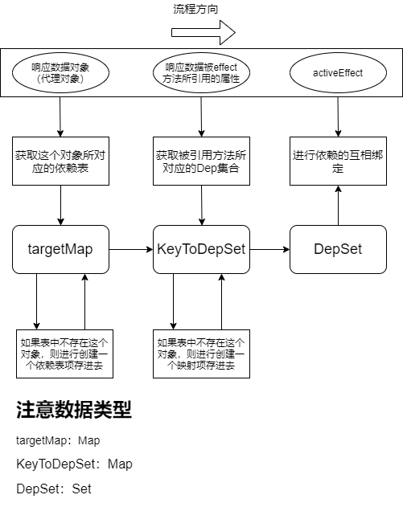
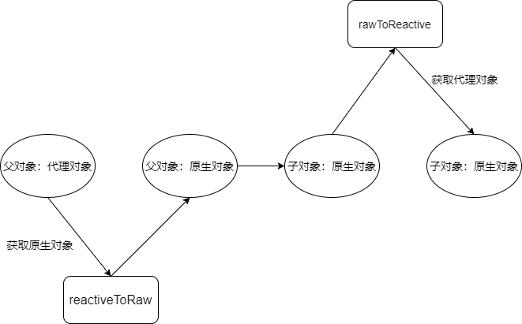

# Vue3.0响应数据对象的构建过程（必读）

### 1.数据与影响因子Effect互相绑定的存储结构（targetMap）

- 构建代码

  ```typescript
  /**
   * @description 追踪就是依赖的添加过程，相当于2.0的observer过程
   * @param target 代理对象
   * @param type 观察的类型，在开发环境中使用
   * @param key 想要被观察的属性，也就是effect函数中访问的对象的属性
   */
  function track(target: object, type: TrackOpTypes, key: unknown) {
    if (!shouldTrack || activeEffect === undefined) {
      return
    }
    let depsMap = targetMap.get(target)
    if (depsMap === void 0) {
      targetMap.set(target, (depsMap = new Map()))
    }
    let dep = depsMap.get(key)
    if (dep === void 0) {
      depsMap.set(key, (dep = new Set()))
    }
  
    if (!dep.has(activeEffect)) {
      dep.add(activeEffect)
      activeEffect.deps.push(dep)
      if (__DEV__ && activeEffect.options.onTrack) {
        activeEffect.options.onTrack({
          effect: activeEffect,
          target,
          type,
          key
        })
      }
    }
  }
  ```

- 进行构建流程分析

  

通过阅读代码以及流程图，我们可以很清楚地了解到以下情况：

- `targetMap`并不是一蹴而就的，**而是通过依赖的绑定不断地构建起来的**。也就是说在网页运行当中，这个`targetMap`会被不断进行维护，所以它是一个全局的对象。
- **Vue3.0**和**Vue2.0**的一个特别明显的区别是3.0的数据响应系统是在**数据层与用户层之间做一层隔离层，用户层只能通过这层隔离层去访问数据。**这是由代理决定的，代理是不会对原生对象进行任何处理的。
- 由于不会对原生对象进行任何处理，**Vue3.0**中进行存储依赖关系是不会存在对象的属性上，而是通过一个**闭包变量的方式进行存储**（`targetMap`直接声明在一个`ts`文件，最后会处理成一个闭包）（详情可以了解一下模块化是如何进行处理的），所以一般程序员是不能够查询这个数据的具体情况，在某种程度上具有安全性。

### 2.响应型数据和原生数据的互相转换结构

- 首先看一下存储结构：

  ```typescript
  // WeakMaps that store {raw <-> observed} pairs.
  export const rawToReactive = new WeakMap<any, any>()
  export const reactiveToRaw = new WeakMap<any, any>()
  export const rawToReadonly = new WeakMap<any, any>()
  export const readonlyToRaw = new WeakMap<any, any>()
  ```

  使用表结构进行存储对应的关系，便于在执行的时候进行对象的互相查询转换。为什么要用`WeakMap`来存储对应的关系呢？笔者通过阅读代码后得出以下结论：

  - 用户拿到的数据永远是代理后的数据，但是框架内部方法大部分使用的是原生对象，所以需要有某种数据结构来进行存储这层关系。
  - 使用`WeakMap`的原因：这几个`WeakMap`在整个程序运行期间只有增加没有回收操作。如果使用普通的`Map`，那么在不断加入对象的情况下，**会造成弃用对象的无法被GC回收**。

- 再看**Vue3.0**框架中父子对象之间的关系：

  - 原生对象：原生对象的父子关系是通过对象的属性来维持的。

  - 代理对象：代理对象的数据域是原生对象，它本身是没有数据的。那么它是如何进行父子关系的维持呢？**Vue3.0**是这么处理的：

    

同样，这四个对象也是一个闭包数据，所以用户也是无法直接访问到的。