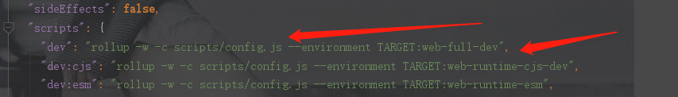
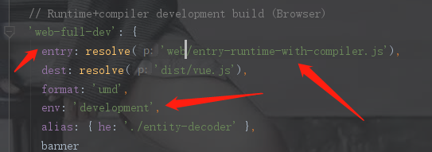

# Vue构造函数

## 入口

​	依照Vue技术内幕，以命令npm run dev为入口，根据程序运行的顺序进行阅读Vue源码，首先看一下项目的入口在哪里。先看一下package.json文件，找到dev命令函，进行查看。如下图



发现是在scripts/config.js文件里面是作为这个命令的入口，那么我们顺着这条路看到这个命令，如下图



entry就是入口的位置，dest就是编译后目的地址。那么这个路径到底是从哪里开始的，我们先看一下同目录下的配置文件，可以看到如下代码：

```js
const path = require('path')

const resolve = p => path.resolve(__dirname, '../', p)

module.exports = {
  vue: resolve('src/platforms/web/entry-runtime-with-compiler'),
  compiler: resolve('src/compiler'),
  core: resolve('src/core'),
  shared: resolve('src/shared'),
  web: resolve('src/platforms/web'),
  weex: resolve('src/platforms/weex'),
  server: resolve('src/server'),
  sfc: resolve('src/sfc')
}
```

有这么一句代码代表着web的路径

```js
  web: resolve('src/platforms/web'),
```

## 入口初始化

我们就顺着这个路径找到了这个文件，我们对这个文件从头到尾进行代码的查看吧，首先看到一个函数

```js
const idToTemplate = cached(id => {
  const el = query(id)
  return el && el.innerHTML
})
```

这个字面意思就是通过id找到对应的template，cached这个函数可以通过一层层寻找从而在shared/utils.js中找到，代码如下：

```js
/**
 * Create a cached version of a pure function.
 * // 创建一个闭包缓存
 */
export function cached<F: Function> (fn: F): F {
  const cache = Object.create(null)
  return (function cachedFn (str: string) {
    const hit = cache[str]
    return hit || (cache[str] = fn(str))
  }: any)
}
```

怎么去看待这个函数呢，首先它创建了一个cache对象，这个对象然后返回一个调用这个对象函数，其实这个就是相当于一个闭包，通过闭包的方式进行创建cache散列表缓存，并且返回一个方法进行访问这个散列表对象。而这个返回的函数就是进行读取操作，如果没有的话就进行写入再读取。读取fn执行结果并进行缓存，如果下次需要读取的时候就不需要进行调用函数，减少计算量，这就是缓存的作用。

那么在这个idToTemplate中的作用是什么呢？我们先看一个这个query函数。

这个query就是通过id进行查询查找到所对应的元素，我们可以学习他们这个写法，这事一种设计模式，jq经常会用到：

```js
/**
 * Query an element selector if it's not an element already.
 * 查询这个元el是不是一个字符串（#.开头的），如果是的话就进行查询，如果不是的话就返回
 */
export function query (el: string | Element): Element {
  if (typeof el === 'string') {
    const selected = document.querySelector(el)
    if (!selected) {
      process.env.NODE_ENV !== 'production' && warn(
        'Cannot find element: ' + el
      )
      return document.createElement('div')
    }
    return selected
  } else {
    return el
  }
}
```

这个query就是通过id字符串寻找dom节点，其实也就是getElement的作用，不同的是这个函数内部进行了处理。

那么总体来看这个idToTemplate函数的作用就是寻找id所在的dom对象，并且创建缓存，方便下次进行访问。

接下来可以看到Vue对象的声明挂载函数mount，但是我们会发现有一个Vue对象，这个对象是怎么出生的呢？如果我们不知道Vue对象，那么对下面的代码就可能有一些理解不了的地方，那么我们先转到Vue对象进行讨论。

## Vue对象的诞生

我们先顺着路径找一下，最后在src/core/instance/index.js找到了Vue函数的出生，我们看一下这个文件吧

```js
import { initMixin } from './init'
import { stateMixin } from './state'
import { renderMixin } from './render'
import { eventsMixin } from './events'
import { lifecycleMixin } from './lifecycle'
import { warn } from '../util/index'

function Vue (options) {
  if (process.env.NODE_ENV !== 'production' &&
    !(this instanceof Vue)
  ) {
    warn('Vue is a constructor and should be called with the `new` keyword')
  }
  this._init(options)
}

initMixin(Vue)
stateMixin(Vue)
eventsMixin(Vue)
lifecycleMixin(Vue)
renderMixin(Vue)

export default Vue

```

这个Vue对象利用了混入模式，那么我们需要一个一个将方法进行混入到Vue对象中，这个Vue方法没有什么好解释的，我们从上到下先从initMixin方法看起，可以看到这个文件的内容。

```js
let uid = 0  // 这个是Vue对象的id，递增

export function initMixin (Vue: Class<Component>) {
  Vue.prototype._init = function (options?: Object) {
    const vm: Component = this  
    // a uid
    vm._uid = uid++ // 递增

    let startTag, endTag
    /* istanbul ignore if */
    if (process.env.NODE_ENV !== 'production' && config.performance && mark) {
      startTag = `vue-perf-start:${vm._uid}`
      endTag = `vue-perf-end:${vm._uid}`
      mark(startTag)
    }

    // a flag to avoid this being observed
    vm._isVue = true
    // merge options
    if (options && options._isComponent) {  // 内部的component组件是已经初始完毕了，所以不需要重新来进行组件的合并
      // optimize internal component instantiation
      // since dynamic options merging is pretty slow, and none of the
      // internal component options needs special treatment.
      initInternalComponent(vm, options)
    } else {
      vm.$options = mergeOptions(
        resolveConstructorOptions(vm.constructor),
        options || {},
        vm
      )
    }
    /* istanbul ignore else */
    if (process.env.NODE_ENV !== 'production') {
      initProxy(vm)
    } else {
      vm._renderProxy = vm
    }
    // expose real self
    vm._self = vm
    initLifecycle(vm)
    initEvents(vm)
    initRender(vm)
    callHook(vm, 'beforeCreate')
    initInjections(vm) // resolve injections before data/props
    initState(vm)
    initProvide(vm) // resolve provide after data/props
    callHook(vm, 'created')

    /* istanbul ignore if */
    if (process.env.NODE_ENV !== 'production' && config.performance && mark) {
      vm._name = formatComponentName(vm, false)
      mark(endTag)
      measure(`vue ${vm._name} init`, startTag, endTag)
    }

    if (vm.$options.el) {
      vm.$mount(vm.$options.el)
    }
  }

```


```js
const mount = Vue.prototype.$mount
Vue.prototype.$mount = function (
  el?: string | Element,  // 参数可能是一个元素的名字或一个元素
  hydrating?: boolean  // 这个先放着
): Component {
  el = el && query(el)  // 获得对应的元素

  /* istanbul ignore if */
  if (el === document.body || el === document.documentElement) {
    // 不用过多解释，就是不能挂载到文档或者body上面
    process.env.NODE_ENV !== 'production' && warn(
      `Do not mount Vue to <html> or <body> - mount to normal elements instead.`
    )
    return this
  }

  const options = this.$options
  // resolve template/el and convert to render function
  // 将模板转为渲染内容的作用
  if (!options.render) {
    let template = options.template
    if (template) {
      if (typeof template === 'string') {
        if (template.charAt(0) === '#') {
          template = idToTemplate(template)  // 找到ID所对应的template
          /* istanbul ignore if */
          if (process.env.NODE_ENV !== 'production' && !template) {
            warn(
              `Template element not found or is empty: ${options.template}`,
              this
            )
          }
        }
      } else if (template.nodeType) {
        // 这个说明这个template是一个dom节点，所以直接使用，记住这里用到了template的innerHtml，返回去看一下idToTemplate是否也是返回了innerHTML
        template = template.innerHTML
      } else {
        if (process.env.NODE_ENV !== 'production') {
          warn('invalid template option:' + template, this)
        }
        return this
      }
    } else if (el) {
      template = getOuterHTML(el)
    }
    if (template) {
      /* istanbul ignore if */
      if (process.env.NODE_ENV !== 'production' && config.performance && mark) {
        mark('compile')
      }

      const { render, staticRenderFns } = compileToFunctions(template, {
        outputSourceRange: process.env.NODE_ENV !== 'production',
        shouldDecodeNewlines,
        shouldDecodeNewlinesForHref,
        delimiters: options.delimiters,
        comments: options.comments
      }, this)
      options.render = render
      options.staticRenderFns = staticRenderFns

      /* istanbul ignore if */
      if (process.env.NODE_ENV !== 'production' && config.performance && mark) {
        mark('compile end')
        measure(`vue ${this._name} compile`, 'compile', 'compile end')
      }
    }
  }
  return mount.call(this, el, hydrating)
}
```

