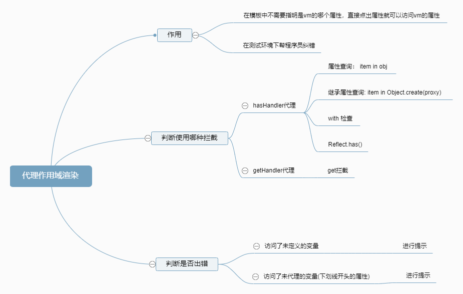

# Vue的初始化之开篇

从上一篇文章上面我们了解到了Vue选项的合并策略。合并完选项后，我们也就看完了以下的代码。

```JS
vm.$options = mergeOptions(
  resolveConstructorOptions(vm.constructor),
  options || {},
  vm
)
```

这段代码让我们花了一大个篇幅，也就是像这段代码的含义一样，进行选项的合并。

我们接着继续看吧。

### 1. 渲染函数作用域代理

我们就接着来看一下`instance/init.js`里面的代码吧，我们看完了选项合并，那么接下来看到了下面这段代码

```js
if (process.env.NODE_ENV !== 'production') {
  initProxy(vm)
} else {
  vm._renderProxy = vm
}
```

这段代码的逻辑很简单。在生产环境下直接将`_renderProxy`属性赋值为vm，在非生产环境下就调用`initProxy`这个方法。我们可以跟着这个方法的名字猜测以下这个方法的作用可能是增加初始化的拦截，在开发阶段就发现错误，然后在生产阶段就不会有错误。

那么我们就进入到这个方法里面来，看看它到底做了什么？

```js
initProxy = function initProxy (vm) {
    if (hasProxy) {
      // determine which proxy handler to use
      const options = vm.$options
      const handlers = options.render && options.render._withStripped
        ? getHandler
        : hasHandler
      vm._renderProxy = new Proxy(vm, handlers)
    } else {
      vm._renderProxy = vm
    }
  }
```

我们可以看到这段代码，这就是`initProxy`方法的内容，我们进行分析一下。

```js
if (hasProxy) {
	// ...
}
```

我们首先会看到这个代码块，这个代码块很简单，就是判断浏览器中是否自带原生的Proxy这个方法。我们也可以在这个instance/proxy.js中进行查找到`hasProxy`这个变量。如下代码块：

```js
const hasProxy =
      typeof Proxy !== 'undefined' && isNative(Proxy)
    
export function isNative (Ctor: any): boolean {
  return typeof Ctor === 'function' && /native code/.test(Ctor.toString())
}
```

上面的代码块的逻辑很简单，就是判断以下这个浏览器是否支持Proxy。

看完这个的话，我们不去看`initProxy`方法里面的代码，我们先来看一下这个文件里面其他的方法吧。

```js
const allowedGlobals = makeMap(
    'Infinity,undefined,NaN,isFinite,isNaN,' +
    'parseFloat,parseInt,decodeURI,decodeURIComponent,encodeURI,encodeURIComponent,' +
    'Math,Number,Date,Array,Object,Boolean,String,RegExp,Map,Set,JSON,Intl,' +
    'require' // for Webpack/Browserify
  )
```

`makeMap`函数的作用我这里可以直接说是生成一个散列表，用来判断一个对象中是否存在特定属性的键值。而这个`allowedGlobals`就是检测是否存在全局变量全局变量。

接下来看到这个

```js
const warnNonPresent = (target, key) => {
    warn(
      `Property or method "${key}" is not defined on the instance but ` +
      'referenced during render. Make sure that this property is reactive, ' +
      'either in the data option, or for class-based components, by ' +
      'initializing the property. ' +
      'See: https://vuejs.org/v2/guide/reactivity.html#Declaring-Reactive-Properties.',
      target
    )
  }
```

这个就是报错，如果**你访问了一个未定义的变量，这个就是进行报错**以下是一个小例子来说明：

```js
const vm = new Vue({
    el: '#app',
    template: '<div>{{a}}</div>',
    data: {
        test: 1
    }
})
```

大家注意，在模板中我们使用 `a`，但是在 `data` 属性中并没有定义这个属性，这个时候我们可以得到报错信息。

```js
const warnReservedPrefix = (target, key) => {
    warn(
      `Property "${key}" must be accessed with "$data.${key}" because ` +
      'properties starting with "$" or "_" are not proxied in the Vue instance to ' +
      'prevent conflicts with Vue internals' +
      'See: https://vuejs.org/v2/api/#data',
      target
    )
  }
```

提示你使用`$data.key`去访问以`$`或者`_`开头的变量，而不是直接用`this.key`去访问变量。

```js
if (hasProxy) {
    const isBuiltInModifier = makeMap('stop,prevent,self,ctrl,shift,alt,meta,exact')
    config.keyCodes = new Proxy(config.keyCodes, {
      set (target, key, value) {
        if (isBuiltInModifier(key)) {
          warn(`Avoid overwriting built-in modifier in config.keyCodes: .${key}`)
          return false
        } else {
          target[key] = value
          return true
        }
      }
    })
  }
```

上面的代码的话。判断是否有原声的拦截层，如果有的话就进行大括号里面的代码，如果没有的话就不进行任何操作。

```js
const isBuiltInModifier = makeMap('stop,prevent,self,ctrl,shift,alt,meta,exact')
```

上面的代码首先检测宿主环境是否支持 `Proxy`，如果支持的话才会执行里面的代码，内部的代码首先使用 `makeMap` 函数生成一个 `isBuiltInModifier` 函数，该函数用来检测给定的值是否是内置的事件修饰符，我们知道在 `Vue` 中我们可以使用事件修饰符很方便地做一些工作，比如阻止默认事件等。

然后为 `config.keyCodes` 设置了 `set` 代理，其目的是防止开发者在自定义键位别名的时候，覆盖了内置的修饰符，比如：

```js
Vue.config.keyCodes.shift = 16
```

由于 `shift` 是内置的修饰符，所以上面这句代码将会得到警告。

接下来我们可以看到这个方法

```js
const hasHandler = {
    has (target, key) {
      const has = key in target   // 判断target中是否有该键值
      const isAllowed = allowedGlobals(key) ||
        (typeof key === 'string' && key.charAt(0) === '_' && !(key in target.$data))  // 这个键值是一个以_开头的字符串并且不在data中
      if (!has && !isAllowed) {
        // 进行报错
        if (key in target.$data) warnReservedPrefix(target, key)  // 使用$data属性去访问，因为未代理$或者_开头的属性
        else warnNonPresent(target, key)    // 使用了没有进行配置的属性
      }
      return has || !isAllowed
    }
  }
```

 上面的代码就是进行拦截的内容，其中

```js
const has = key in target   // 判断target中是否有该键值
const isAllowed = allowedGlobals(key) ||
      (typeof key === 'string' && key.charAt(0) === '_' && !(key in target.$data)) 
```

是进行判断是否有这个键值以及这个键值的内容是否是以`_`开头的。接下来就是对这个属性是否存在与vm这个对象中进行判断并且进行报错。

到这里很多人会有疑惑了，`hasHandler`是用来干什么的呢？其实，是在开发环境下，对开发者代码进行检测，如果你使用了未曾定义的属性或者使用了没有被代理的属性，肯定会进行提示并且纠正错误。这里很明确告诉你们，这个handler是用来设置为vm的拦截层（Proxy）的，那么这个has的拦截层可以拦截程序员的什么操作呢？！

我这里是假设你们已经知道了Proxy的用法了。

`has` 可以拦截以下操作：

- 属性查询: `foo in proxy`
- 继承属性查询: `foo in Object.create(proxy)`
- `with` 检查: `with(proxy) { (foo); }`
- `Reflect.has()`

这些都是has方法可以拦截的内容，但是has方法并不能够拦截对象的get方法，那么接下来就有一个对get方法进行拦截的handler

```js
const getHandler = {
    get (target, key) {
      if (typeof key === 'string' && !(key in target)) {
        if (key in target.$data) warnReservedPrefix(target, key)
        else warnNonPresent(target, key)
      }
      return target[key]
    }
  }
```

这里的逻辑也是很简单的，我就不进行解释了，它的作用就是拦截一下属性的get方法，比如a['a']、a.a这两个用法都会被拦截。

我们看完了这个文件的方法后，再回头看一下这个`initProxy`这个方法吧

```js
  initProxy = function initProxy (vm) {
    if (hasProxy) {
      // determine which proxy handler to use
      const options = vm.$options
      const handlers = options.render && options.render._withStripped
        ? getHandler
        : hasHandler
      vm._renderProxy = new Proxy(vm, handlers)
    } else {
      vm._renderProxy = vm
    }
  }
```

首先进行判断是否存在原生的拦截`Proxy`这个对象，如果有的话就进行设置拦截层，如果没有的话就直接赋值为vm。

在这里的前提是假如你已经学会了ES6的`Proxy`这个对象，那么我们继续往下探讨。

```js
const handlers = options.render && options.render._withStripped
        ? getHandler
        : hasHandler
```

如果`options.render`或者`options.render._withStripped`存在，就用`getHander`，否则就用到`hasHandler`方法。

那么`options.render`是什么呢？

大家可能比较疑惑的是为什么会这样，其实我们后面讲到渲染函数的时候你自然就知道了，不过现在大家可以先看一下，打开 `core/instance/render.js` 文件，找到 `Vue.prototype._render` 方法，里面有这样的代码：

```js
vnode = render.call(vm._renderProxy, vm.$createElement)
```

可以发现，调用 `render` 函数的时候，使用 `call` 方法指定了函数的执行环境为 `vm._renderProxy`，渲染函数长成什么样呢？还是以上面的例子为例，我们可以通过打印 `vm.$options.render` 查看，所以它长成这样：

```js
vm.$options.render = function () {
    // render 函数的 this 指向实例的 _renderProxy
    with(this){
        return _c('div', [_v(_s(a))])   // 在这里访问 a，相当于访问 vm._renderProxy.a
    }
}
```

从上面的代码可以发现，显然函数使用 `with` 语句块指定了内部代码的执行环境为 `this`，由于 `render` 函数调用的时候使用 `call` 指定了其 `this` 指向为 `vm._renderProxy`，所以 `with` 语句块内代码的执行环境就是 `vm._renderProxy`，所以在 `with` 语句块内访问 `a` 就相当于访问 `vm._renderProxy` 的 `a` 属性，前面我们提到过 `with` 语句块内访问变量将会被 `Proxy` 的 `has` 代理所拦截，所以自然就执行了 `has` 函数内的代码。最终通过 `warnNonPresent` 打印警告信息给我们，所以这个代理的作用就是为了在开发阶段给我们一个友好而准确的提示。

这里的render就是将模板里面的html标签进行渲染，然后作用域设为vm。这就是为什么你可以在模板中直接调用这个vue对象的属性了。如下面：

```js
const vm = new Vue({
    el: '#app',
    template: '<div>{{test}}</div>',
    data: {
        test: 1
    }
})
// 1
```

`with`的作用就是延长作用域链，并且将当前的默认作用域设为`this`。所以模板中访问的内容就是`vm._renderProxy.test`而`_renderProxy`就是我们这节所说的作用域代理，如果你是生产环境，则直接使用`vm`。否则会判断是否有拦截对象，如果有则进行拦截，如果没有的话也是设为vm。这也就是这节的内容。

总结：



1. 在渲染的时候会进行作用域代理，以至于在模板中可以使用`vm`对象的属性，而不需要指出是哪个对象
2. 如果是测试环境下并且具有原生的proxy，会帮开发者发现代理中的错误并且进行提示，减少开发者的测试成本。

### 2. 初始化之initLifCycle

接下来代码来到这里

```js
vm._self = vm
initLifecycle(vm)
```

知名见义，这个方法就是初始化生命周期的，我们来看一下这个`initLifecycle`的代码吧。

```js
export function initLifecycle (vm: Component) {
  const options = vm.$options

  // locate first non-abstract parent
  let parent = options.parent  	// 下面是寻找第一个不是抽象类的父组件
  if (parent && !options.abstract) {
    while (parent.$options.abstract && parent.$parent) {
      parent = parent.$parent
    }
    parent.$children.push(vm)  // 将这个vm对象推进去第一个非抽象的父组件
  }

  vm.$parent = parent  	// 将vm直接指向这个父类
  vm.$root = parent ? parent.$root : vm  	// 将root设为父类的$root
	// 进行生命周期的初始化值
  vm.$children = []
  vm.$refs = {}

  vm._watcher = null
  vm._inactive = null
  vm._directInactive = false
  vm._isMounted = false
  vm._isDestroyed = false
  vm._isBeingDestroyed = false
}
```

上面的代码看了是不是一头雾水，第一个不是抽象类的父组件到底是哪里来的呢？我们举个例子吧。

```js
// 子组件本身并没有指定 parent 选项
var ChildComponent = {
  created () {
    // 但是在子组件中访问父实例，能够找到正确的父实例引用
    console.log(this.$options.parent)
  }
}

var vm = new Vue({
    el: '#app',
    components: {
      // 注册组件
      ChildComponent
    },
    data: {
        test: 1
    }
})
```

子组件中并没有指出parent是谁，但是能够访问父组件，那么上面寻找非抽象的第一个父组件就是上面的父组件。

那么什么是抽象组件，我们一般的组件都是具象的组件，而且vue对象也不会暴露出来抽象与否的组件。抽象组件是不会真实地渲染在dom树上的。下面是定义一个抽象组件的代码：

````js
AbsComponents = {
  abstract: true,
  created () {
    console.log('我是一个抽象的组件')
  }
}
````

Vue中自带有全局抽象组件比如说keep-alive这个组件，虽然它并没有渲染，也没有出现在组件的父子关系中，但是它们也有很大的作用的。

总结：在initLifecycle中是先寻找第一个非抽象的父组件，然后进行父子组件关系的联系。而忽略到其中的所有的抽象组件，但是不代表这些抽象组件是没有什么作用的。（它们只是不会渲染到页面上）。

### 3.initEvent

接下来是事件的初始化：

```js
export function initEvents (vm: Component) {
  // 初始化事件
  vm._events = Object.create(null)
  // 初始化是否有事件钩子
  vm._hasHookEvent = false
  // init parent attached events
  const listeners = vm.$options._parentListeners  // 将父组件的事件赋值到这里
  if (listeners) {
    updateComponentListeners(vm, listeners)
  }
}
```

这里首先对vm事件散列表进行创建初始化对象，并且初始化是否有是否有钩子事件。

并且将父组件的监听事件都储存起来，然后如果有监听事件的话就调用函数。

```js
export function updateComponentListeners (
  vm: Component,
  listeners: Object,
  oldListeners: ?Object
) {
  target = vm
  updateListeners(listeners, oldListeners || {}, add, remove, createOnceHandler, vm)
  target = undefined
}
```

上面的逻辑语句只有三条，然后第一个和第三个感觉有点矛盾？那我们先放着不看，先看一下第二条方法的内容吧。

第二条方法引用到`add` `remove` `createOnceHandler` 这三个方法，那么我们先来看一下这三个方法的内容和作用吧。

```js
let target: any

function add (event, fn) {
  target.$on(event, fn)
}

function remove (event, fn) {
  target.$off(event, fn)
}

function createOnceHandler (event, fn) {
  const _target = target
  return function onceHandler () {
    const res = fn.apply(null, arguments)
    if (res !== null) {
      _target.$off(event, onceHandler)
    }
  }
}
```

```js
target = vm
```

由上面的代码我们可以知道这个target就是vm，最终也会是vm。那么我们可以从原型链上面进行查找这个`$on`方法到底长什么样子。(要涉及到eventMixin)

```js
export function eventsMixin (Vue: Class<Component>) {
  const hookRE = /^hook:/
  Vue.prototype.$on = function (event: string | Array<string>, fn: Function): Component {
    const vm: Component = this
    if (Array.isArray(event)) {
      for (let i = 0, l = event.length; i < l; i++) {
        vm.$on(event[i], fn)
      }
    } else {
      (vm._events[event] || (vm._events[event] = [])).push(fn)
      // optimize hook:event cost by using a boolean flag marked at registration
      // instead of a hash lookup
      if (hookRE.test(event)) {
        vm._hasHookEvent = true
      }
    }
    return vm
  }

  Vue.prototype.$once = function (event: string, fn: Function): Component {
    const vm: Component = this
    function on () {
      vm.$off(event, on)
      fn.apply(vm, arguments)
    }
    on.fn = fn
    vm.$on(event, on)
    return vm
  }

  Vue.prototype.$off = function (event?: string | Array<string>, fn?: Function): Component {
    const vm: Component = this
    // all
    if (!arguments.length) {
      vm._events = Object.create(null)
      return vm
    }
    // array of events
    if (Array.isArray(event)) {
      for (let i = 0, l = event.length; i < l; i++) {
        vm.$off(event[i], fn)
      }
      return vm
    }
    // specific event
    const cbs = vm._events[event]
    if (!cbs) {
      return vm
    }
    if (!fn) {
      vm._events[event] = null
      return vm
    }
    // specific handler
    let cb
    let i = cbs.length
    while (i--) {
      cb = cbs[i]
      if (cb === fn || cb.fn === fn) {
        cbs.splice(i, 1)
        break
      }
    }
    return vm
  }
```

其中我们只需要看两个Vue原型上面的方法

```js
Vue.prototype.$on = function (event: string | Array<string>, fn: Function): Component {
    const vm: Component = this
    if (Array.isArray(event)) {
      // 如果是一个数组的话，递归调用
      for (let i = 0, l = event.length; i < l; i++) {
        vm.$on(event[i], fn)
      }
    } else {
      // 如果vm的事件列表存在的话，那么就将回调函数推进去，如果不存在的话就初始化并且将回调函数推进去
      (vm._events[event] || (vm._events[event] = [])).push(fn)
      // optimize hook:event cost by using a boolean flag marked at registration
      // instead of a hash lookup
      if (hookRE.test(event)) {
        // 判断这个事件是否有钩子，如果有的话就进行标志
        vm._hasHookEvent = true
      }
    }
    return vm
  }
```

简单来说，上面的$on方法就是一个事件挂载机制，你可以理解为dom2级事件，把回调函数都放到这个散列表的某个属性数组中。

```js
Vue.prototype.$off = function (event?: string | Array<string>, fn?: Function): Component {
  	// 记住这个event如果是数组的话，是各种事件名
    const vm: Component = this
    // 如果参数长度为0，将vm_events赋值为对象
    if (!arguments.length) {
      vm._events = Object.create(null)  // 这个的操作就是去除这个vue对象的所有事件监听回调函数
      return vm
    }
    // array of events		
    if (Array.isArray(event)) {
      for (let i = 0, l = event.length; i < l; i++) {
        vm.$off(event[i], fn)	// 递归调用该函数
      }
      return vm
    }
    // specific event
    const cbs = vm._events[event]	// 获取散列表中的事件handler函数
    if (!cbs) {
      // 如果没有绑定事件的话就不进行任何操作
      return vm
    }
    if (!fn) {
      // 如果没有回调函数的话，将该值赋为空指针。说明是要将对于这个事件的监听的所有函数进行去除
      vm._events[event] = null
      return vm
    }
    // specific handler
    let cb
    let i = cbs.length
    while (i--) {
      // 查询找到的事件，进行去除
      cb = cbs[i]
      if (cb === fn || cb.fn === fn) {
        cbs.splice(i, 1)
        break
      }
    }
    return vm
  }
```

上面的逻辑已经讲得很清楚了。这个函数的思想我们可以学习一下，这个函数就是js进行写的一个表现。如何理解这段代码呢？我分成以下几点：

1. 当传入一个事件类型数组的时候，这个函数的作用就是进行遍历这个事件类型数组并且再次调用自己。
2. 当传入的是一个事件类型的话，如果取消的回调函数存在，那么就进行查询vm中绑定的事件。
   1. 如果vm的这个事件类型并没有绑定事件，不进行任何操作
   2. 如果vm中有这个事件类型的话，进行取消绑定操作该函数操作
3. 当传入的是一个事件类型，但是没有传入取消函数的话，取消vm上该类型的所有事件
4. 如果没有传入参数的话，说明想要取消所有事件，那么就直接换个事件对象就行了。

接下来是`$once`这个方法，我们阅读以下代码

```js
function createOnceHandler (event, fn) {
  const _target = target
  return function onceHandler () {
    const res = fn.apply(null, arguments)
    if (res !== null) {
      _target.$off(event, onceHandler)
    }
  }
}
```

很容易理解，事件监听了，返回一个回调函数是执行一次就进行取消的事件。而且这里是一个闭包，大家要记住，虽然刚刚那串代码

```js
export function updateComponentListeners (
  vm: Component,
  listeners: Object,
  oldListeners: ?Object
) {
  target = vm
  // ...
  target = undefined
}
```

虽然执行完毕后会将target取消掉，但是闭包的存在，这个vm会被`_target`所指向，也就是说如果你不执行，那么这个事件会一直被记住，内存永远不会释放。

到这里`$on`和`$off`和`onceHandler`我们已经阅读完毕了，那么接下来呢，我们就看会刚刚的`updateListeners`方法到底是怎么一回事。

```js
export function updateListeners (
  on: Object,  // 父组件的监听事件
  oldOn: Object,	// {}
  add: Function,	// 
  remove: Function,
  createOnceHandler: Function,
  vm: Component
) {
  let name, def, cur, old, event	// 定义变量
  for (name in on) {	// 遍历vm所有的事件类型
    def = cur = on[name]	// 提取事件类型的所有绑定函数（有可能是函数数组也有可能是函数）
    old = oldOn[name]	// 提取旧的事件绑定
    event = normalizeEvent(name)	// 规格化事件
    /* istanbul ignore if */
    if (__WEEX__ && isPlainObject(def)) {  // 如果这个
      cur = def.handler
      event.params = def.params
    }
    if (isUndef(cur)) {
      // 如果当前事件的undefined的，进行报错
      process.env.NODE_ENV !== 'production' && warn(
        `Invalid handler for event "${event.name}": got ` + String(cur),
        vm
      )
    } else if (isUndef(old)) {
      // 如果老的事件是undefined的，则
      if (isUndef(cur.fns)) {
        cur = on[name] = createFnInvoker(cur, vm)
      }
      if (isTrue(event.once)) {
        cur = on[name] = createOnceHandler(event.name, cur, event.capture)
      }
      add(event.name, cur, event.capture, event.passive, event.params)
    } else if (cur !== old) {
      // 如果事件是旧事件，那么旧的对象事件就要进行更新
      old.fns = cur
      on[name] = old
    }
  }
  for (name in oldOn) {
    if (isUndef(on[name])) {
      event = normalizeEvent(name)
      remove(event.name, oldOn[name], event.capture)
    }
  }
}
```

```js
const normalizeEvent = cached((name: string): {
  name: string,
  once: boolean,
  capture: boolean,
  passive: boolean,
  handler?: Function,
  params?: Array<any>
} => {
  const passive = name.charAt(0) === '&'
  name = passive ? name.slice(1) : name
  const once = name.charAt(0) === '~' // Prefixed last, checked first
  name = once ? name.slice(1) : name
  const capture = name.charAt(0) === '!'
  name = capture ? name.slice(1) : name
  return {
    name,
    once,
    capture,
    passive
  }
})
// 格式化就是将事件名称前缀去掉
```

### 4.initRender

在 `initEvents` 的下面，执行的是 `initRender` 函数，该函数来自于 `core/instance/render.js` 文件，我们打开这个文件找到 `initRender` 函数，如下：

```js
export function initRender (vm: Component) {
  vm._vnode = null // the root of the child tree
  vm._staticTrees = null // v-once cached trees
  const options = vm.$options
  const parentVnode = vm.$vnode = options._parentVnode // the placeholder node in parent tree
  const renderContext = parentVnode && parentVnode.context
  vm.$slots = resolveSlots(options._renderChildren, renderContext)
  vm.$scopedSlots = emptyObject
  // bind the createElement fn to this instance
  // so that we get proper render context inside it.
  // args order: tag, data, children, normalizationType, alwaysNormalize
  // internal version is used by render functions compiled from templates
  vm._c = (a, b, c, d) => createElement(vm, a, b, c, d, false)
  // normalization is always applied for the public version, used in
  // user-written render functions.
  vm.$createElement = (a, b, c, d) => createElement(vm, a, b, c, d, true)

  // $attrs & $listeners are exposed for easier HOC creation.
  // they need to be reactive so that HOCs using them are always updated
  const parentData = parentVnode && parentVnode.data

  /* istanbul ignore else */
  if (process.env.NODE_ENV !== 'production') {
    defineReactive(vm, '$attrs', parentData && parentData.attrs || emptyObject, () => {
      !isUpdatingChildComponent && warn(`$attrs is readonly.`, vm)
    }, true)
    defineReactive(vm, '$listeners', options._parentListeners || emptyObject, () => {
      !isUpdatingChildComponent && warn(`$listeners is readonly.`, vm)
    }, true)
  } else {
    defineReactive(vm, '$attrs', parentData && parentData.attrs || emptyObject, null, true)
    defineReactive(vm, '$listeners', options._parentListeners || emptyObject, null, true)
  }
}
```

慢慢来，先看前两段代码

```js
vm._vnode = null // the root of the child tree
vm._staticTrees = null // v-once cached trees
```

这个两个属性都被赋值为空指针，它们会在合适的地方被赋值并使用，到时候我们再讲其作用，现在我们暂且不介绍这两个属性的作用，你只要知道这两句话仅仅是在当前实例对象上添加了两个属性就行了。

接着是这么一段代码：

```js
const options = vm.$options
const parentVnode = vm.$vnode = options._parentVnode // the placeholder node in parent tree
const renderContext = parentVnode && parentVnode.context
vm.$slots = resolveSlots(options._renderChildren, renderContext)
vm.$scopedSlots = emptyObject
```

上面这段代码从表面上看很复杂，可以明确地告诉大家，如果你看懂了上面这段代码就意味着你已经知道了 `Vue` 是如何解析并处理 `slot` 的了。由于上面这段代码涉及内部选项比较多如：`options._parentVnode`、`options._renderChildren` 甚至 `parentVnode.context`，这些内容牵扯的东西比较多，现在大家对 `Vue` 的储备还不够，所以我们会在本节的最后阶段补讲，那个时候相信大家理解起来要容易多了。

不讲归不讲，但是有一些事儿还是要讲清楚的，比如上面这段代码无论它处理的是什么内容，其结果都是在 `Vue` 当前实例对象上添加了三个实例属性：

```js
vm.$vnode
vm.$slots
vm.$scopedSlots
```

再往下是这段代码：

```js
// bind the createElement fn to this instance
// so that we get proper render context inside it.
// args order: tag, data, children, normalizationType, alwaysNormalize
// internal version is used by render functions compiled from templates
vm._c = (a, b, c, d) => createElement(vm, a, b, c, d, false)	// 函数封装
// normalization is always applied for the public version, used in
// user-written render functions.
vm.$createElement = (a, b, c, d) => createElement(vm, a, b, c, d, true)
```

这段代码在 `Vue` 实例对象上添加了两个方法：`vm._c` 和 `vm.$createElement`，这两个方法实际上是对内部函数 `createElement` 的包装。其中 `vm.$createElement` 相信手写过渲染函数的同学都比较熟悉，如下代码：

```js
render: function (createElement) {
  return createElement('h2', 'Title')
}
```

我们知道，渲染函数的第一个参数是 `createElement` 函数，该函数用来创建虚拟节点，实际上你也完全可以这么做：

```js
render: function () {
  return this.$createElement('h2', 'Title')
}
```

上面两段代码是完全等价的。而对于 `vm._c` 方法，则用于编译器根据模板字符串生成的渲染函数的。`vm._c` 和 `vm.$createElement` 的不同之处就在于调用 `createElement` 函数时传递的第六个参数不同，至于这么做的原因，我们放到后面讲解。有一点需要注意，即 `$createElement` 看上去像对外暴露的接口，但其实文档上并没有体现。

再往下，就是 `initRender` 函数的最后一段代码了：

```js
// $attrs & $listeners are exposed for easier HOC creation.
// they need to be reactive so that HOCs using them are always updated
const parentData = parentVnode && parentVnode.data

/* istanbul ignore else */
if (process.env.NODE_ENV !== 'production') {
  defineReactive(vm, '$attrs', parentData && parentData.attrs || emptyObject, () => {
    !isUpdatingChildComponent && warn(`$attrs is readonly.`, vm)
  }, true)
  defineReactive(vm, '$listeners', options._parentListeners || emptyObject, () => {
    !isUpdatingChildComponent && warn(`$listeners is readonly.`, vm)
  }, true)
} else {
  defineReactive(vm, '$attrs', parentData && parentData.attrs || emptyObject, null, true)
  defineReactive(vm, '$listeners', options._parentListeners || emptyObject, null, true)
}
```

上面的代码主要作用就是在 `Vue` 实例对象上定义两个属性：`vm.$attrs` 以及 `vm.$listeners`。这两个属性在 `Vue` 的文档中是有说明的，由于这两个属性的存在使得在 `Vue` 中创建高阶组件变得更容易，感兴趣的同学可以阅读 [探索Vue高阶组件](http://caibaojian.com/vue-design/more/vue-hoc.html)。

我们注意到，在为实例对象定义 `$attrs` 属性和 `$listeners` 属性时，使用了 `defineReactive` 函数，该函数的作用就是为一个对象定义响应式的属性，所以 `$attrs` 和 `$listeners` 这两个属性是响应式的，至于 `defineReactive` 函数的讲解，我们会放到 `Vue` 的响应系统中讲解。

另外，上面的代码中有一个对环境的判断，在非生产环境中调用 `defineReactive` 函数时传递的第四个参数是一个函数，实际上这个函数是一个自定义的 `setter`，这个 `setter` 会在你设置 `$attrs` 或 `$listeners` 属性时触发并执行。以 `$attrs` 属性为例，当你试图设置该属性时，会执行该函数：

```js
() => {
  !isUpdatingChildComponent && warn(`$attrs is readonly.`, vm)
}
```

可以看到，当 `!isUpdatingChildComponent` 成立时，会提示你 `$attrs` 是只读属性，你不应该手动设置它的值。同样的，对于 `$listeners` 属性也做了这样的处理。

这里使用到了 `isUpdatingChildComponent` 变量，根据引用关系，该变量来自于 `lifecycle.js` 文件，打开 `lifecycle.js` 文件，可以发现有三个地方使用了这个变量：

```js
// 定义 isUpdatingChildComponent，并初始化为 false
export let isUpdatingChildComponent: boolean = false

// 省略中间代码 ...

export function updateChildComponent (
  vm: Component,
  propsData: ?Object,
  listeners: ?Object,
  parentVnode: MountedComponentVNode,
  renderChildren: ?Array<VNode>
) {
  if (process.env.NODE_ENV !== 'production') {
    isUpdatingChildComponent = true
  }

  // 省略中间代码 ...

  // update $attrs and $listeners hash
  // these are also reactive so they may trigger child update if the child
  // used them during render
  vm.$attrs = parentVnode.data.attrs || emptyObject
  vm.$listeners = listeners || emptyObject

  // 省略中间代码 ...

  if (process.env.NODE_ENV !== 'production') {
    isUpdatingChildComponent = false
  }
}
```

上面代码是简化后的，可以发现 `isUpdatingChildComponent` 初始值为 `false`，只有当 `updateChildComponent` 函数开始执行的时候会被更新为 `true`，当 `updateChildComponent` 执行结束时又将 `isUpdatingChildComponent` 的值还原为 `false`，这是因为 `updateChildComponent` 函数需要更新实例对象的 `$attrs` 和 `$listeners` 属性，所以此时是不需要提示 `$attrs` 和 `$listeners` 是只读属性的。

最后，对于大家来讲，现在了解这些知识就足够了，至于 `$attrs` 和 `$listeners` 这两个属性的值到底是什么，等我们讲解虚拟DOM的时候再回来说明，这样大家更容易理解。

##    