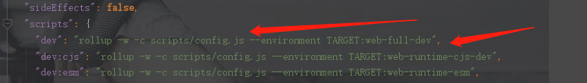
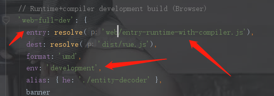
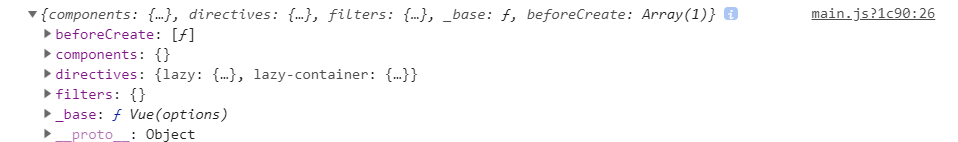
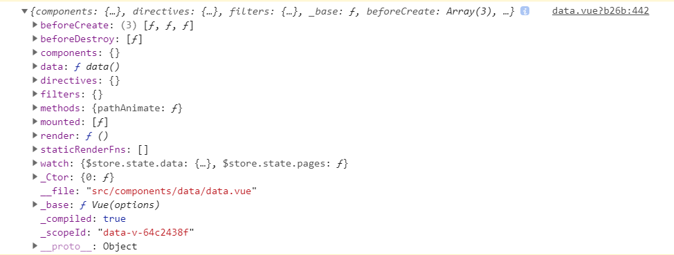
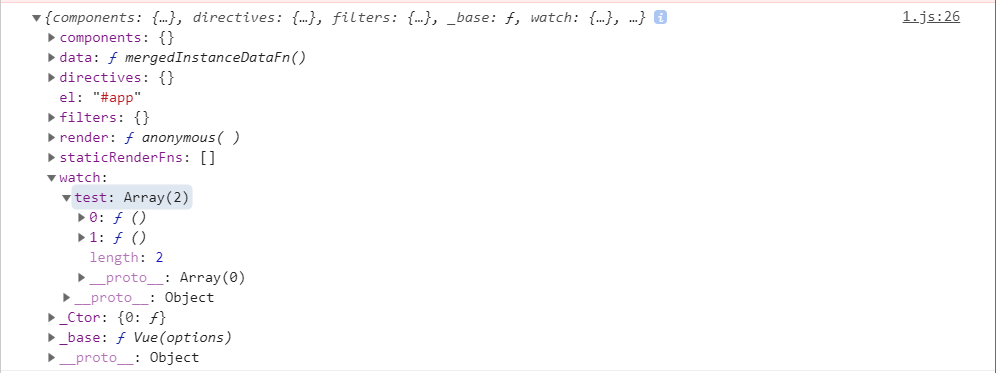
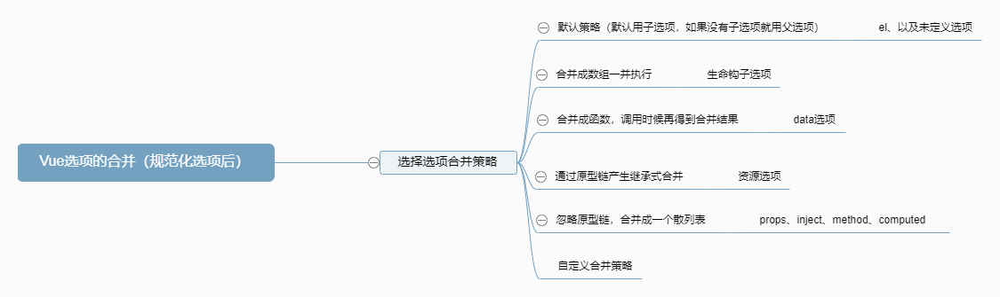

# Vue构造函数

## 入口

​	依照Vue技术内幕，以命令npm run dev为入口，根据程序运行的顺序进行阅读Vue源码，首先看一下项目的入口在哪里。先看一下package.json文件，找到dev命令函，进行查看。如下图



发现是在scripts/config.js文件里面是作为这个命令的入口，那么我们顺着这条路看到这个命令，如下图



entry就是入口的位置，dest就是编译后目的地址。那么这个路径到底是从哪里开始的，我们先看一下同目录下的配置文件，可以看到如下代码：

```js
const path = require('path')

const resolve = p => path.resolve(__dirname, '../', p)

module.exports = {
  vue: resolve('src/platforms/web/entry-runtime-with-compiler'),
  compiler: resolve('src/compiler'),
  core: resolve('src/core'),
  shared: resolve('src/shared'),
  web: resolve('src/platforms/web'),
  weex: resolve('src/platforms/weex'),
  server: resolve('src/server'),
  sfc: resolve('src/sfc')
}
```

有这么一句代码代表着web的路径，我们可以跟着这条路径找到这个入口处

```js
  web: resolve('src/platforms/web'),
```

## 入口初始化

我们就顺着这个路径找到了这个文件，我们对这个文件从头到尾进行代码的查看吧，首先看到一个函数

```js
const idToTemplate = cached(id => {
  const el = query(id)
  return el && el.innerHTML
})
```

这个字面意思就是通过id找到对应的template，cached这个函数可以通过一层层寻找从而在shared/utils.js中找到，代码如下：

```js
/**
 * Create a cached version of a pure function.
 * // 创建一个闭包缓存
 */
export function cached<F: Function> (fn: F): F {
  const cache = Object.create(null)
  return (function cachedFn (str: string) {
    const hit = cache[str]
    return hit || (cache[str] = fn(str))
  }: any)
}
```

怎么去看待这个函数呢，首先它创建了一个cache对象，这个对象然后返回一个调用这个对象函数，其实这个就是一个闭包，通过闭包的方式进行创建cache散列表缓存，并且返回一个方法进行访问这个散列表对象。而这个返回的函数就是进行读取操作，如果没有的话就进行写入再读取。读取fn执行结果并进行缓存，如果下次需要读取的时候就不需要进行调用函数，减少计算量，这就是缓存的作用。

那么在这个idToTemplate中的作用是什么呢？我们先看一个这个query函数。

这个query就是通过id进行查询查找到所对应的元素，我们可以学习他们这个写法，这事一种设计模式，jq经常会用到：

```js
/**
 * Query an element selector if it's not an element already.
 * 查询这个元el是不是一个字符串（#.开头的），如果是的话就进行查询，如果不是的话就返回
 */
export function query (el: string | Element): Element {
  if (typeof el === 'string') {
    const selected = document.querySelector(el)
    if (!selected) {
      process.env.NODE_ENV !== 'production' && warn(
        'Cannot find element: ' + el
      )
      return document.createElement('div')
    }
    return selected
  } else {
    return el
  }
}
```

这个query就是通过id字符串寻找dom节点，其实也就是getElement的作用，不同的是这个函数内部进行了处理。

那么总体来看这个idToTemplate函数的作用就是寻找id所在的dom对象，并且创建缓存，方便下次进行访问。

接下来可以看到Vue对象的声明挂载函数mount，但是我们会发现有一个Vue对象，这个对象是怎么出生的呢？如果我们不知道Vue对象，那么对下面的代码就可能有一些理解不了的地方，那么我们先转到Vue对象进行讨论。

## Vue对象的诞生

我们先顺着路径找一下，最后在src/core/instance/index.js找到了Vue函数的出生，我们看一下这个文件吧

```js
import { initMixin } from './init'
import { stateMixin } from './state'
import { renderMixin } from './render'
import { eventsMixin } from './events'
import { lifecycleMixin } from './lifecycle'
import { warn } from '../util/index'

function Vue (options) {
  if (process.env.NODE_ENV !== 'production' &&
    !(this instanceof Vue)
  ) {
    warn('Vue is a constructor and should be called with the `new` keyword')
  }
  this._init(options)
}

initMixin(Vue) 
stateMixin(Vue)
eventsMixin(Vue)
lifecycleMixin(Vue)
renderMixin(Vue)

export default Vue
```

我们现在以一个新创建的Vue对象为线索进行探讨吧！

```js
new Vue({
  el: '#app',
  components: { App },
  template: '<App/>'
})
```

这个Vue对象利用了混入模式，如果学习了JavaScript设计模式的同学就很清楚，如果还没有学习过的同学不要紧，可以先去看一下混入模式的作用。简单来说，混入模式就是将一些方法。属性等混入到一类对象中，在进行创建对象实例的时候将这些属性方法混入到对象中，提高代码的重复利用率。

注意：我们这个教程探讨的是vue对象，如果用vue-cli的话，每个组件其实是一个vue实例，而不是一个app.vue实例的组件。

### initMixin混入

#### 混入_init方法

```js
let uid = 0  // 这个是Vue对象的id，递增。

export function initMixin (Vue: Class<Component>) {
  Vue.prototype._init = function (options?: Object) {
    const vm: Component = this  
    // a uid
    vm._uid = uid++ // 递增

    let startTag, endTag
    /* istanbul ignore if */
    if (process.env.NODE_ENV !== 'production' && config.performance && mark) {
      startTag = `vue-perf-start:${vm._uid}`
      endTag = `vue-perf-end:${vm._uid}`
      mark(startTag)
    }

    // a flag to avoid this being observed
    vm._isVue = true
    // merge options
    if (options && options._isComponent) {  // 内部的component组件是已经初始完毕了，所以不需要重新来进行组件的合并
      // optimize internal component instantiation
      // since dynamic options merging is pretty slow, and none of the
      // internal component options needs special treatment.
      initInternalComponent(vm, options)
    } else {
      // 如果这个选项并不是组件的话，那么要对这个选项进行合并
      vm.$options = mergeOptions(
        resolveConstructorOptions(vm.constructor),
        options || {},
        vm
      )
    }
  }

```

上面提到的options其实就是我们在编辑代码中的method、props、component等等内容,根据Vue的文档来看，这些内容的话，编辑者是可以通过多种方式来进行输入的。（比如说components可以用数组、对象进行表示）。但是程序的话，必须通过某一种特定方式进行操作，那么需要这个选项的合并，将这些选项合并成特定的格式。

我们从上面代码的20行看起，先看看这个initInternalComponent看起：

```js
export function initInternalComponent (vm: Component, options: InternalComponentOptions) {
  const opts = vm.$options = Object.create(vm.constructor.options)  // 根据vm构造器，即（Vue函数）的原型上面的options进行构造
  // doing this because it's faster than dynamic enumeration.
  const parentVnode = options._parentVnode
  opts.parent = options.parent
  opts._parentVnode = parentVnode

  const vnodeComponentOptions = parentVnode.componentOptions
  opts.propsData = vnodeComponentOptions.propsData
  opts._parentListeners = vnodeComponentOptions.listeners
  opts._renderChildren = vnodeComponentOptions.children
  opts._componentTag = vnodeComponentOptions.tag

  if (options.render) {
    opts.render = options.render
    opts.staticRenderFns = options.staticRenderFns
  }
}
// 我并不是很理解这一段代码的意思。
```

看完上面的代码后，我们先看下面

```js
vm.$options = mergeOptions(
  resolveConstructorOptions(vm.constructor),
  options || {},
  vm
)	// 合并选项有三个参数，第一个是处理一下构造器选项，第二个是选项内容，第三个是虚拟对象
```

先看一下第一个参数的处理过程是怎么样的吧！

```js
export function resolveConstructorOptions (Ctor: Class<Component>) {
  let options = Ctor.options  // Ctor是Vue的构造函数，一般来说是，但是如果通过Vue.extend方法继承的时候，就不是Vue的构造函数
  if (Ctor.super) {
    // 当用Vue.extend方法时候，产生了子类，对子类进行创建的时候会执行这一步
    const superOptions = resolveConstructorOptions(Ctor.super)  // 得到Vue的options
    const cachedSuperOptions = Ctor.superOptions
    if (superOptions !== cachedSuperOptions) {
      // 判断是否对继承的子类进行修改
      // super option changed,
      // need to resolve new options.
      Ctor.superOptions = superOptions
      // check if there are any late-modified/attached options (#4976)
      const modifiedOptions = resolveModifiedOptions(Ctor)  // 将修改选项进行挑出来可
      // update base extend options
      if (modifiedOptions) {	// 进行合并
        extend(Ctor.extendOptions, modifiedOptions)
      }
      options = Ctor.options = mergeOptions(superOptions, Ctor.extendOptions)
      if (options.name) {
        options.components[options.name] = Ctor
      }
    }
  }
  return options  // 返回options选项。
}
```

如果以我们现在的例子来看的话，是直接跳过上面的判断语句的。返回的就是构造器的options。

返回的是构造器的options，那么构造器的options是什么呢，我们可以对Vue构造器的options进行打印，如下：

（因为在获取vm.options的时候，我们并没有对vm.constructor.options进行操作，所以可以直接用Vue.constructor.options查看）



这个是在Vue构造函数中直接打印出来的（这个也就是mergeOptions中的第一个参数），这些很多都是空的。上面的一些方法是vue自带的方法。然后我们可以看到下面一个vue实例的构造器的options选项，可以看出很大区别。



这个mergeOption的结果，所以这个mergeOptions作用就是合并这些选项。

所以根据我们的例子，将选项合并这个可以看做是如下的代码：

```js
vm.$options = mergeOptions(
  // resolveConstructorOptions(vm.constructor)
  {
    components: {},
    directives:{},
    filters: Object.create(null),
    _base: Vue
  },
  // options || {}
  {
    el: '#app',
    components: { App },
    template: '<App/>'
  },
  vm
)
```

我们现在的进度是已经知道了mergeOption的三个参数是什么了，那我们看一下这个方法的内部吧。

#### 选项的合并

```js
export function mergeOptions (
  parent: Object,
  child: Object,
  vm?: Component
): Object {
  if (process.env.NODE_ENV !== 'production') {
    checkComponents(child)  // 测试环境下检测选项
  }

  if (typeof child === 'function') {
    child = child.options  // 想一下什么options是函数呢，只有Vue.extend继承出来的对象
  }

  normalizeProps(child, vm)  // 规范化传参
  normalizeInject(child, vm)	// 规范化inject
  normalizeDirectives(child)	// 规范化directives

  // Apply extends and mixins on the child options,
  // but only if it is a raw options object that isn't
  // the result of another mergeOptions call.
  // Only merged options has the _base property.
  if (!child._base) {
    if (child.extends) {
      parent = mergeOptions(parent, child.extends, vm)
    }
    if (child.mixins) {
      for (let i = 0, l = child.mixins.length; i < l; i++) {
        parent = mergeOptions(parent, child.mixins[i], vm)
      }
    }
  }

  const options = {}
  let key
  for (key in parent) {
    mergeField(key)
  }
  for (key in child) {
    if (!hasOwn(parent, key)) {
      mergeField(key)
    }
  }
  function mergeField (key) {
    const strat = strats[key] || defaultStrat
    options[key] = strat(parent[key], child[key], vm, key)
  }
  return options
}
```

```js
  normalizeProps(child, vm)  // 规范化传参
  normalizeInject(child, vm)	// 规范化inject
  normalizeDirectives(child)	// 规范化directives
```

我们首先会看到将选项进行规范化，什么是选项规范化呢？！先看看props的两种表现形式

```js
props: ['id'],
props: {
  id: {
    type: Number,
    default: 0
  }
}
```

这个props会有两种表现形式，那边这个规范化就是将这两种表现形式变成代码能够了解的形式。我们先看一下normalizeProps

```js
function normalizeProps (options: Object, vm: ?Component) {
  const props = options.props
  if (!props) return
  const res = {}
  let i, val, name
  if (Array.isArray(props)) {
    // props是数组的时候
    i = props.length
    // 遍历，当传入的属性是字符串的时候，把它转为对象进行处理。
    while (i--) {
      val = props[i]
      if (typeof val === 'string') {
        // 将下划线命名法转为驼峰命名法
        name = camelize(val)
        res[name] = { type: null } // props传回来的值转为对象
      } else if (process.env.NODE_ENV !== 'production') {
        warn('props must be strings when using array syntax.')
      }
    }
  } else if (isPlainObject(props)) {
    // 如果是一个纯对象：即就是一个{}进行添加属性产生的对象
    for (const key in props) {
      val = props[key]
      name = camelize(key)
      res[name] = isPlainObject(val) // 判断是否是纯对象
        ? val
        : { type: val }
    }
  } else if (process.env.NODE_ENV !== 'production') {
    // 报错
    warn(
      `Invalid value for option "props": expected an Array or an Object, ` +
      `but got ${toRawType(props)}.`,
      vm
    )
  }
  options.props = res
}
```

看了以上的代码，很容易就知道这些的话其实是对props一些特殊的编写方式进行处理从而得到一个统一的规则。如果你看懂了上面的代码。那么接下来的两个规范化选项就很容易了。

```js
function normalizeInject (options: Object, vm: ?Component) {
  const inject = options.inject
  if (!inject) return
  const normalized = options.inject = {}
  if (Array.isArray(inject)) {
    for (let i = 0; i < inject.length; i++) {
      normalized[inject[i]] = { from: inject[i] }  // 将字符串
    }
  } else if (isPlainObject(inject)) {
    for (const key in inject) {
      const val = inject[key]
      normalized[key] = isPlainObject(val)
        ? extend({ from: key }, val)
        : { from: val }
    }
  } else if (process.env.NODE_ENV !== 'production') {
    warn(
      `Invalid value for option "inject": expected an Array or an Object, ` +
      `but got ${toRawType(inject)}.`,
      vm
    )
  }
}
```

这个就很清晰明了了，extend代码如下，其实就是对象的复制。

```js
export function extend (to: Object, _from: ?Object): Object {
  for (const key in _from) {
    to[key] = _from[key]
  }
  return to
}
```

接下来是directives选项的规范化

````js
function normalizeDirectives (options: Object) {
  const dirs = options.directives
  if (dirs) {
    for (const key in dirs) {
      const def = dirs[key]
      if (typeof def === 'function') {
        dirs[key] = { bind: def, update: def }
      }
    }
  }
}
````

将选项进行规范化完毕后，我们可以看到下面的代码

```js
if (!child._base) {
  if (child.extends) {
    // 如果是继承的，那么执行这一步合并
    parent = mergeOptions(parent, child.extends, vm)
  }
  if (child.mixins) {
    // 混入的就执行这一步
    for (let i = 0, l = child.mixins.length; i < l; i++) {
      parent = mergeOptions(parent, child.mixins[i], vm)
    }
  }
}

// 我们的例子既不是继承的也不是混入的，所以直接来到这里。
const options = {}
let key
for (key in parent) {
  mergeField(key)
}
for (key in child) {
  if (!hasOwn(parent, key)) {
    mergeField(key)
  }
}
function mergeField (key) {
  const strat = strats[key] || defaultStrat
  options[key] = strat(parent[key], child[key], vm, key)
}
```

我们直接来到我们这个例子所要执行的步骤，直接来到以下代码：

```js
const options = {}
let key
for (key in parent) {
  mergeField(key)
}
for (key in child) {
  if (!hasOwn(parent, key)) {
    mergeField(key)
  }
}
function mergeField (key) {
  const strat = strats[key] || defaultStrat
  options[key] = strat(parent[key], child[key], vm, key)
}
```

先看一下这个mergeField是怎么一回事吧，我们先看到defaultStrat是怎么一回事吧。我们就直接来到以下代码

```js
/**
 * Default strategy.
 */
const defaultStrat = function (parentVal: any, childVal: any): any {
  return childVal === undefined
    ? parentVal
    : childVal
}
```

这个默认的策略就是如果子选项的这个属性有。就直接返回子选项，没有就返回父选项。

接下来就看一下这个strats是什么了

#### 选项合并策略

##### el的合并策略

同样是在options.js文件中，我们可以看到它对strats的属性进行定义，从上到下逐个来看

```js
/**
 * Options with restrictions
 */
if (process.env.NODE_ENV !== 'production') {
  // 在非生产环境下，也就是开发环境的时候，执行下面这条指令
  strats.el = strats.propsData = function (parent, child, vm, key) {
    // 这里判断vm是否存在的原因是可能直接定义组件、或者通过继承下来的子类。编写者可能带上el属性，这样是不可以的。
    if (!vm) {
      // 这里是
      warn(
        `option "${key}" can only be used during instance ` +
        'creation with the `new` keyword.'
      )
    }
    return defaultStrat(parent, child)
  }
}
```

首先我们来到这里，我们可以看到下面的判断语句

```js
strats.el = strats.propsData = function (parent, child, vm, key) {
  // 这里判断vm是否存在的原因是可能直接定义组件、或者通过继承下来的子类。编写者可能带上el属性，这样是不可以的。
  if (!vm) {
    // 这里是在没有传入vm的情况下执行的
    warn(
      `option "${key}" can only be used during instance ` +
      'creation with the `new` keyword.'
    )
  }
  return defaultStrat(parent, child)
}
```

这里很清楚的说，传入的如果带有el属性的options的时候，那么必须是Vue创建出来的实例。但是我们会有一些疑惑：什么时候才有不带vm的参数呢？我们以开头那个例子为线索的时候，是不会经过这条判断的，那么在什么时候会经过这条判断语句呢？是在以Vue.extend继承获得的子类进行构造的时候就会经过这条线索。我们可以去看extend的调用合并选项的代码。在/core/golbal.api/extend.js中可以看到以下代码。

```js
Sub.options = mergeOptions(
  Super.options,
  extendOptions
)
```

这个就是Vue.extend中调用合并选项的代码。由于没有第三个函数，所以在合并el的时候，如果带有el选项的话就会报错。

##### data的合并策略

看完合并元素的代码之后，我们可以接着看一下合并data的代码

```js
strats.data = function (
  parentVal: any,
  childVal: any,
  vm?: Component
): ?Function {
  if (!vm) {
    if (childVal && typeof childVal !== 'function') {
      process.env.NODE_ENV !== 'production' && warn(
        'The "data" option should be a function ' +
        'that returns a per-instance value in component ' +
        'definitions.',
        vm
      )

      return parentVal
    }
    return mergeDataOrFn(parentVal, childVal)
  }

  return mergeDataOrFn(parentVal, childVal, vm)
}
```

首先可以看到还是判断是否传入了vue实例

```js
if (childVal && typeof childVal !== 'function') {
  process.env.NODE_ENV !== 'production' && warn(
    'The "data" option should be a function ' +
    'that returns a per-instance value in component ' +
    'definitions.',
    vm
  )

  return parentVal
}
return mergeDataOrFn(parentVal, childVal)
```

如果传入了vue实例的话，会进行判断子选项的data是否存在，如果存在的话，就会判断是否是函数，如果不是的话，报错并返回父容器。如果满足条件则会返回一个mergeDataOrFn(parentVal, childVal)这样一个函数执行结果。那么我们要看一下mergeDataOrFn到底是什么？

```js
export function mergeDataOrFn (
  parentVal: any,
  childVal: any,
  vm?: Component
): ?Function {
  if (!vm) {
    // 同样是组件或者子类中才会调用的代码块
    // in a Vue.extend merge, both should be functions
    // 在这里的话，可以通过前面的代码块看一下，传入的childVal只要存在，必定是个function类型的
    // 注释也说这两个必定是functions类型
    if (!childVal) {
      return parentVal
    }
    if (!parentVal) {
      return childVal
    }
    // when parentVal & childVal are both present,
    // we need to return a function that returns the
    // merged result of both functions... no need to
    // check if parentVal is a function here because
    // it has to be a function to pass previous merges.
    // 如果存在的话返回的也是一个函数
    return function mergedDataFn () {
      return mergeData (
        typeof childVal === 'function' ? childVal.call(this, this) : childVal,
        typeof parentVal === 'function' ? parentVal.call(this, this) : parentVal
      )
    }
  } else {
    // 
    return function mergedInstanceDataFn () {
      // instance merge
      // vue实例对象渲染
      const instanceData = typeof childVal === 'function'
        ? childVal.call(vm, vm)
        : childVal
      const defaultData = typeof parentVal === 'function'
        ? parentVal.call(vm, vm)
        : parentVal
      // 如果子类val存在的话，就返回合并或的结果，否则返回父类val
      if (instanceData) {
        return mergeData(instanceData, defaultData)
      } else {
        return defaultData
      }
    }
  }
}
```

从上面的源码解析中，我们可以观察出以下四个点：

1. data合并后返回的结果是一个函数：

   返回一个函数，然后这个数据处理为这个函数的返回值，每次执行都会产生一个独立的样本。vue.js文档中也有提及到，就是为了避免共享数据。我们希望每个组件都有一个内部状态，外部执行环境没有权限或者说能力去改变这个环境。如果返回的是一个数据的话，那么如果这个组件作为多个模板的话，模板之间就会产生数据的影响。

2. 合并data过程中childVal可能存在，但是parentVal一定存在。当childVal存在的时候，返回的是与parentVal合并的结果，否则直接返回parentVal：

   这是因为在初始化vue对象实例之前，也就是在初始化整个项目的时候，会对这个Vue构造函数进行初始化默认选项，其代码如下：

   ```js
   var ASSET_TYPES = [
     'component',
     'directive',
     'filter'
   ];
   ASSET_TYPES.forEach(function (type) {
     Vue.options[type + 's'] = Object.create(null); // Vue构造器拥有的默认资源选项配置
   });
   // Vue内置组件
   var builtInComponents = {
     KeepAlive: KeepAlive
   };
   var platformComponents = {
     Transition: Transition,
     TransitionGroup: TransitionGroup
   };
   // Vue 内置指令，例如： v-model, v-show
   var platformDirectives = {
     model: directive,
     show: show
   };
   // 将_from对象合并到to对象，属性相同时，则覆盖to对象的属性
   function extend (to, _from) {
     for (var key in _from) {
       to[key] = _from[key];
     }
     return to
   }
   extend(Vue.options.components, builtInComponents); 
   extend(Vue.options.components, platformComponents); // 扩展内置组件
   extend(Vue.options.directives, platformDirectives);  // 扩展内置指令
   ```

   上面的内容的话,是在页面初始化的时候就会存在的，是Vue构造函数上原型的东西。如果是通过构造函数构造出Vue实例的话，那么也会存在parentVal的，如果是以extend来创建子类的话，那么也是必定存在parentVal的（父类如果为空的会，它也会继承Vue构造函数中的默认配置）

3. 为什么数据合并在合并的时候返回一个函数，但是这个函数没有执行，而是在初始化后再执行。即为什么在合并阶段并没有把数据合并好，而是等到初始化的时候在合并数据？

   我们在合并阶段的时候将这个data处理成一个函数，然后再初始化完毕后在执行的一个原因是：一个组件可能会传入props、inject这两个参数，如果我们在它们之前合并的话，那么一下代码就不会执行了

   ```js
   // 子组件：使用 props 初始化子组件的 childData 
   const Child = {
     template: '<span></span>',
     data () {
       return {
         childData: this.parentData
       }
     },
     props: ['parentData'],
     created () {
       // 这里将输出 parent
       console.log(this.childData)
     }
   }
   
   var vm = new Vue({
       el: '#app',
       // 通过 props 向子组件传递数据
       template: '<child parent-data="parent" />',
       components: {
         Child
       }
   })
   ```

   在这个例子中，如果data是在初始化之前就执行了的话，那么`data`里面的childData就是一个undefined属性。

   子组件的数据 `childData` 的初始值就是 `parentData` 这个 `props`。而之所以能够这样做的原因有两个

   - 1、由于 `props` 的初始化先于 `data` 选项的初始化
   - 2、`data` 选项是在初始化的时候才求值的，你也可以理解为在初始化的时候才使用 `mergeData` 进行数据合并。

4. 如果childVal是个函数，那么返回call中为什么要加入this/vm的参数呢？！

   在编写data的时候，也可以这么做。

   基本操作

   ```js
   data () {
     return {
       childData: this.parentData
     }
   }
   ```

   但是也可以这么写：

   ```js
   data (vm) {
     return {
       childData: vm.parentData
     }
   }
   // 或者使用更简单的解构赋值
   data ({ parentData }) {
     return {
       childData: parentData
     }
   }
   ```

   这时候有的人也会有疑惑了，上面有的地方并没有使用call传参，那还可以像上面在data函数中添加参数吗？

   答案是可以的。

   比如这里：

   ```js
   if (!childVal) {
     return parentVal
   }
   if (!parentVal) {
     return childVal
   }
   ```

   直接将 `parentVal` 或 `childVal` 返回了，我们知道这里的 `parentVal` 和 `childVal` 就是 `data` 函数，由于被直接返回，所以并没有指定其运行的作用域，且也没有传递当前实例作为参数，所以我们必然还是在其他地方做这些事情，而这个地方就是我们说的第二个地方，它在哪里呢？当然是初始化的时候，后面我们会讲到的，如果这里大家没有理解也不用担心。

总的来说，data的合并其实是将默认options选项和传进来的options进行合并（其中默认的options可以通过程序员按需修改）

##### 生命周期钩子的合并策略

```js
/**
 * Hooks and props are merged as arrays.
 */
function mergeHook (
  parentVal: ?Array<Function>,
  childVal: ?Function | ?Array<Function>
): ?Array<Function> {
  const res = childVal
    ? parentVal
      ? parentVal.concat(childVal)
      : Array.isArray(childVal)
        ? childVal
        : [childVal]
    : parentVal  // 在这里进行处理成为一个数组
  return res
    ? dedupeHooks(res)
    : res
}

function dedupeHooks (hooks) {
  const res = []
  for (let i = 0; i < hooks.length; i++) {
    if (res.indexOf(hooks[i]) === -1) {
     	// 如果数组不存在这个钩子，那么就进行插入
      res.push(hooks[i])
    }
  }
  return res
}

LIFECYCLE_HOOKS.forEach(hook => {
  strats[hook] = mergeHook
})
```

声明钩子的合并，我们首先看到这个地方

```js
LIFECYCLE_HOOKS.forEach(hook => {
  strats[hook] = mergeHook
})
```

我们会去看一下这个生命钩子到底包含了什么东西？

```js
export const LIFECYCLE_HOOKS = [
  'beforeCreate',
  'created',
  'beforeMount',
  'mounted',
  'beforeUpdate',
  'updated',
  'beforeDestroy',
  'destroyed',
  'activated',
  'deactivated',
  'errorCaptured',
  'serverPrefetch'
]
```

这个其实就是我们平时用vue的时候的一些声明函数，我们一般会用到的有三个：`created` `mounted` `beforeMount` .其它的也是声明周期钩子函数，但是平时也不会怎么去用到。

接下来我们解释一下那个三元运算符吧。

```js
const res = childVal
    ? parentVal
      ? parentVal.concat(childVal)
      : Array.isArray(childVal)
        ? childVal
        : [childVal]
    : parentVal  // 在这里进行处理成为一个数组

// 这个代码我们可以用以下文字来进行解释
const res = childVal是否存在
		? 如果存在child，那么parentVal是否存在
			? 如果两者存在，那么将childVal合并到parentVal中
			: 否则判断childVal是否是个数组
				? childVal是个数组，返回childVal
				: childVal不是数组，将它变成数组
```

合并声明周期钩子为数组，有什么表现呢?我们可以通过以下的例子来进行解释

```js
const Parent = Vue.extend({
  created: function () {
    console.log('parentVal')
  }
})

const Child = new Parent({
  created: function () {
    console.log('childVal')
  }
})
```

合并的结果如下：

```js
[
  created: function () {
    console.log('parentVal')
  },
  created: function () {
    console.log('childVal')
  }
]
```

我们还可以注意到这个代码

```js
: Array.isArray(childVal)
  ? childVal
  : [childVal]
```

childVal判断是不是一个数组，如果是直接返回，如果不是就转为一个数组，那么我们可以这么搞

```js
new Vue({
  created: [
    function () {
      console.log('first')
    },
    function () {
      console.log('second')
    },
    function () {
      console.log('third')
    }
  ]
})
```

这样的好处就是代码分离。能够融合成一个函数尽量融合成一个函数，这里只是说它可以这么用。

##### 资源选项（assets）的合并

我们可以看到以下的代码

```js
/**
 * Assets
 *
 * When a vm is present (instance creation), we need to do
 * a three-way merge between constructor options, instance
 * options and parent options.
 */
function mergeAssets (
  parentVal: ?Object,
  childVal: ?Object,
  vm?: Component,
  key: string
): Object {
  const res = Object.create(parentVal || null)  // res是以praentVal作为原型创建的对象
  if (childVal) {
    process.env.NODE_ENV !== 'production' && assertObjectType(key, childVal, vm)
    return extend(res, childVal)  // extend代码也就是合并两个对象并返回合并结果
  } else {
    return res
  }
}

ASSET_TYPES.forEach(function (type) {
  strats[type + 's'] = mergeAssets
})
```

同样这个驱动代码是以下代码

```js
ASSET_TYPES.forEach(function (type) {
  strats[type + 's'] = mergeAssets
});

// 这个是ASSET_TYPES
export const ASSET_TYPES = [
  'component',
  'directive',
  'filter'
]
```

再来看一下上面函数的代码吧

```js
const res = Object.create(parentVal || null)  // res是以praentVal作为原型创建的对象
```

res是继承于parentVal的一个对象。这条代码就实现了组件间资源的继承了。如果想要查找某个组件资源，它会沿着原型链往上查找，直到查找完毕或者找到为止。

接下来是一个判断语句:

```js
if (childVal) {
	process.env.NODE_ENV !== 'production' && assertObjectType(key, childVal, vm)
	return extend(res, childVal)
} else {
	return res
}
```

我们先来看一下assertObjectType方法的作用是什么

```js
function assertObjectType (name: string, value: any, vm: ?Component) {
  if (!isPlainObject(value)) {
    warn(
      `Invalid value for option "${name}": expected an Object, ` +
      `but got ${toRawType(value)}.`,
      vm
    )
  }
}
```

判断value，即上面的childVal即子组件的components属性等是否是一个纯对象。如果不是的话就报错。那么什么是纯对象呢？简单来说，以下这样子就是纯对象

```js
{
  name : '123'
}
```

键值对也就是JSON对象是纯对象，那么什么不是纯对象呢？比如说dom对象、Function类型、array类型等等都不是纯对象(JS中万物皆对象)。我们怎么去判断是否是纯对象呢？

```js
/**
 * Strict object type check. Only returns true
 * for plain JavaScript objects.
 */
export function isPlainObject (obj: any): boolean {
  return _toString.call(obj) === '[object Object]'
}
```

这个也就是检验是否是纯对象。有兴趣的可以去了解一下检验各种类型的方法。

所以这段代码的逻辑也非常简单

```js
if (childVal) {
	process.env.NODE_ENV !== 'production' && assertObjectType(key, childVal, vm)
	return extend(res, childVal)
} else {
	return res
}
```

如果childVal存在并且格式正确，则返回childVal与res合并的结果（res是空的，但是它原型链上有东西，将res作为一个模板，将childVal的属性添加到这个模板上）。注意：这里一定要res作为第一个参数，不然的话原型链上的东西会丢失的，我们可以看一下extend函数：

```js
/**
 * Mix properties into target object.
 */
export function extend (to: Object, _from: ?Object): Object {
  for (const key in _from) {
    to[key] = _from[key]
  }
  return to
}
```

那么这个串代码有什么用呢？

我们举个例子吧，大家知道在任何组件模板中我们都可以直接使用`<transition/>` 组件或者 `<keep-alive/>` ，但是我们并没有进行声明这个组件，那么是为什么呢？！

先举个例子

```js
new Vue({
  el: '#app',
  components: {
    child
  }
})
```

在这vue对象中声明了一个child组件，然后我们在Vue构造函数中的options有个默认的值就是如下：

```js
Vue.options = {
	components: {
	  KeepAlive,
	  Transition,
	  TransitionGroup
	},
	directives: Object.create(null),
	directives:{
	  model,
	  show
	},
	filters: Object.create(null),
	_base: Vue
}
```

它具有三个默认的components。我们可以利用这三个组件的原因就是这个继承关系，通过Object.create()创造一个继承于parentVal的对象。

```js
const res = Object.create(parentVal || null)  // res是以praentVal作为原型创建的对象
```

这串代码是继承，然后下面这串代码是合并。

```js
if (childVal) {
	process.env.NODE_ENV !== 'production' && assertObjectType(key, childVal, vm)
	return extend(res, childVal)
} else {
	return res
}
```

那么刚刚那个例子中的components结果就如下：

```js
res = {
  ChildComponent
  // 原型
  __proto__: {
    KeepAlive,
    Transition,
    TransitionGroup
  }
}
```

资源选项的合并主要是通过原型链的继承关系，加入你有使用到vue.extend这个来进行创建继承关系的话，那么子组件也像上面那个例子一样可以不用引入父组件进而进行使用。

##### 选项watch的合并策略

接下来看一下watch选项的合并吧

```js
/**
 * Watchers.
 *
 * Watchers hashes should not overwrite one
 * another, so we merge them as arrays.
 */
strats.watch = function (
  parentVal: ?Object,
  childVal: ?Object,
  vm?: Component,
  key: string
): ?Object {
  // work around Firefox's Object.prototype.watch...
  if (parentVal === nativeWatch) parentVal = undefined
  if (childVal === nativeWatch) childVal = undefined
  /* istanbul ignore if */
  if (!childVal) return Object.create(parentVal || null)  // 如果没有watch这个选项的话，那么直接返回parentVal继承对象
  if (process.env.NODE_ENV !== 'production') {
    assertObjectType(key, childVal, vm) // 类型检测，如果不是一个纯对象，则会报错
  }
  if (!parentVal) return childVal  // 如果没有父类，直接返回子类
	// 其他情况
  const ret = {}
  extend(ret, parentVal) // 将对象的属性迁移过来，这个操作就是去掉parentVal中的原型链上的东西
  for (const key in childVal) {
    // 这串代码实际上就是将父类与子类一起合并成一个数组返回，即相同的watch数据监听可以有多个绑定函数
    let parent = ret[key]	
    const child = childVal[key]
    if (parent && !Array.isArray(parent)) {
      parent = [parent]
    }
    ret[key] = parent
      ? parent.concat(child)
      : Array.isArray(child) ? child : [child]
  }
  return ret
}	
```

我们以一个例子来说明这个watch流程吧

```js
let Sub = Vue.extend({
  watch: {
    test: function () {
      console.log('extend: test change')
    }
  }
})

// 使用子类创建实例
const v = new Sub({
  el: '#app',
  data: {
    test: 1
  },
  // 检测 test 的变化
  watch: {
    test: function () {
      console.log('instance: test change')
    }
  }
})

// 修改 test 的值
v.test = 2

console.log(v.$options)

// extend: test change
// instance: test change
```

然后打印v.$options的结果如下图：



可以看到test的监听对象是一个数组，这也就验证了我们这条监听变量通过继承方式，是不会覆盖的，反而是进行添加至数组进行一起执行的。但是这个watch中的test不一定只是数组，只有当继承关系下，两者都监听到test的时候才会变成数组，如果只有一个vue对象去监听的话，类型只是函数。

##### 选项props、methods、inject、computed的合并策略

`props` `methods` `inject` `cpmputed` 四个方法的合并策略都是一样的，都是合成一个散列表。合并的代码如下：

```js
/**
 * Other object hashes.
 */
strats.props =
strats.methods =
strats.inject =
strats.computed = function (
  parentVal: ?Object,
  childVal: ?Object,
  vm?: Component,
  key: string
): ?Object {
  if (childVal && process.env.NODE_ENV !== 'production') {
    assertObjectType(key, childVal, vm)  // 检测是否是纯对象
  }
  if (!parentVal) return childVal		// 如果父组件的相应的属性没有的话，就直接返回子组件
  const ret = Object.create(null)	
  extend(ret, parentVal)		// 进行拓展
  if (childVal) extend(ret, childVal)		// 如果子组件在的话也进行拓展
  return ret
}
```

这个合并策略逻辑很简单，最后也是合成一个纯对象进行返回。

##### 选项provide的合并策略

```js
strats.provide = mergeDataOrFn
```

也就是说 `provide` 选项的合并策略与 `data` 选项的合并策略相同，都是使用 `mergeDataOrFn` 函数。

##### 选项处理小结

至此选项的合并也到此为止了那么我来总结一下选项处理的方式吧。

| 选项                             | 处理方式                                                     | 备注 |
| -------------------------------- | ------------------------------------------------------------ | ---- |
| el                               | 使用默认处理，但是如果是子组件或者是Vue.extend的选型带这个属性的话，非生产环境下会报错 |      |
| data                             | data会处理成一个函数，在初始化完毕时候进行执行。处理成函数的原因：1、数据独立，如果是一个对象的话，多次调用这个组件的数据会重合。 |      |
| hook                             | 生命钩子的合并策略是合成一个数组，在监听到vue对象的生命周期的时候进行数组的执行 |      |
| assets                           | 资源选项的合并是合并原型链，子类可以不用引进直接使用父类引进的组件等等 |      |
| watch                            | watch的合并策略：当父类中有同样数据监听的时候，处理成一个数组，如果不是的话处理成一个函数 |      |
| props、methods、inject、computed | 处理成为一个哈希散列表                                       |      |
| provide的合并策略                | 使用mergeDataOrFn函数                                        |      |
| 默认策略                         | 如果子组件存在，使用子组件，否则使用父组件                   |      |

##### 最后再回头看一下mixins和extends

前面的话，我们没有进行讨论这两个方法的用法，那么到这里我们知道了选项的合并后，我们就开始探讨这两个方法的用法吧。我们先看一下代码。

```js
const extendsFrom = child.extends
if (extendsFrom) {
  parent = mergeOptions(parent, extendsFrom, vm)
}
if (child.mixins) {
  for (let i = 0, l = child.mixins.length; i < l; i++) {
    parent = mergeOptions(parent, child.mixins[i], vm)
  }
}
```

那么`child.extends` 的用法是什么呢？举个例子吧

```js
const consoleMixin = {
  created () {
    console.log('created:mixins')
  }
}

new Vue ({
  mixins: [consoleMixin],
  created () {
    console.log('created:instance')
  }
})

// created:mixins
// created:instance
```

很容易理解这个`mixins`就是为了提高代码的重复利用率而设置的。

而这个extends也差不多是这种用法，只不过extends只能添加一个对象属性，而不能想上面添加多个。

所以上面的代码就很好理解了

```js
const extendsFrom = child.extends
if (extendsFrom) {
  parent = mergeOptions(parent, extendsFrom, vm)  // 将拓展的选项融合到父选项中
}
if (child.mixins) {
  for (let i = 0, l = child.mixins.length; i < l; i++) {
    // 将拓展的选项融合到父选项中
    parent = mergeOptions(parent, child.mixins[i], vm)
  }
}
```

也就是如果有进行`mixin` `extend`添加的话，会执行这一步，就是先将用户添加的属性放在父类中（用户用到混入模式也就是有那种继承关系），然后再进行合并。至此，选项的合并就到此结束了。

##### 选项合并的总结

我先画个结构图吧。



这个思维导图的话，我们可以看到一些选项合并的策略以及这些策略的内容。哪些使用了这些策略。这些都非常明了，这一章节除了讲明白选项是如何合并的，还给我们一个非常好的例子来使用策略模式。最后的最后，我们还是要讲一下自定义合并策略。vue它是有提供一个接口来让我们进行增加自定义合并策略。

```js
Vue.config.optionMergeStrategies.customOption = function (parentVal, childVal) {
    return parentVal ? (parentVal + childVal) : childVal
}
```

我们可以通过给`Vue.config.optionMergeStrategies.customOption` 赋值一个新的策略来实现自定义策略，比如上图就是实现了customOption的实现策略。这一篇我们就讲明白了选项合并策略了。