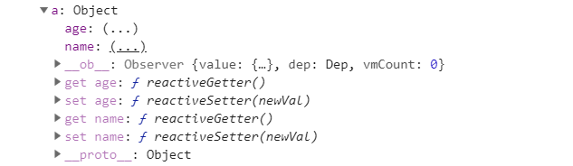
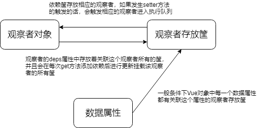

## 总体介绍
这篇博客仅仅只对与`vue`的数据响应系统进行介绍，将涉及到数据响应系统外部的知识点都不进行探究。本博客不会从源码中逐条代码进行分析，一来这样子篇幅比较长；二来读者的思路会被我拉着走，没有自己的思考；三来没意思。本博客中仅会出现`关键性`代码以及为了`解释`某个点而举例子的代码.那么我们就开始本博客吧！

@[toc]
## 1. Vue数据响应的初始化
### 何为数据响应初始化，以及数据响应初始化入口

​        在vue对象的`选项合并`，`数据类选项初始化`后，`vue`对象的`data`属性不再是一个执行函数，而是一个真正的`纯对象（plainObject）`了。使用过`Vue`的会知道`Vue`是一个`MVVM`框架，`model`层并不会直接去操作`view`层（即可以对`Dom`进行操作，但没必要）。那么它是怎么做的呢？就是利用数据响应。而数据响应则是对`data`内部的数据属性进行逐一侦听，一旦数据发生改变，则要求立即做出响应。而要对`Vue`实例的`data`属性中的每一个属性进行监听，我们就必须采用特定的做法。鉴于js的语言特性，`vue`只能对`Object`和`Array`等引用数据类型添加一个不可枚举的属性（\_\_ob\_\_）用来进行数据的媒介。所以数据响应的初始化就是对这些数据进行添加_\_ob\_\_属性。

​        数据响应初始化的入口可以看以下目录：/src/core/instance/state.js里面的initState的observe方法，这就是数据响应的入口。

### 数据响应初始化的策略

​        首先，我们要知道js那么多数据类型，并非所有的数据类型都能/要进行观察的，只有非基本数据类型，即这个`Object`和`Array`类的才能设置 _\_ob\_\_属性从而进行监听。并且还特别注意到对于以\_和\$开头的属性是不会进行观察的，以及`VNode`实例也不会进行观察。对于对象的属性以及数组则有不同的选项初始化策略。

首先是对象属性：

- 对根对象`vm.data`进行添加\_\_ob\_\_属性，并且枚举了对象的所有属性，进行添加\_\_ob\_\_属性，如果这个对象的某个属性是对象的话，那么对这个属性进行递归添加观察者属性
- 使用定义对象属性的方法`Object.defineProperty`对于每个属性的`getter`和`setter`方法进行重新定义（当然会缓存之前定义的`setter`或者`getter`方法）

其次是对数组：

- 遍历数组，递归调用`observer`方法对数组的每一项进行观察。
- 对数组的方法进行变异继承，使得数组发生长度的改变的时候也能对新增的内容进行观察。

只有通过赋值_\_ob\_\_属性进行改变的时候才能被监听到，如果想要对一个对象新增加属性的话，可以用`Vue.$set`方法进行提醒vue对象新增加对这个属性的观察。以下就是景观数据响应初始化后的结果。



****
## 2. 以一个小demo来说说Vue数据响应的做法

### 数据响应的思路

数据响应的话，我们要知道我们要做的两件事是什么？

1. 并不是对所有的数据都要进行响应操作，所以要确定对谁才需要进行数据响应。
2. 何时才需要对数据进行更新。

对于问题1，我们希望的是被使用到的数据才进行数据响应的操作，没有用的数据进行更新的时候，我们是暂且不会对其进行数据响应的更新（可能将来会用到，所以还是需要进行赋值响应属性）。

对于问题2，我们希望的是一旦数据发生改变，我们就立即进行响应，这样数据就足够快进行反应。

我们知道每个对象的属性具有与生俱来的两个方法`getter`和`setter`方法。`getter`方法就是需要用到的时候就调用，`setter`方法则是在进行数据修改的时候就调用到。这就刚好符合我们的2个条件，被使用、数据改变的时候触发。没错，`Vue`就是在调用对象的`getter`方法的时候进行搜集谁需要进行观察，在该属性`setter`方法调用的时候就进行触发响应。

### 小demo说一下数据响应过程

#### 重新定义getter和setter方法

以下则是数据响应的核心代码，就是我们本博客的重点！

首先，我们定义一个对象，并且具有`name`这个属性,对这个对象的`getter`和`setter`方法进行改写。

```js
let obj = {
  name: 'Weybn'
}

Object.defineProperty(objm 'name', {
	enumerable: true,
  configurable: true,
  get() {
  	console.log('get');
	}，
  set() {
    console.log('set');
  }
})

obj.name   // get
obj.name = 'Weybn'  // set 
```

我们对`obj`对象的`name`属性进行访问的时候，会调用调用到这个对象的`get`拦截方法，从而输出`get`，在对`name`属性进行赋值的时候，则会调用到`set`的拦截方法，从而进行输出`set`。

上面的话，很明显`getter`和`setter`方法是没有任何作用的，我们在进行数据响应的同时是不能把这两个方法原本的作用给去掉。我们可以用以下的方法进行改进。

```js
let obj = {
  name: 'Weybn'
}

let val = obj['name'];

Object.defineProperty(obj 'name', {
	enumerable: true,
  configurable: true,
  get() {
  	return val;
	}，
  set(newVal) {
    val = newVal
  }
})

obj.name   // Weybn
obj.name = 'Weybn' 
```

通过一个`val`变量的介入，这样就可以还原到`name`的原本的`getter`和`setter`方法了。那接下来要怎么做才能进行模拟。

#### 模拟响应观察者的做法

`Vue`对象中的观察者是很复杂的，它里面具有一个叫做`callback`的方法，在响应的时候会直接执行这个`callback`方法，那么我们直接将这个响应回调函数看做是观察者吧。那么我们需要有一个数组来存放观察者对象。

附：`Watcher`对象的创建有三种情况，`vue`的`watch`选项、`computed`选项以及渲染函数会具有一个观察者。并不是每个对象的属性都会注册一个观察者。接下来我们就用`render`模拟渲染函数观察者

```js
let cbs = [];

let obj = {
  name: 'Weybn'
}

// 中介
Target = null

function watch(fn) {
  // 将fn缓存起来，等到调用get的时候进行推进执行队列
  Target = fn;
  // 进行依赖的添加
  obj['name'];
}

// 执行回调函数
function notify() {
  for (let i = 0; i < cbs.length; i++) {
    cbs[i]();
  }
}

let val = obj['name'];

Object.defineProperty(obj, 'name', {
	enumerable: true,
  configurable: true,
  get() {
    // 将执行回调函数推进筐中
  	cbs.push(Target)
  	return val;
	},
  set(newVal) {
    // 触发回调函数
    notify();
    val = newVal
  }
})

watch(() => {
  console.log('123')
})

obj.name = 1
```

我们将上述的`cbc`数组看做一个筐，这个筐就是存放所有的回调函数。当调用`watch`方法的时候，会将`watch`方法的回调函数设为`Target`然后在进行访问数据的`get`方法，这样就完成的观察者的添加。一旦我们修改这个属性的值的话，就可以立刻反应。

但是上面有几个明显的缺点：

- 不能新的变量的值到一个回调函数里面
- 不能让多个属性都能够同时进行观察

接下来我们就对上面的代码进行改造，首先是先对于`cbc`改名为`dep`，其次是让每个属性都有一个自己的回调函数，所以我们放到枚举代码块内进行声明，这样就相当于一个闭包了。以下是代码

```js
let obj = {
  name: 'Weybn',
  age: 20
}

// 中介
Target = null

function watch(pro, fn) {
  // 将fn缓存起来，等到调用get的时候进行推进执行队列
  Target = fn;
  // 进行依赖的添加
  obj[pro];
}

let val = obj['name'];

for (let key in obj) {
  // 每个对象的属性都应该具有一个筐，这个筐存放着这个属性的所有回调函数
  let dep = []
  
  // 执行回调函数
  function notify(newVal) {
    for (let i = 0; i < cbs.length; i++) {
      dep[i](newVal);
    }
  }
  
  Object.defineProperty(obj, key, {
    enumerable: true,
    configurable: true,
    get() {
      // 将执行回调函数推进筐中
      dep.push(Target)
      return val;
    },
    set(newVal) {
      if (val == newVal) return ;
      // 触发回调函数
      notify(newVal);
      val = newVal
    }
  })
}

watch('name', (newVal) => {
  console.log('name', newVal)
})

watch('age', (newVal) => {
  console.log('age', newVal);
})

obj.name = 1;  // name 1
obj.age = 2;   // age 2
```

这是一个特别简单的数据响应系统。其中要特别注意到的是以下几点：

- 一个对象的每个属性都应该具有一个筐，这个筐存放着这个对象的属性的所有观察者
- 应当具有防止赋的值是不变的情况下进行触发`notify`（以上代码有体现）

这样上面的代码就组成一个非常简单的`Vue`响应系统的小demo了

****

## 3. Vue数据响应的关键点的解释

### Vue中数据、观察者、依赖筐是怎么组成的？

我们可以先看一下下面这张图


### 

**数据属性**：`Vue`中的对象属性都有\_\_ob\_\_属性，跟第二点的思路相同，每个属性都有一个存放的筐对象

**观察者存放筐**：每个观察者存放筐dep都会存放这个筐所指向的数据挂载的所有观察者的对象。

**观察者对象**： 观察者对象是通过设置 `watch`选项、`computed`选项或者在模板中被引用的时候会产生的。这个对象有`deps`数组，存放着这个对象挂载的所有属性的筐对象，这个 `deps`的作用是为了判断进行某个数据是否有对这个观察者进行添加。


****
## 4. Vue数据响应的运作流程