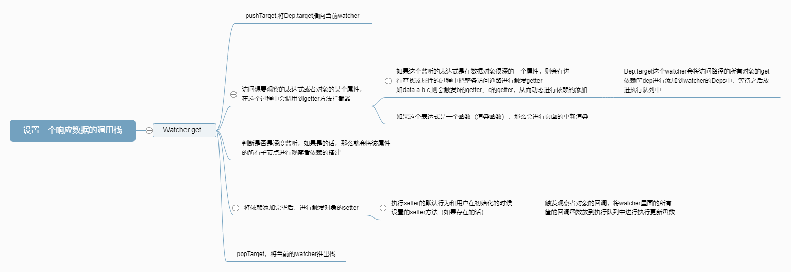

## 总体介绍
这篇博客仅仅只对与`vue`的数据响应系统进行介绍，涉及到数据响应系统外部的知识点都不进行探究。本博客不会从源码中逐条代码进行分析，一来这样子篇幅比较长；二来读者的思路会被我拉着走，没有自己的思考空间；三来没意思。本博客中仅会出现`关键性`代码以及为了`解释`某个点而举例子的代码。

本博客在阅读的时候需要有一个配菜进行配合阅读——《Vue2.6源码》，可以直接从github上搜索vue，然后clone下来。在阅读本博客前你要知道Vue是怎么诞生的。

本文章适合于看了Vue数据响应过程，但是没有搞懂这个数据响应的整个过程的读者。

@[toc]
## 1. Vue数据响应的初始化
### 何为数据响应初始化，以及数据响应初始化入口

​        在`vue`对象的`选项合并`，`数据类选项初始化`后，`vue`对象的`data`属性不再是一个执行函数，而是一个真正的`纯对象（plainObject）`了。使用过`Vue`的会知道`Vue`是一个`MVVM`框架，`model`层并不会直接去操作`view`层（即可以对`Dom`进行操作，但没必要）。那么它是怎么做的呢？就是利用数据响应。而数据响应则是对`data`内部的数据属性进行逐一侦听，一旦数据发生改变，则要求立即做出响应。而要对`Vue`实例的`data`属性中的每一个属性进行监听，我们就必须采用特定的做法。鉴于js的语言特性，`vue`只能对`Object`和`Array`等引用数据类型添加一个不可枚举的属性（\_\_ob\_\_）用来进行数据的媒介。所以数据响应的初始化就是对这些数据进行添加_\_ob\_\_属性。

​        数据响应初始化的入口可以看以下目录：/src/core/instance/state.js里面的initState的observe方法，这就是数据响应的入口。

### 数据响应初始化的策略

​        首先，我们要知道js那么多数据类型，并非所有的数据类型都能/要进行观察的，只有非基本数据类型，即这个`Object`和`Array`类的才能设置 _\_ob\_\_属性从而进行监听。并且还特别注意到对于以\_和\$开头的属性是不会进行观察的（这个`Vue`系统的保留符号属性，会被`Vue`视为自己的属性，无需观察），以及`VNode`子类实例也不会进行观察。对于对象、数组会有不同的初始化策略。如下：

首先是对象属性：

- 对根对象`vm.data`进行添加\_\_ob\_\_属性，并且枚举了对象的所有属性，如果是引用数据类型，则进行添加\_\_ob\_\_属性，如果这个对象的某个属性是对象的话（即具有深度的对象），那么对这个属性进行深度递归添加观察者属性
- 使用定义对象属性的方法`Object.defineProperty`对于每个**属性**的`getter`和`setter`方法进行重新定义（会缓存之前定义的`setter`或者`getter`方法，在触发`getter`和`setter`的时候进行执行）

其次是对数组：

- 遍历数组，递归调用`observer`方法对数组的每一项进行观察。
- 由于数组没有对每一个下标设置`getter`和`setter`的方法，所以要另辟蹊径
- 先创建一个数组对象，继承于Array，缓存数组的所有方法（slice、splice等等），然后再重新定义这些的方法，最后vue初始化的时候，将内部形成的数组的原型都指向这个变异原型。

只有通过赋值_\_ob\_\_对象，并且重新设置了`getter`和`setter`进行改变的时候才能被监听到，如果想要对一个对象新增加属性（在初始化的时候没有的属性）的话，可以用`Vue.$set`方法进行提醒vue对象新增加对这个属性的观察，也可以为一个数组的某个下标直接改变的时候通知vue去执行观察者。以下就是景观数据响应初始化后的结果。


****
## 2. 以一个小demo来说说Vue数据响应的做法

### 数据响应的思路

数据响应的话，我们要知道我们要做的两件事是什么？

1. 并不是对所有的数据都要进行响应操作，所以要确定对谁才需要进行数据响应。
2. 何时才需要对数据进行更新。

对于问题1，我们希望的是**被使用到**的数据才进行数据响应的操作，没有用的数据进行更新的时候，我们是暂且不会对其进行数据响应的更新（可能将来会用到，所以还是需要进行赋值响应属性）。

对于问题2，我们希望的是一旦数据发生改变，我们就立即进行响应，这样数据就足够快进行反应。

我们知道每个对象的属性具有与生俱来的两个方法`getter`和`setter`方法。`getter`方法就是需要用到的时候就调用，`setter`方法则是在进行数据修改的时候就调用到。这就刚好符合我们的2个条件，被使用、数据改变的时候触发。没错，`Vue`就是在调用对象的`getter`方法的时候进行搜集谁需要进行观察，在该属性`setter`方法调用的时候就进行触发响应。

### 小demo说一下数据响应过程

#### 重新定义getter和setter方法

以下则是数据响应的核心代码，就是我们本博客的重点！

首先，我们定义一个对象，并且具有`name`这个属性,对这个对象的`getter`和`setter`方法进行改写。

```js
let obj = {
  name: 'Weybn'
}

Object.defineProperty(objm 'name', {
	enumerable: true,
  configurable: true,
  get() {
  	console.log('get');
	}，
  set() {
    console.log('set');
  }
})

obj.name   // get
obj.name = 'Weybn'  // set 
```

我们对`obj`对象的`name`属性进行访问的时候，会调用调用到这个对象的`get`拦截方法，从而输出`get`，在对`name`属性进行赋值的时候，则会调用到`set`的拦截方法，从而进行输出`set`。

上面的话，很明显`getter`和`setter`方法是没有任何作用的，我们在进行数据响应的同时是不能把这两个方法原本的作用给去掉。我们可以用以下的方法进行改进。

```js
let obj = {
  name: 'Weybn'
}

let val = obj['name'];

Object.defineProperty(obj 'name', {
	enumerable: true,
  configurable: true,
  get() {
  	return val;
	}，
  set(newVal) {
    val = newVal
  }
})

obj.name   // Weybn
obj.name = 'Weybn' 
```

通过一个`val`变量的介入，这样就可以还原到`name`的原本的`getter`和`setter`方法了。那接下来要怎么做才能进行模拟。

#### 模拟响应观察者的做法

`Vue`对象中的观察者是很复杂的，它里面具有一个叫做`callback`的方法，在响应的时候会直接执行这个`callback`方法，那么我们直接将这个响应回调函数看做是观察者吧。那么我们需要有一个数组来存放观察者对象。

附：`Watcher`对象的创建有三种情况，`vue`的`watch`选项、`computed`选项以及渲染函数会具有一个观察者。并不是每个对象的属性都会注册一个观察者。接下来我们就用`render`模拟渲染函数观察者

```js
let dep = [];

let obj = {
  name: 'Weybn'
}

// 中介
Target = null

function watch(fn) {
  // 将fn缓存起来，等到调用get的时候进行推进执行队列
  Target = fn;
  // 进行依赖的添加
  obj['name'];
}

// 执行回调函数
function notify() {
  for (let i = 0; i < dep.length; i++) {
    dep[i]();
  }
}

let val = obj['name'];

Object.defineProperty(obj, 'name', {
	enumerable: true,
  configurable: true,
  get() {
    // 将执行回调函数推进筐中
  	cbs.push(Target)
  	return val;
	},
  set(newVal) {
    // 触发回调函数
    notify();
    val = newVal
  }
})

watch(() => {
  console.log('123')
})

obj.name = 1
```

我们将上述的`dep`数组看做一个筐，这个筐就是存放所有的回调函数。当调用`watch`方法的时候，会将`watch`方法的参数fn（回调函数）设为`Target`然后在进行访问数据的`get`方法，这样就完成的观察者的添加。一旦我们修改这个属性的值的话，就可以立刻反应。

但是上面有几个明显的缺点：

- 不能新的变量的值到一个回调函数里面
- 不能让多个属性都能够同时进行观察

接下来我们就对上面的代码进行改造，让每个属性都有一个自己的回调函数，所以我们放到枚举代码块内进行声明，这样就相当于一个闭包了。以下是代码

```js
let obj = {
  name: 'Weybn',
  age: 20
}

// 中介
Target = null

function watch(pro, fn) {
  // 将fn缓存起来，等到调用get的时候进行推进执行队列
  Target = fn;
  // 进行依赖的添加
  obj[pro];
}

let val = obj['name'];

for (let key in obj) {
  // 每个对象的属性都应该具有一个筐，这个筐存放着这个属性的所有回调函数
  let dep = []
  
  // 执行回调函数
  function notify(newVal) {
    for (let i = 0; i < cbs.length; i++) {
      dep[i](newVal);
    }
  }
  
  Object.defineProperty(obj, key, {
    enumerable: true,
    configurable: true,
    get() {
      // 将执行回调函数推进筐中
      dep.push(Target)
      return val;
    },
    set(newVal) {
      if (val == newVal) return ;
      // 触发回调函数
      notify(newVal);
      val = newVal
    }
  })
}

watch('name', (newVal) => {
  console.log('name', newVal)
})

watch('age', (newVal) => {
  console.log('age', newVal);
})

obj.name = 1;  // name 1
obj.age = 2;   // age 2
```

这是一个特别简单的数据响应系统。其中要特别注意到的是以下几点：

- 一个对象的每个属性都应该具有一个筐，这个筐存放着这个对象的属性的所有观察者
- 应当具有防止赋的值是不变的情况下进行触发`notify`（以上代码有体现）

这样上面的代码就组成一个非常简单的`Vue`响应系统的小demo了

总结：

- `getter`方法用来搜集哪些数据进行添加依赖
- `setter`方法来进行触发依赖
- 对象的每个属性都要有一个筐（`Dep`）进行存放这个数据属性所挂载的所有观察者对象（以闭包的形式）
- 由于`Array`类型不支持对每个下标的`getter``setter`的拦截，所以`Array`某个下标进行改变的时候，并不能够触发观察者，但是可以针对数组的方法进行变异从而进行监听

****

## 3. Vue数据响应的关键点的解释

### Vue中数据、观察者、依赖筐是怎么组成的？

我们可以先看一下下面这张图


### 

**数据属性**：`Vue`中的对象都有`__ob__`属性，demo中是为每个属性都存放一个`dep`不大一样（Vue有自己的办法进行传参），但思想是一样的。

**观察者存放筐**：每个观察者存放筐dep都会存放这个筐所指向的数据挂载的所有观察者的对象。

**观察者对象**： 观察者对象是通过设置 `watch`选项、`computed`选项或者在`template`选项中被引用的时候会产生的。这个对象有`deps`数组，存放着这个对象挂载的所有属性的筐对象，这个 `deps`的作用是为了判断进行某个数据是否有对这个观察者进行添加。

### Vue中哪些数据被观察者观察

`Vue`里面观察者实例有两种，一种是`Vue`系统的观察者，一种是用户自定义的观察者。

- Vue中定义的渲染函数，用于模板渲染，这个是系统观察者。只要用户数据在模板中出现，那么它就是这个观察者观察的对象（包括这个属性的路径上的所有对象属性）如：`a.b.c`，`a.b`属性，`b.c`属性都会被观察。
- Vue选项中定义的watch、computed属性，这是用户自定义的观察者，被监听的数据属性的路径上所有的对象属性都会被观察。如：`a.b.c`，`a.b`属性，`b.c`属性都会被观察。

### Vue实现Demo中的Target

如果你很仔细地看了数据响应的小demo的实现了的话，一定会注意到一个公用的变量`Target`，这个`Target`相当于一个运输媒介，将`watch`方法中的回调`watcher`搬到对应的对象属性的`dep`数组中。那么真正的`Vue`数据响应中是否有这个`Target`？是的，有这个变量，并且有必要拿出来讲一下。

```js
Dep.target = null
const targetStack = []

export function pushTarget (target: ?Watcher) {
  targetStack.push(target)
  Dep.target = target
}

export function popTarget () {
  targetStack.pop()
  Dep.target = targetStack[targetStack.length - 1]
}
```

这个`Dep.target`是什么呢？我们看一下`Dep`类吧。

```js
export default class Dep {
  static target: ?Watcher;
  // ...
}
```

这个`Dep`就是小demo里面提到的`Dep`筐类，生产附在数据属性上的`__ob__`的属性。这个`target`为什么是静态的呢？从我们一个小demo里面可以看出，同一个时间内有且只能有一个属性进行挂载`watcher`，这个`target`设置的目的有两个：

- 同一个时间内有且只能有一个`watcher`进行挂载
- 相当于一个数据传输中介：
  - 进行数据属性挂载`watcher`使用了`getter`方法，但是`getter`方法不能进行传参，那么怎么让这个数据知道有个`watcher`要挂载它呢？就是使用到了这个`target`
  - 我们的小demo中，观察者和筐是放在一个文件中的，但是在`vue`开发过程中，观察者和筐类是放在不同的文件中。让`getter`知道是谁来观察的只能通过`pushTarget`和`popTarget`进行传输。

接下来我来介绍一下整个挂载的过程吧。

首先接下来是`watcher`对象的`get`方法（目录在：/src/core/observe/watcher.js）

```js
get () {
    pushTarget(this)
    let value
    const vm = this.vm
    try {
      // 触发依赖的搜集
      value = this.getter.call(vm, vm)    // 执行getter方法，前面无论是function类型的还是obj类型的观测者对象都会被封装成函数.这里可以看做是数据的搜集。
      // 特别说明一下，这个getter会调用到数据属性的get方法，从而触发
    } catch (e) {
      if (this.user) {
        // 报错
        handleError(e, vm, `getter for watcher "${this.expression}"`)
      } else {
        throw e
      }
    } finally {
      // "touch" every property so they are all tracked as
      // dependencies for deep watching
      if (this.deep) {
        // 是否是深度观察，如果是的话就将这个深度观察进行遍历来让这个对象的所有子项都添加了依赖
        traverse(value)
      }
      popTarget()
      // 添加完依赖后，要交换一下进行更新deps框
      // 进行清空临时的依赖筐
      this.cleanupDeps()
    }
    return value
  }
```

我们可以看到第一行代码,`pushTarget`

```js
pushTarget(this)
```

这个操作就是将本观察者推进栈中，并且将`Dep`的静态属性`target`指向这个观察者，在执行中间代码的期间`target`一直指向这个观察者。我们就可以猜测到接下来肯定是要进行依赖的挂载了。那么这个`watcher`是如何进行依赖的挂载的呢？从小demo里面我们知道依赖的挂载是通过调用`getter`方法进行依赖的挂载。那么我们就要特别关注一下`getter`方法。

接下来就是下面的代码。

```js
try {
  // 触发依赖的搜集
  value = this.getter.call(vm, vm)    // 执行getter方法，前面无论是function类型的还是obj类型的观测者对象都会被封装成函数.这里可以看做是数据的搜集。
  // 特别说明一下，这个getter会调用到数据属性的get方法，从而触发
} catch (e) {
  if (this.user) {
    // 报错
    handleError(e, vm, `getter for watcher "${this.expression}"`)
  } else {
    throw e
  }
}
```

我们第一眼就会看到下面的代码。

```js
value = this.getter.call(vm, vm)
```

这个`getter`方法是什么呢？它涉及到选项的初始化等，那我这里接直接说明吧。先举一个例子

```js
new Vue({
  data() {
    return {
    	a: {
        name: '123'
    	}
    }
  },
  watch: {
    'a.name'() {
      console.log('123')
    }
  }
});

// 那么这个getter就是以下内容。
function createGetter(str) {
  let data =>  这个data指向vue对象的data属性
  let strArr = str.split('.');
  
  return () => {
    let res, base;
    res = data;
    for (let i = 0; i < strArr.length; i++) {
      res = res[strArr[i]];   // 在这条路上所有的数据属性都会被调用一次getter方法，也就解释了为什么想要监听一个数据属性，整条通路上的属性都会被访问到。
    }
    return res;
  }
}
// 那用于渲染函数的时候是返回什么东西呢？！
function anonymous() {
	with(this){return _c('span',[_v("这个将不会改变: "+_s(a.name)+_s(c))])}
}

// with的里面就相当于 this.data + 内容，
// 由此可见，我们可以直接去访问属性从而添加依赖
```

这个`getter`方法在获得值的同时还会触发整条通路上的数据属性的`getter`方法，然后进行依赖的挂载。那么这些`getter`方法的拦截器在哪呢？接下来就是`Vue`数据观察的核心代码。

```js
Object.defineProperty(obj, key, {
  enumerable: true,
  configurable: true,
  get: function reactiveGetter () {
    const value = getter ? getter.call(obj) : val   // 得到之前缓存的值
    if (Dep.target) {
      // target是Dep的静态属性，这个属性的说明是：正在观测中对象，可以到observe/watcher中的get方法查看，代表这个执行这个函数的一个对象，这个getter就是那边触发的
      // 这个如果没有观测者的话，指向的就是渲染函数
      // console.log(obj, key, Dep.target);
      dep.depend()
      if (childOb) {
        childOb.dep.depend()
        if (Array.isArray(value)) {
          // 对数组进行深度遍历添加依赖
          dependArray(value)
        }
      }
    }
    return value
  },
  set: function reactiveSetter (newVal) {
    const value = getter ? getter.call(obj) : val
    /* eslint-disable no-self-compare */
    // 进行判断值有没有发生改变，如果没有发生改变的话说明不需要进行触发依赖
    // 其中newVal !== newVal && value !== value 是为了检测NaN
    if (newVal === value || (newVal !== newVal && value !== value)) {
      return
    }
    /* eslint-enable no-self-compare */
    if (process.env.NODE_ENV !== 'production' && customSetter) {
      // 进行用户传入的设置
      customSetter()
    }
    // #7981: for accessor properties without setter
    if (getter && !setter) return   // 如果一个对象具有缓存的getter方法但是没有缓存的setter方法的时候，不会接着往下执行
    if (setter) {
      // 进行执行原本的setter方法
      setter.call(obj, newVal)
    } else {
      // 没有缓存的setter方法的时候，不会进行任何操作
      val = newVal
    }
    // 如果是深度观测的话，那么会进行深度观测对象
    childOb = !shallow && observe(newVal)
    dep.notify()  // 触发观察者对象
  }
})
```

上面就是Vue数据观察的核心之一，它里面会有很多关键的操作，本篇博客中主要讲的是思路，而不是具体的代码细节，所以接下来讲解的时候会将细节省去。

我们挑重点来，直接看`get`拦截器

```js
get: function reactiveGetter () {
  const value = getter ? getter.call(obj) : val   // 如果用户有自定义的getter，那么执行它，如果没有就执行一开始缓存的值。
  if (Dep.target) {
    // target是Dep的静态属性，这个属性的说明是：正在观测中对象，可以到observe/watcher中的get方法查看，代表这个执行这个函数的一个对象，这个getter就是那边触发的
    // 这个如果没有观测者的话，指向的就是渲染函数
    // console.log(obj, key, Dep.target);
    dep.depend()
    if (childOb) {
      childOb.dep.depend()
      if (Array.isArray(value)) {
        // 对数组进行深度遍历添加依赖
        dependArray(value)
      }
    }
  }
  return value
},
```

先看一下注释，然后我们直接来到判断语句，如果`Dep.target`存在，依照我们前面的流程的话，这个肯定存在，并且指向我们想要观察的对象。我们查看这个`dep.depend()`所在地先。

```js
depend () {
  if (Dep.target) {
  	Dep.target.addDep(this)
  }
}
```

特别注意到如果`Dep.target`存在，就进行`addDep`方法。`Dep.target`只能指向一个`watcher`，也就是说同一个时间内只能有一个`watcher`进行绑定。

`Dep.target`是一个`watcher`实例，调用这个`addDep`方法，并且传入刚刚那个触发`getter`方法的筐的引用。我们来看一下`addDep`的代码吧。

```js
addDep (dep: Dep) {
  const id = dep.id
  if (!this.newDepIds.has(id)) {
    // 如果这个依赖的框并不在newDepIds里面，那么就进行添加到散列表中，
    // 并且在依赖村放放的框进行添加，如果有的话就不进行添加，这是避免依赖的重复添加
    this.newDepIds.add(id)
    this.newDeps.push(dep)
    if (!this.depIds.has(id)) {
    // 如果这个id并不在depIds里面，也就是之前没有添加过的，那么要在这个属性的依赖筐中进行添加本观察者
    	dep.addSub(this)
    }
  }
}
```

这段代码直接这么理解，就是一个互相绑定的过程，`watcher`对象绑定这个对象所在的所有的筐，放到`newDeps`数组中，然后刚刚那个数据筐则将这个`watcher`纳入。这样就是一个双向绑定。这样就完成了依赖的添加。

```js
popTarget()
```

最后再将这个`watcher`出栈，去给其他对象添加依赖。

下面就是设置一个依赖的调用栈的思维导图。



****
## 4. Vue数据响应的运作流程

### 在什么时候会进行触发数据响应回调？

除了在重新设置数据的时候会调用响应回调，在初始化的时候也会进行调用数据相应回调。

### 数据响应的流程是怎么样的呢？

 我们前面提过，在响应阶段的开头必定是将数据的数值进行改变，也就是`setter`方法。所以我们要来看一下数据属性的`setter`拦截方法。

```js
set: function reactiveSetter (newVal) {
  const value = getter ? getter.call(obj) : val
  /* eslint-disable no-self-compare */
  // 进行判断值有没有发生改变，如果没有发生改变的话说明不需要进行触发依赖
  // 其中newVal !== newVal && value !== value 是为了检测NaN
  if (newVal === value || (newVal !== newVal && value !== value)) {
    return
  }
  /* eslint-enable no-self-compare */
  if (process.env.NODE_ENV !== 'production' && customSetter) {
    // 进行用户传入的设置
    customSetter()
  }
  // #7981: for accessor properties without setter
  if (getter && !setter) return   // 如果一个对象具有缓存的getter方法但是没有缓存的setter方法的时候，不会接着往下执行
  if (setter) {
    // 进行执行原本的setter方法
    setter.call(obj, newVal)
  } else {
    // 没有缓存的setter方法的时候，不会进行任何操作
    val = newVal
  }
  // 如果是深度观测的话，那么会进行深度观测对象
  childOb = !shallow && observe(newVal)
  dep.notify()  // 触发观察者对象
}
```

`setter`方法的执行逻辑如下

1. 先获取之前的值，进行比较，看看是否发生了值的改变，如果没有改变的话，那么就不用进行任何操作
2. 当发生了改变后，我们要执行以下`setter`方法，执行完毕后我们可以看到`dep.notify`这个方法，这个方法就是通知观察者进行回调函数。

```js
notify () {
  // stabilize the subscriber list first
  const subs = this.subs.slice()    // 拷贝subs依赖
  if (process.env.NODE_ENV !== 'production' && !config.async) {
    // subs aren't sorted in scheduler if not running async
    // we need to sort them now to make sure they fire in correct
    // order
    subs.sort((a, b) => a.id - b.id)
  }
  for (let i = 0, l = subs.length; i < l; i++) {
    // 将依赖进行更新操作（依赖就是watcher）
    subs[i].update()
  }
}
```

将这个`dep`所挂载的所有观察者对象进行更新。这一步就是通知所有的观察者可以进行回调函数。接下来的代码涉及的内容比较广，我这里做一个简单的介绍就行了，不深入研究。通过观察者进行回调的时候，将所有的观察者推到一个队列中进行回调执行。由于`watcher`对象在创建的时候会传入一个方法，这个方法就是`watch`/`computed`的定义的函数，会将新的值传入这个函数并且执行。并且，只要一个数据有在`template`中出现，那么这个数据就会挂载`render`函数观察者，只要这个数据发生改变的时候，就进行通知`render`函数观察者进行渲染页面。下面本博客整个过程的流程图：

.svg)