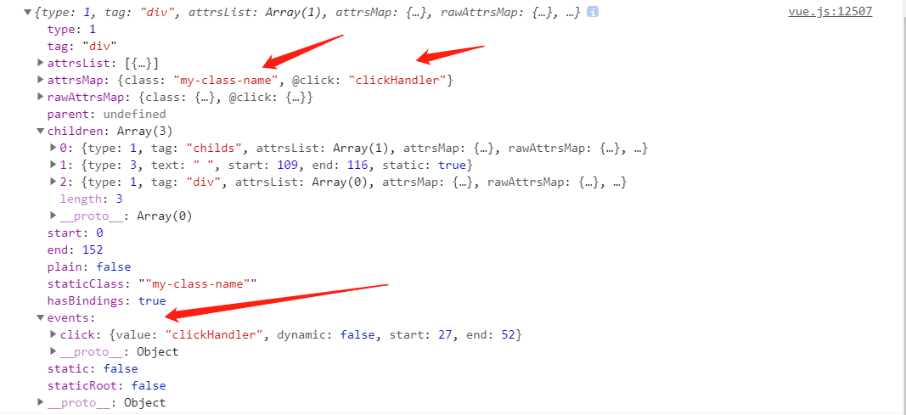
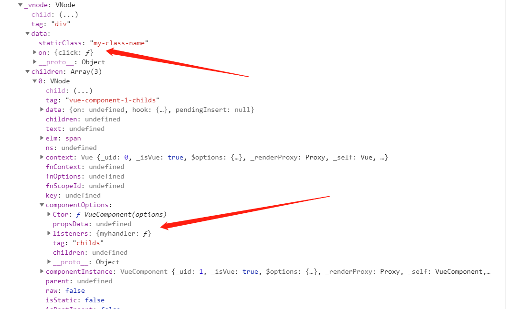
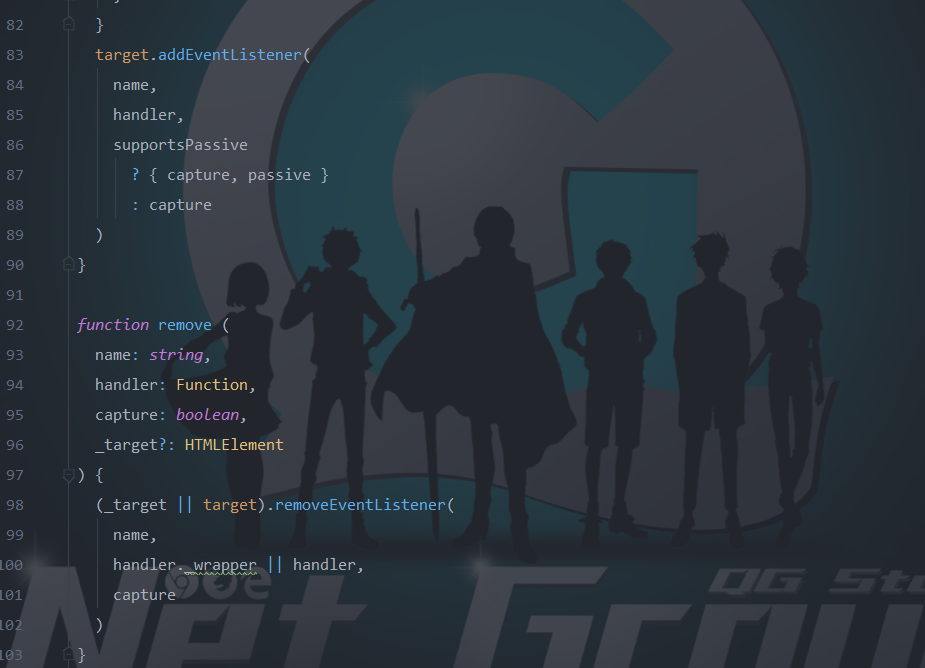
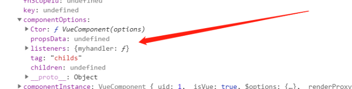
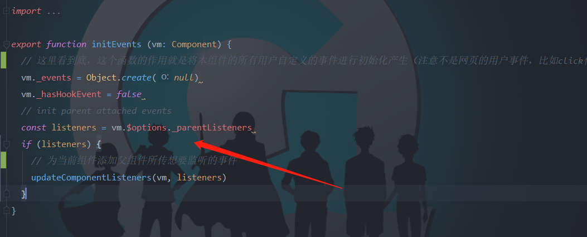

# Vue框架的事件系统

### Vue中事件的基础

#### 1.Vue中如何绑定事件

​	`Vue`框架相比于`React`框架，提供了模板的功能，而模板与`HTML`代码极为相似，这使得我们可以花费很少的时间从原生到`Vue`框架的过渡，这是`Vue`的优点之一。不过模板到处理的时候只是一个字符串，而不是真正的`HTML`代码。所以如果我们以原生的方式来对节点进行监听的话，**很可能会出错**。这是因为有可能模板还没有渲染到页面上。不过，`Vue`推荐使用在模板上进行事件绑定的功能。下面是使用的例子：

```jsx
// 下面是模板
<div id="example-1">
  <button v-on:click="counter += 1">Add 1</button>
  <p>The button above has been clicked {{ counter }} times.</p>
</div>

// 下面是Vue
var example1 = new Vue({
  el: '#example-1',
  data: {
    counter: 0
  }
})
```

以上是对DOM节点进行监听：在想要进行监听的节点上添加`v-on:click`即可进行监听，也可以使用简写`@click`来进行监听。

如果对于组件类型的节点的监听，如何使用呢？答案还是按照上面的来进行使用。只不过更加广泛，可以自己定义事件的类型，比如使用`@myHandler`、`@myClick`等等。不过它们的触发是在组件中主动触发的，而不是使用到了DOM的事件监听。

```jsx
<!-- 没有效果 -->
<my-component v-on:my-event="doSomething"></my-component>

// 触发事件(被监听的组件内部使用)
this.$emit('my-event')
```

不过组件的话，也支持对最外层的节点进行监听的功能，只需要使用`@click.native`即可对容器内部最外层的DOM节点进行事件监听。

#### 2.Vue中事件的分类

在模板中，无非有两中类型的节点：组件节点和DOM节点。对于这两种节点的处理方式是不同的，所以有两种类型的事件：

1. DOM类型事件，这种最终在**创建节点的时候会自动进行事件的监听，在撤销节点的时候自动进行事件的解除。**所以框架帮我们考虑了这些绑定与解绑操作。
2. 自定义事件：这种是绑定在组件上的事件，最后不会像DOM类型的事件那样进行处理，而是使用到了`Vue`的自定义的事件系统，也就是在组件层面上的事件监听。所以它和普通标签的事件的处理方式是完全不同的。下面就直接讲几个要点吧：
   - `Vue`内部实现了一个事件类，不过是和`Vue`框架结合在一起，如果想要看抽离出来的代码的话，我这里有一份：[TypeScript简单实现Vue内部的事件类](<https://github.com/gayyou/Micro-Helper/blob/master/src/utils/event/CustomEvent.ts>)
   - 每个`Vue`实例（包括组件实例）内部都有一个事件类实例，所以不同组件中进行绑定事件的时候是不会互相冲突的。

我这里就先讲这么多，后面再细细讲解它们分别怎么实现的。

### 事件从模板上到绑定的整个流程

从开启一个`Vue`应用的时候（具有编译功能的`Vue`框架版本），是怎么创建和绑定事件的？这是本部分需要进行讲解的。在介绍之前，需要以一个例子来说明，这样读者会比较清楚如何进行处理，以及处理的结果。

```js
let component = {
  template: '<span data-name="Weybn">我是span的内容</span>',
};
new Vue({
  el: '#app',
  template: `
  <div class="my-class-name"
    @click.stop="clickHandler"
  >
      <childs
        @myhandler="sayHello"
      />
      <div>文本节点, {{myName}}</div>
  </div>
  `,
  components: {
    childs: component
  },
  methods: {
    sayHello() {
      console.log('hello')
    },
    clickHandler() {
      console.log('click')
    }
  },
  data() {
    return {
      myName: ''
    }
  }
});

```

上面是一个`Vue`实例引用一个组件，并且给组件监听了事件，还给外壳的`DIV`标签添加普通的DOM事件，那么我们看看各个阶段的处理以及处理的结果

#### 1.模板编译，生成抽象语法树，转为代码

先讲解一下模板编译，模板编译的话，很像浏览器拿到`HTML`代码生成DOM节点的过程，非常相似。浏览器生成DOM进行匹配标签的话，是利用了`stack`进行匹配，而模板编译也是。然后整个过程如下：

1. 词法分析：在此阶段进行分析判断**标签是否闭合成功、属性的设定方式是否正确、动态绑定是否符合要求的语法**等等，来确保语法是正确的。

2. 句法分析：在语法分析的基础上，进一步分析一句代码，比如说**表达式是否正确、一些特殊的用法是否符合要求、v-if和v-else是否使用正确**，确保没有使用错误的代码，然后生成抽象语法树。

3. 抽象语法树：生成一棵ast，我们简单看看ast节点的处理吧！

   

   可以明显看到模板上的内容会处理成ast的节点，后面ast转为代码的时候会进一步处理。

4. 代码：将ast处理成为可执行的代码，实际上处理成为一个字符串，然后通过`new Function`或者`eval`将字符串弄成可执行代码，这样就生成了执行渲染函数。

   那么事件在这里做了什么事情呢？答案是处理事件的修饰符，比如说`@xxx.stop`、`@xxx.native`等等。我们可以来到`\src\compiler\codegen\events.js`这个文件中，看到对于各种修饰符的处理。现在进行处理的话，分成两大类：对于DOM事件、组件事件。

   - DOM事件：

     - 有修饰符：拥有修饰符的话，会在监听函数外面包一层函数，用来执行修饰符的作用。如果stop的话，调用`event.stopPrograntion`。比如前面例子中的点击事件，最后直接接触DOM事件处理的函数是：

       ```js
       function($event) {
         $event.stopPropagation();
         
         clickHandler($event);
       }
       ```

     - 没有修饰符：不包装函数。

   - 组件（自定义事件）：处理方式和DOM事件一致，所以在模板编译中，组件节点也是看做普通节点来处理。

   看一眼上面代码最后生成的字符串吧！

   ```js
   with (this) {
     return _c('div', {
       staticClass: "my-class-name", on: {
         "click": function ($event) {
           $event.stopPropagation();
           return clickHandler($event)
         }
       }
     }, [_c('childs', {on: {"myhandler": sayHello}}), _v(" "), _c('div', [_v("文本节点, " + _s(myName))])], 1)
   }
   ```

   我们知道`with`的作用是将括号内部的对象的属性绑定到大括号的`AO`对象中（不懂的话就掘金搜一搜），所以可以直接访问`sayHello`、`myName`等属性。这个最后会调用生成`VNode`的函数，生成`VNode`节点

#### 2.在组件渲染的时候生成VNode

我们知道组件在调用渲染函数观察者的时机有两个：1.第一次挂载；2.修改渲染函数所绑定的数据。不懂的话，推荐看一下我的博客[Vue3.0响应式系统](<https://juejin.im/post/5e384a00f265da57434ba781>)。那么在执行的前面的代码，会返回`VNode`，然后通过`patch`进行渲染真实的dom节点或者组件（这个具体我们后面再讲）。

我们看一下刚刚那个例子所生成的`VNode`树吧。



得特别注意到我所标注的两个点，在`VNode`的时候，就已经产生分叉了，这最终会被不同的方式进行处理。

1. DOM型的话，处理到`data`中
2. 足健行的话，处理到**组件配置**中。

#### 3.VNode生成真实的DOM节点或者组件时候进行事件绑定

`VNode`所指向的节点有两大类：DOM型和组件型，而`Vue`框架在这之前对两种类型的事件的处理是一致的，也就是进行抽象化处理，但是在这里就产生了分叉。

##### 如何处理DOM型事件

如果要追究到DOM型事件的话，要去`vdom`里面看懂看通代码。我这里就直接给出答案。最后在对事件进行绑定解绑的时候，会到达这样的代码：



也就是说，平台会调用原生方法，在创建dom的时候去添加事件监听，在销毁dom前进行解绑。

##### 如何处理自定义事件

刚刚我们提到了，如果是自定义事件的话，会合并到组件的选项中。并且在组件初始化的时候会进行处理。首先我们明确在组件选项的哪个属性？



在`listeners`属性中，我们翻看源码，在`core/instance/events.js`中出现，也就是在组件初始化的时候会进行处理。



在这里就能够拿到父组件所传进来的事件回调，并且执行`updateComponentListeners`来进行添加组件事件的监听。所以重点来了：**自定义事件的话，父亲组件进行监听的话，那么会传进来函数的引用以及事件的类型，然后在组件的事件实例中进行监听！**。前面我们提过，`Vue`内部实现了一个事件类，那么这个事件类也是在这个文件进行实现，有兴趣的话可以看看。

### 总结

至此的话，我们就对`Vue`框架的事件系统的声明、产生、绑定都进行了讲解，以几个`tips`结束吧。

1. 每个组件都有事件类的传递。
2. 父组件对于子组件监听，最后处理的结果是父组件传参进子组件，子组件进行注册事件。
3. 事件系统的声明到绑定贯穿了`Vue`的三大模块：模板编译、Virtual DOM、数据响应系统。

