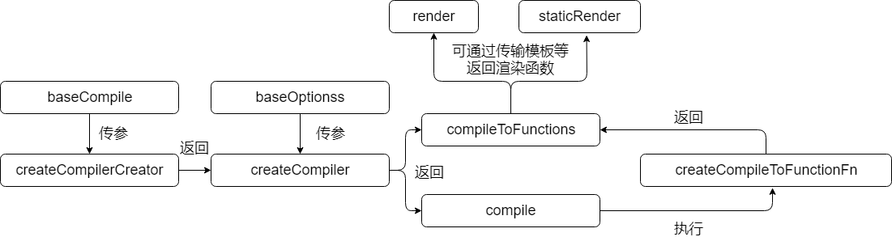

#  Vue的语法模板编译器

## 一、编译器内部结构以及解释

### 1.抽象语法树的生成

#### 抽象语法树解析函数

| 函数名                    | 作用                                                         |
| ------------------------- | ------------------------------------------------------------ |
| compileToFunctions        | 生成渲染函数、静态渲染函数                                   |
| createCompiler            | compileToFunctions、compile方法的生成函数                    |
| createCompilerCreator     | 可以根据传进来的基础编译方法（bashCompile）生成不同的createCompiler |
| createCompileToFunctionFn | 将compile转为compileToFunctions方法                          |
| compile                   | 根据baseCompile组合而成的方法                                |

#### 调用关系路径图



- `createCompilerCreator`函数通过传入`baseCompile`，将`baseComile`进行添加属性配置，从而返回一个创建编译器的方法（`createCompiler`）。
- `createCompiler`可以通过传入参数配置得到编译器`compile`以及编译器转成的函数`compileToFunctions`。`compileToFunctions`可以得到渲染函数以及静态渲染函数
- `compileToFunctions`是由`compile`通过调用`createCompileToFunctionsFn`函数生成

#### 为何要有这种内部结构

- 为何要有`baseCompile`进行传参从而返回`createCompiler`呢？

  首先我们要知道`Vue`源码中的编译器的目录结构：

  ```text
  ├── src
  │   ├── compiler -------------------------- 编译器代码的存放目录
  │   ├── ├── codegen ----------------------- 根据AST生成目标平台代码
  │   ├── ├── parser ------------------------ 解析原始代码并生成AST
  ```

  编译器由两部分组成，一部分是进行解析原始的代码生成抽象语法树（AST），第二部分则是根据抽象语法树生成目标平台代码。

  两个部分分别会导出一个函数进行调用生成：

  - `codegen`导出`generate`方法将AST生成目标代码
  - `parser`导出`parse`将模板生成AST

  有了上面的两个方法，就可以制作一个自己的编译器，可以通过模板编译形成目标代码，如下：

  ```js
  function myCompiler (template, options) {
  	const ast = parse(template.trim(), options);
    const code = generate(ast, options);
    
    // 检验错误的代码
    
    retrun code;
  }
  ```

  上面的代码就封装了一个编译器，可以直接使用。但是如果现在多了一个需求，需要再制作别的类型的编译器，那么就需要进行定义其他类型的编译器 。

  ```js
  function myCompiler (template, options) {
  	const ast = parse(template.trim(), options);
    const code = otherGenerate(ast, options);
    
    // 检验错误的代码
    
    retrun code;
  }
  ```

  ast是不会进行改变的。并且一般情况下，检验错误的代码是相同的，这时候就会出现一个代码冗余的现象。如果可以将检错代码封装起来，叫做`createCompilerCreator`。然后通过传入`baseCompile`生成一个`createCompiler`。如下：

  ```js
  function createCompilerCreator (baseCompile) {
    return createCompiler function (template: string, options: CompilerOptions) {
  
      // 一些处理编译错误的代码
  
      return baseCompile(template, options)
    }
  }
  ```

  这样我们就可以根据具体情况生成不同平台的语法编译器

  ```js
  // 创建 web 平台的编译器
  const webCompiler = createCompilerCreator(function baseCompile (template, options) {
    const ast = parse(template.trim(), options)
    const code = generate(ast, options)
    return code
  })
  
  // 创建其他平台的编译器
  const otherCompiler = createCompilerCreator(function baseCompile (template, options) {
    const ast = parse(template.trim(), options)
    const code = otherGenerate(ast, options)
    return code
  })
  ```

  实际上，`Vue`中有两种平台，一种是web平台，另外一种是ssr平台，两者的编译器是不同的。

  现在我们再来看 `src/compiler/index.js` 文件中的如下这段代码：

  ```js
  export const createCompiler = createCompilerCreator(function baseCompile (
    template: string,
    options: CompilerOptions
  ): CompiledResult {
    const ast = parse(template.trim(), options)
    if (options.optimize !== false) {
      optimize(ast, options)
    }
    const code = generate(ast, options)
    return {
      ast,
      render: code.render,
      staticRenderFns: code.staticRenderFns
    }
  })
  ```

  实际上这段代码所创建的就是 `web` 平台下的编译器，大家可以打开 `src/server/optimizing-compiler/index.js` 文件，你会看到如下这段代码：

  ```js
  export const createCompiler = createCompilerCreator(function baseCompile (
    template: string,
    options: CompilerOptions
  ): CompiledResult {
    const ast = parse(template.trim(), options)
    optimize(ast, options)
    const code = generate(ast, options)
    return {
      ast,
      render: code.render,
      staticRenderFns: code.staticRenderFns
    }
  })
  ```

  而这段代码是用来创建服务端渲染环境的编译器，注意如上代码中的 `generate` 函数和 `optimize` 函数已经是来自 `src/server` 目录下的相关文件了。

- `compile`和`compileToFunctions`有什么区别呢？

  `compileToFunctions`是`compile`通过`createCompileToFunctionsFn`方法生成的。`compile`是将代码以字符串形式生成，`compileToFunctions`则是将字符串的代码生成真正可用的代码。

## 二、词法分析器

### 1.概况：

- 代码位置：`/compiler/parser/html-parser`
- 入口方法名：`parseHTML`
- 参数：模板的字符串
- 作用：将`vue`传进来的字符串进行分析。以树状的形式对字符串中每个标签进行获取标签名、标签属性、标签内容。并且根据`html`的语法对传进来的字符串进行校错。主要校错方向为：标签是否正确闭合、属性名是否以键值对方式填写（并不会对具体的语法进行校错，这些操作放到句法分析器上面进行校错）。

### 2.流程：

- 必要变量：
  - `stack`：存放标签栈，由于`html`是树状结构，除了单元标签之外的所有标签都必须成对存在，并且满足类似于括号的匹配。所以最好的解决办法用栈来进行验证。
  - `index`：当前字符串在原始字符串的下标。进行提取数据的流程中，传进来的原始字符串进行切割（去掉前面部分），这个`index`就是为了记住当前字符串第一个下标在原始字符串下标的位置。
  - `lastTag`：记录栈顶的标签名，也就是父节点的标签名。
  - `*Match`各种匹配的结果对象，如果是标签的话，里面存放着标签的名称、属性。

- 假设传入的`html`是没有任何语法错误的，那么词法分析器的流程如下：

1. 对左半部标签进行处理：创建一个标签对象用来存储标签的所有信息。通过正则表达式获取左标签的标签名。再通过正则获取这个标签的所有属性（无论是否是动态属性），并将所有属性都以键值对的形式（每个属性都存放在一个单独的对象中）放到存储标签信息对象的`attrsList`属性数组中，以便句法分析器的使用。
2. 解析完左标签后，将左标签名压入`stack`中，并且`lastTag`指向这个标签名，接下来进行解析这个标签的内容。
3. 接下来有三种可能的情况
   - 遇到左标签：说明这是个字标签，那么重复第一个操作。
   - 遇到文本内容：遇到文本，将文本进行提取。根据提取的字符串的长度进行字符串进位操作（切割操作）。
   - 遇到右标签：遇到右标签，说明当前子树已经遍历完毕了，可以进行遍历下一步操作，首先要进行出栈操作，并且改变`lastTag`的指向，并且进行进位操作。

**注意：标签的情况有两类，一类是双元标签（有左右两个标签），另外一类是一元标签（仅有一个标签），上面仅仅是针对于双元标签而言的，而实际代码中会进行判断是否是一元标签。如果是一个一元标签，提取属性后，进行闭合，不会产生子节点。**

看完上述的讲解后，会产生以下的问题：

- 关键性变量里面没有一个变量存储所有的结果，那么对词法解析的结果放到哪里呢？

  源码中的词法分析器和句法分析器是在`parseHTML`这个方法调用的。我的意思是在词法分析函数中也会调用句法分析方法来进行分析句法。分析句法的结果会以**抽象语法树**（`AST`）的节点形式存储。最终会形成一棵树，每分析一句话都会进行这样的操作，所以词法分析和句法分析是并行的，这样好处就是无需进行二次遍历。

- 上述问题讲到词法分析和句法分析是并行的，那么为什么不一起讲呢？

  有两个点来进行说明：

  1. 分层原理：在进行模板的编译时候，我们要先对词法进行提取，然后再又句法分析器进行分析。只有完成词法分析部分，我们才能对句法进行分析。并且只有在词法阶段分析完成并且没有错误的时候，我们才能保证句法分析的程序正常运行。举个例子吧，我们看一句英语，我们只有在每个单词的拼写的词法准确无误的情况下，我们才能够进行分析句子有没有语法的错误。所以这是**两个层次**的关系，只有底层做好了，上一层的数据才能够准确无误。类似的分层思想的典型例子有两个：计算机的组成结构：逻辑电路、门电路、芯片。以及计算机网络上的TCP/IP五层结构。

  2. 代码结构：

     在代码中，此法分析和句法分析的实现代码放在不同的地方。并且在调用方面，当词法分析完毕后才会去调用句法分析器。这也就是为什么要分开讲的原因。

****

## 三、句法分析器

如果将`html`模板看做一个一篇英文文章，词法分析器是对单词进行分析，那么句法分析器就是将一个个分散的单词通过特定的规则进行组装成一句话乃至一篇英文文章。

### 1.概况

- 代码存放位置：`src/compiler/parser/index.js`

- 入口函数：`parseHTML`调用函数参数中的`start``end``chars``comment`四个参数中

- 参数：从词法解析器处理完成后传过来的数据

- 基本思路：跟随词法解析器，将词法解析器中传过来的属性列表根据情况转为`AST`节点的属性值，方便编译的时候取用，并且根据`html`文本的结构生成一棵抽象语法树。

- 抽象语法树节点的结构：

  ```js
  export function createASTElement (
    tag: string,
    attrs: Array<ASTAttr>,
    parent: ASTElement | void
  ): ASTElement {
    return {
      type: 1,  // 类型
      tag,  // 标签名
      attrsList: attrs,  // 所有属性的列表，（对象列表，对象的两个属性分别是name和value）
      attrsMap: makeAttrsMap(attrs),  // 将attrs中的列表的每一项的name作为键，value作为值生成散列表
      rawAttrsMap: {},  // 将value值通过JSON.stingify进行字符串化
      parent,  // 父节点
      children: []  // 子节点
    }
  }
  
  // 这个是抽象语法树节点的基本结构，返回的对象会根据需要进行增加
  ```

### 2.策略

#### （1）抽象语法树层次

在抽象语法树层次上进行探讨的内容是一个标签上的`Vue`属性会影响到其他标签，把这些标签归为一类，进行讲述处理策略。处理的策略如下：

- `v-pre`：这个属性的使用会让子类所有的标签跳过编译器解析，看做一个普通节点，在上面绑定的变量不会进行解析。进行处理的时候会用到`JSON.stringify`比较偏的知识点

  ```js
  const a = new Function('console.log()');
  const b = new Function(JSON.stringify('console.log()'));
  
  // a
  function() {
    console.log()
  }
  // b
  function() {
    "console.log()"
  }
  ```

  一般来说，以字符串为参数进行新建函数的话，会生成可执行代码，但是用`JSON.stringify`的话，就只能生成一个字符串。`v-pre`内部所有的动态属性都最终解析成静态属性。

- `<pre>`：这个标签不会忽视掉内部的任何空白区域。一般标签内部的文本会将左右的空白区域去除，但是这个标签内部不会调用字符串的`trim()`方法进行去除。

- `v-if v-else v-else-if`：先判断中间是否有一个不是这个链的节点，如果有的话，会提示用户说会忽视掉。然后在这个条件判断链中的所有元素不是以兄弟节点的形式存在，而是用抽象语法树的`ifCondition`进行存储。

- `v-for`：处理列表渲染的策略是将迭代器的内容（被迭代对象、获取数据形式、是否有下标等等）提取出来，并且混入到抽象语法树的节点上面。

#### （2）抽象语法树节点层次

对抽象语法树上的节点进行获取分析储存，以便构造构造编译函数的时候使用，可以分成下面两类。

- 动态属性：

  - 静态属性名：以`v-bind:key`或者`:key`开头，并且`key`是常量。对于静态属性名的情况下，通过正则表达对属性进行获取
  - 动态属性名

- 静态属性：

  对于静态属性，那么处理的策略类似于`v-pre`，用`JSON.stringify`进行处理，这样用`new Function`创建函数的时候就会当成一个字符串来对待。

#### （3）特殊标签

### 3.处理结果