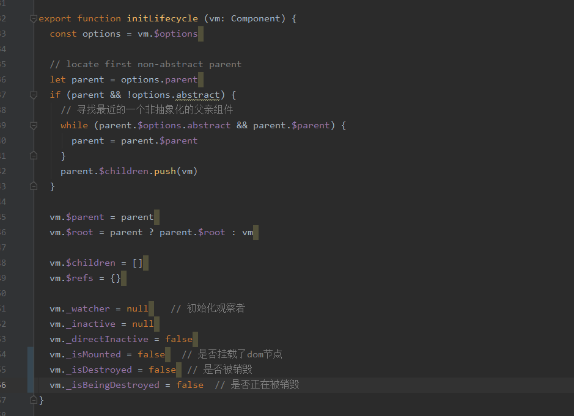

# Vue项目源码中对所有生命周期钩子做的事情的汇总

### 0.new 一个Vue对象的时候会发生什么事情

### 1.beforeCreate之前

##### 1）声明周期初始化

初始化声明周期，对VM实例对象进行属性的初始化（VM实例对象就是Vue的实例），涉及到的属性列表如下图：

这是初始化的代码，为什么要初始化呢？如果不初始化，那么这些值访问到默认是undefined，这样的话是未定义而不是定义了，这样会导致后面开发的时候的一些误解。

注：非抽象组件是什么？

- 抽象组件：这些组件的特征是没有挂载任何的dom节点，也就是在整个页面上是找不到他们的存在的。它们的作用很大程度上都是为了处理公共的事情，它们也可以通过获取子组件的dom节点，从而来拿到页面的事件，进行统一处理。特征是没有渲染出dom节点。slot、transition等都是抽象组件。要注意的一点是渲染后，用户不管是从vue对象、还是dom节点上都是找不到抽象组件的存在的，但是它们确确实实是存在的。所以抽象组件一般比较安全。
- 非抽象组件：一般用户定义的普通组件。

##### 2）事件初始化

对于父亲组件对本组件的事件监听（也就是调用的时候的@+事件）的容器进行初始化，将父亲节点对本组件的事件监听加载到_events属性中

##### 3）渲染初始化

对本组件的VNode和插槽等进行初始化，并且对createElement进行初始化

对$attr、$listeners

- $listeners也就是外部组件对这个实例对象的事件监听

#### 2.created之前

1. 初始化inject组件深度数据注入
2. 初始化data、props等（按照顺序，下面初始化的属性名不能跟上面的一样，否则在开发环境下会进行报错）
   1. 初始化传入参数（未与外界传进来的值进行挂载）
      1. 根据子组件的配置项合并后的结果来创建prop属性
      2. 对这些属性进行深度观测
   2. 初始化method
      1. 判断方法是否是函数，如果不是的话就会报错，如果是函数的话，会用bind函数进行挂载上下文对象
   3. 初始化data
      1. 对选项合并时候弄成data函数进行执行，并且把它放到了$data和vm的属性上
      2. 执行选项合并后，会进行判断data中是否出现了props出现的属性，如果出现的话，那么就会报错
      3. 对所有的对象进行深度数据观察
   4. 初始化computed
      1. 当然是需要进行判断前面是否存在这个属性
      2. 针对于ssr和非ssr进行处理：ssr的话处理成一个函数，这样在渲染的时候调用后就会产生与非ssr一样的效果。非ssr的话就是处理成一个属性，这个属性同样是通过观察者来实现的
   5. 初始化watch
      1. 创建观察者对象，并且将观察者对象的方法赋值在vm对象上，可能传进来的观察者是一个选项、一个字符串、一个方法。在这里都进行处理成一个函数。
3. 初始化provide（组件深度事件传播）

#### 3.beforeMount之前

1. 判断vm传进来的options是否存在渲染函数（即render），这个render函数是如何来的？等会总结
   - 如果存在渲染函数的话，不进行处理，（此时render是一个函数，可以通过执行获得渲染的内容）
   - 如果不存在渲染函数的话，将渲染函数赋值为创建空的VNode的函数，等待接下来的时候

#### 4.mounted之前

1. 根据beforeMount前面处理的得到VNode的方法，处理成为一个Update函数，以便之后使用，以后每次进行调用

#### 5.beforeUpdate之前

#### 6.updated之前

#### 7.beforeDestroy之前

1. 并没有任何操作

#### 8.destroyed之前

1. 对数据的观察者进行移除（以及他们的框列表）
2. 对渲染函数观察者、watcher观察者、compute观察者进行移除
3. 将VNode树上的节点进行移除

#### 9.destroyed之后

1. 关闭VM的所有监听事件
2. 解除与DOM节点、父亲节点的联系，等待GC