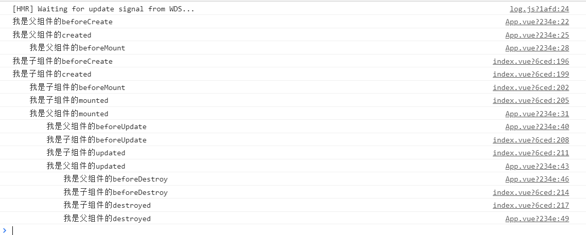

# 从源码上来看，Vue对象的每个生命周期钩子前都干了什么？

## 一、从官方文档查看的Vue的生命周期钩子

上面的图片是从**Vue**的官网里面找到的，如果单从这张图去查看生命周期干了什么，我们只能知道：

- 在**beforeMount**前会对给出的模板进行编译（仅仅是在用**Vue.js**打包的时候会进行编译，在用脚手架的时候，在打包过程中会把模板编译成为渲染函数，这样可以避免每次创建一个**Vue**对象的时候进行编译模板）
- 在**mounted**后，**Vue**实例对象才是完整的对象，这个转改能够维持到**beforeDestroy**。

但是我们不知道的东西会有很多，我这里就举出几个问题：

1. 父子节点的生命周期执行顺序是怎么样的？
2. 每个生命周期能够访问到的数据是否相同？
3. 我们知道修改了**data**后能够触发更新生命周期的钩子，那么到底是怎样进行触发的？
4. 我们知道**Vue**的话是通过**VNode**来更新管理真实的**DOM**的，那么在上面的生命周期什么时候进行渲染的？

为什么我们要知道上面的情况？因为我们可能会遇到一些问题，需要知道**Vue**里面的实现

- 一般情况下，我们在组件初始化完毕的时候，也就是在**mounted**回调函数里面调用我们初始化的执行代码（很大情况下是请求，也就是异步操作），但是如果现在有一个性能的需求，就是要求尽早地调用我们初始化的代码，那么选择哪个生命周期呢？这得根据每个生命周期干的事情来决定
- 对于一些全局**同步的操作**，比如解析路由来对应页面显示的内容等等这些操作，那么我们是想要它尽早地完成，以便全局使用。

在这里的话，我们可以对我提出的第一个问题进行解决。现在场景是这样的，我们有一个父亲组件（**app.vue**），还有一个子组件（**index.vue**）,父亲组件传给子组件一个**abc**属性（这个属性绑定父亲组件的**abc**数据），在创建页面后，设定定时器，1s后更新**abc**属性，两秒后将父组件进行销毁，那么会出现什么情况呢？

我们打印出了以上的信息，可以进行回答上面提出的第一个问题：

- 父组件总是先于子组件创建，但是慢于子组件挂载节点
- 父组件总是在子组件进行更新完毕后再进行更新
- 父组件销毁的时候会进行递归销毁子组件

以上三点都是很容易理解原因的，这里就不进行解释了。我们现在已经知道的父子组件的生命周期执行顺序了，接下来我们看一下每个生命周期钩子前干了什么？

## 二、源码上查看的生命周期钩子（钩子之前）

### 0.选项的合并

​	通过**Vue**的官方文档，我们有时候能够看到一个创建**Vue**实例的选项可以有不同的写法，那么针对于不同的写法，需要有一个工具来把这几个不同的写法进行规范化，这就是选项的合并的所要进行处理的内容。

### 1.beforeCreate

在这个钩子函数前主要是对**Vue**实例进行属性的初始化

- 生命周期状态、监听器的初始化，这些与业务逻辑无关
- 处理父组件对本组件的自定义事件的监听，将其放到**_events**中
- 对创建**VNode**函数进行绑定，在**Vue**实例对象中，是不会存在直接对**DOM**进行操作的，而是通过创建**VNode**，然后通过**patch**的方式对**DOM**节点进行操作，操作的工具方法什么的跟原生一样的，**Vue**工具类里面包含对这些方法的封装。
- 对父组件传进来的属性（props）以及监听事件（v-on）进行深度观察

### 2.created

在这个钩子函数之前主要是对数据进行初始化并且进行监听操作：

- **Injection**、**provide**选项进行初始化
- 对于用户定义的属性进行初始化，以下是按顺序来初始化，如果后面的属性名与前面相同的话，会报错：
  - props：传进来的属性是父组件过来的，这个属性不需要在子组件里面进行观察（因为父组件已经观察它了）
  - method：对设定的方法挂载到**vm**实例中，并且使用**bind**方法绑定函数上下文为**vm**对象，这也就是为什么我们使用箭头函数的方式的时候，也是能够通过**this**访问**vm**实例。
  - data：在选项的合并的时候将**data**处理成一个可执行的函数，这里的话，是将这个函数进行执行，得到组件的数据，并且将所有数据进行深度观测。
  - computed：创建一个**lazy**型的观察者，这个观察者是不会主动去触发的（如果计算属性是函数的话，每次需要拿到值的时候进行调用函数，如果是普通值的话，则会直接获取普通值）。这个计算属性是不能直接赋值操作的（getter方法被设置成一个空函数，所以怎么进行赋值也没有用），所以是个**lazy**型的观察者。**computed**的值只有在获取的时候才会执行然后拿到最新的值，所以它是一个懒求值。
  - watch：对传进来观察的对象的路径进行解析，拿到对应的属性。创建一个观察者，对这个属性进行观察，一旦属性发生变化的时候，会触发这个观察者，调用传进来的函数。

### 3.beforeMount

在挂载前的生命钩子前会进行元素绑定以及渲染函数的操作：

- **vm.$el**属性赋值
- 渲染函数如果为空，进行创建空的方法

### 4.mounted

在本生命周期前，会进行**渲染函数观察者**的设定，当属性改变的时候，会直接反映到页面数据中。渲染函数观察者为什么要在数据观察者设定后进行创建的话，这个等到后面的讲述**Vue的观察者篇章的时候再说**。

这里要注意到一点，在创建观察者的时候，我们可以通过传给观察者一个**before**方法，这样执行观察者的函数前调用**before**方法。渲染函数观察者会传进一个**before**方法，这个方法只有一句话，就是将本组件的声明周期改为**beforeUpdate**，也就是说在修改数据的时候，反映到页面之前，组件会先进入到**beforeUpdate**生命周期。

### 5.beforeUpdate

上面一点也说明了，在**beforeUpdate**前是用户的各项操作，只要修改了某个属性值，那么就会触发这个生命周期钩子。

### 6.updated

触发**beforeUpdate**后，这时候是在清空调用观察者队列（**queue**是存放现在时间所有需要进行回调的观察者的一个队列，当然渲染函数观察者也在里面）。整个队列执行完毕后会进行调用这个**updated**生命周期函数，在调用这个生命周期函数的时候，页面重新渲染已经结束了，所以在**updated**生命周期钩子函数前会做以下事情：

- 打补丁（**patch**函数），这个函数首先是使用**diff**算法实现对**dom**操作的最小化，然后**diff**算法完成后，使用方法来针对于**VNode**修改**dom**节点内容。
- 重新绑定修改后的**dom**节点，你们可以在绑定**vm**对象的**dom**节点的属性上看到**\_\_vue\_\_**这个属性，这个就是指向绑定的**vm**。

### 7.beforeDestroy

仅仅是判断是否正在被**destroy**，使用变量锁（单线程下变量即可作为锁，无需使用原子操作）防止重复操作。

### 8.destroyed

这里主要是对事件、观察者的卸载，在这个生命周期钩子函数前会执行以下事情：

- 观察者的卸载（**computed**、**watch**、**render**）三个观察者进行卸载。
- 对根数据的观察者的卸载。
- 对**VNode**进行卸载，**VNode**的卸载会引发**dom**节点的删除。

### 9.destroyed之后

这里对于组件的产生的事件、监听的事情进行卸载，以及将对应的**dom**节点的**\_\_vue\_\_**属性设空，最后对父亲节点的解绑。

## 三、回答问题

- 问题1在前面已经回答了，就不重复了

- 问题2：每个生命周期能够访问到的数据是否相同？

  回答是不，在**beforeCreate**根本就拿不到数据。

  但是在正常运行的声明周期函数中(**beforeMount**到**updated**)，数据是一致的。这是在修改数据的时候，在一个**事件循环**中先观察者放到队列中，然后触发观察者回调队列的执行。不过在一个**vm**对象中，**渲染函数观察者总是在队列最后执行**的，而且执行**beforeUpdate**是在执行渲染函数观察者回调函数之前执行的。换句话说，触发**beforeUpdate**之前，**$watch**定义的方法已经执行完毕，该更新的数据已经更新了。

- 我们知道修改了**data**后能够触发更新生命周期的钩子，那么到底是怎样进行触发的？

  在上面已经说明地很清楚了，如果有不懂的地方可以再去看一下整个流程。

- 我们知道**Vue**的话是通过**VNode**来更新管理真实的**DOM**的，那么在上面的生命周期什么时候进行渲染的？

  在**beforeUpdate**和**updated**中间。