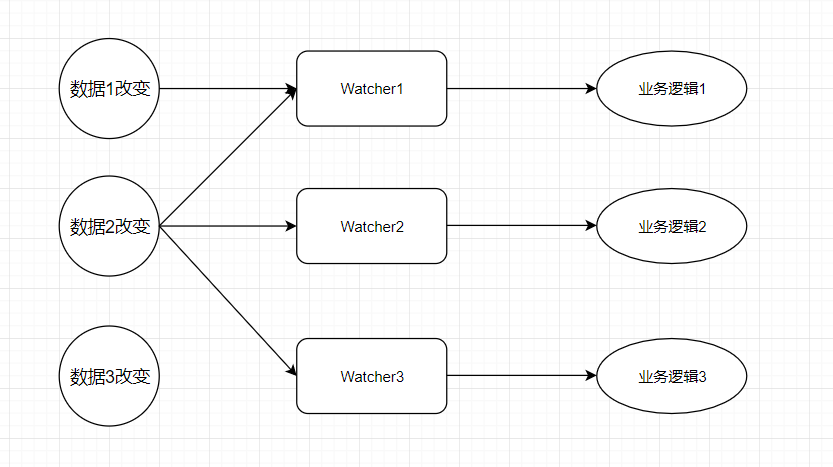
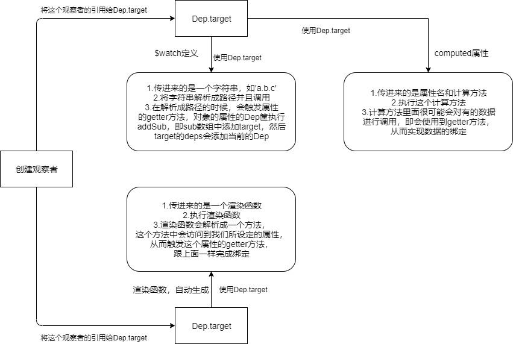
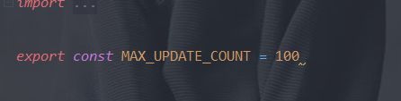

# 理清Vue响应式系统中的Watcher

[TOC]

### 引言

在这里我先提出两个问题（文章末尾会进行解答）：

- 在**Vue**的数据响应系统中，**Dep**和**Watcher**各自分担什么任务？
- **Vue**的数据响应系统的核心是**Object.defineproperty**一定是最好的吗？有什么弊端和漏洞吗？

### 一、什么是响应系统中的Watcher，它的作用是什么？

响应系统中的**Watcher**即这个系统的观察者，它是响应系统中观察者模式的载体，当响应系统中的数据发生改变的时候，它能够知道并且执行相应的函数以达到某种业务逻辑的目的。打个比方，如果你是一个商家，要寄一批货分别给不同的客户，那么**watcher**就是一个个快递员，发出的动作就是数据发生改变。你只需要负责寄出去这个动作就行了，如何找到、送到客户则是**watcher**的事情。

每个**watcher**和数据之间的关系要么是1对1，要么是多对多关系（这与**watcher**的类型有关），**watcher**和业务逻辑只有1对1关系。

### 二、Watcher的类型

在**Vue**源码中是没有体现出**Watcher**的类型的，我在这里给**Watcher**添加类型是为了更好地理解**Watcher**这个对象。**Watcher**在普通的业务逻辑上可以分为以下三类：

- 普通的**Watcher**：与数据1对1关系。
- **lazy**型**Watcher**：与数据1对1关系，但是它是一个惰性求值的观察者，怎么体现呢？对它进行赋值是不会改变它的值，只有当获取它的值的时候，才会更新最新版的数据（在**Vue**中体现为**computed**方法，一般求值是通过方法来求值的）。
- **render**型**Watcher**：与数据是1对多（不考虑传参进子组件）的关系，在一个组件中，渲染函数观察者一定是最后生成的，所以执行观察者队列的时候，渲染函数观察者在一个组件中是最后执行的。

在这里多嘴一下**lazy**型的观察者是怎么回事吧。**lazy**型观察者在**Vue**中表现为**computed**属性，一般这个属性是一个函数，以下是一个例子：

```js
computed: {
  // getCount最后处理成一个属性，然后这个方法被存储在Watcher的某个属性中
  getCount() {
    return this.a + this.b;
  }
}
```

**lazy**观察者里面有一个**dirty**属性，也就是一个开关作用，只有它为**true**的时候使用**getCount**的**getter**方法的时候，才会进行调用这个函数。

如果**lazy**观察者所引用的数据（**a**或者**b**属性）发生改变后，会将这个放到观察者队列中，然后执行这个观察者的时候把**dirty**赋值为**true**（代表下次访问**getter**方法的时候会执行一遍**lazy**的求值方法（求值后会将**dirty**赋值为**false**））。等到下一次需要获取这个数据的时候才进行求值，所以它叫做惰性求值。这种方式能够节省不必要执行函数的开支。

### 三、Watcher和Dep的关系

看过**Vue**源码的**defineReactive**这个方法，就会发现一个被观察的对象里面每个属性会有一个**Dep**依赖筐来存放所有观察它的**Watcher**。而**defineReactive**方法只有初始化每个属性的**dep**却并没有创建观察者（要分清初始化和创建观察者是分开这个事实）。那么这个**Dep**如何添加观察者呢？**Vue**使用了全局变量，这个变量叫做**Dep.target**，它是一个**Watcher**类型的变量，来将**Watcher**和**Dep**进行互相绑定。数据的绑定用图来表示的话如下：



我们可以明确以下区别：

- **$watch**方法定义的观察者，如果不设定**immediate**属性，那么是不会进行调用的，而**computed**和**render**是会进行调用方法的。
- 数据的**Dep**的**subs**数组存放这个数据所绑定的观察者对象，观察者对象的**deps**数组中存放着与这个观察者有关的数据**Dep**。所以数据的**Dep**与**Watcher**其实是多对多关系
- **$watch**和**computed**观察者是在**created**生命钩子函数前就创建完毕并且绑定的，而**render**观察者是在**mounted**之前创建并绑定的，所以同一个组件中，**render**观察者的**id**会大于其他观察者（**id**是在后面执行队列里面升序排序的时候的依据）。 **换句话说，同一个组件，当数据发生改变的时候，渲染函数观察者一定是最后执行的。** 这个很好理解，其他观察者中难免会对数据进行修改，如果渲染函数观察者先执行了，然后其他观察者对数据进行改变的话，那么没办法将数据准确呈现在页面上，导致数据不一致性。

### 四、讲一下观察者执行队列机制

**Vue**是如何实现性能优化的呢？最显著的两个点：

- 观察者设定执行队列，批量执行。
- **diff**算法减少渲染开支。

第二个不在这里面讲解，我们看一下第一个是怎么回事？

这个队列的长度是怎么定量的呢？

- 最大长度是100，源码摆在那里。

  

- 以一个事件循环时间段为搜集时间。（什么是事件循环？可以看一下本博客系统的其他优秀文章）

它的流程是如下的：

- 未执行时候：如果有更改过数据，那么就将对应的观察者直接推进队列中（执行的时候会进行根据**id**升序排序后执行）
- 在执行中的时候，如果有新的观察者进来了（观察者中更改数据，然后这个数据又绑定观察者），按照序号升序来进行排序。

### 五、解答前面的问题

1. **Dep**是负责存放数据所绑定所有的观察者的对象的容器，只要数据发生改变，就会通过这个**Dep**来通知所有观察者进行修改数据。（每个数据都有独一无二的**Dep**）。而**Watcher**更偏向于一个动作，也就是规定的业务逻辑或者渲染函数，是一个执行者。
2. 在**ES5**是很轻便的，很好的。但是在**ES6**出现后，它就一定不是最好的，因为**ES6**有一个**Proxy**代理来统一进行处理。
   - 弊端：如果一个数据有1000个属性，那么就要给这1000个属性使用**Object.defineProperty**，这样在初始化页面的时候会造成卡顿。如果用代理的话，那么只需要执行一次就可以了。
   - 漏洞：如果我们拿到了**vm**实例，那么我们是可以通过修改对象属性的描述符（**descriptor**）来进行修改它，会造成系统的不确定性。这是因为响应系统的模式导致必须将数据的描述符的**configuration**设为**true**，所以其他人能够对它进行修改。

这个问答是我个人阅读完代码后的解答，如果有什么不答错的请指正。