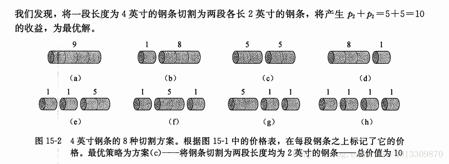
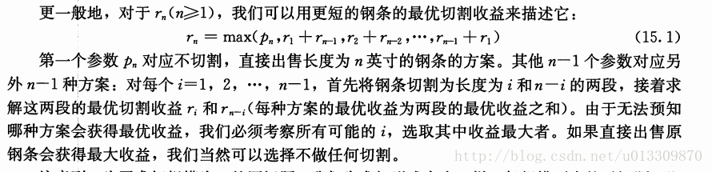
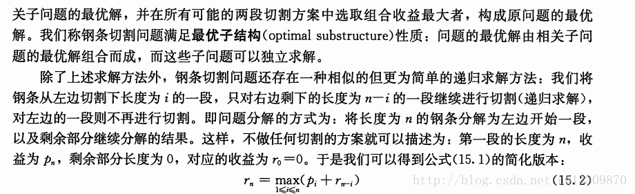

# 算法学习

## 1.动态规划

### 自顶向下的备忘录法

自顶向下的备忘录法通常需要一个数组进行存储求过的值，而这个数组的创建需要有一个函数来提供底层作用域，也就是说自顶向下最少需要两个函数，一个作为主函数一个作为副函数，主函数通过调用递归的副函数进行求求解。副函数会进行判断某个数组的值是否已经已经求解了从而减少计算量。

### 自底向上将问题先分解后汇合

自底向上问题降维化：先将问题分层，然后通过一层层汇聚最后成为问题的综合。

### 例子

#### 1、斐波那契数列

##### 自顶向下法：

```js
function fibonaci(n) {
  let resultArr = [];

  for (let i = 0; i < n; i++) {
    resultArr[i] = -1;
  }

  return fib(n, resultArr);
}

function fib(n, resultArr) {
  if (resultArr[n - 1] != -1) {
    return resultArr[n - 1];
  } else {
    if (n <= 2) {
      return resultArr[n - 1] = 1;
    } else {
      return fib(n - 1, resultArr) + fib(n - 2, resultArr);
    }
  }
}
```


##### 自底向上法：

```js
function fibonaci(n) {
  if (n <= 1) {
    return 1;
  }

  let num1 = 1, num2 = 1;
  let sum;

  for (let i = 2; i < n; i++) {
    sum = num1 + num2;
    num1 = num2;
    num2 = sum;
  }

  return sum;
}
```


#### 2、钢材切割问题

##### 题目：








##### 整体思路：

钢材切割问题的话，可以看做一个整体的，确定价格，然后将这个整体进行分解，分解到一直不能分解了。最后再从最小的进行最优解汇总。只要是每次都是最优解汇总的话，那么最大的一定是最优解。

##### 普通递归法：

普通递归法的思路是从左边开始，先切最小单位的，然后再将右边部分看做一个要求的问题的整体，一直分解，指到不能分解为止。这时候我们得出了右边的最小单位的、不可分解的部分，然后求出最优解，回调回上一层，求出最优解。这样一直回溯，最后最大的最优解就是从小到大的最优解的组合。

```js
function cut(arr, len) {
  if (len <= 0) {
    return 0;
  }

  let maxPrice = Number.NEGATIVE_INFINITY;

  for (let i = 1; i <= len; i++) {
    // 先将钢材切割，左边部分递增，再从右边部分递归切割得出最优解。
    maxPrice = Math.max(maxPrice, arr[i - 1] + cut(arr, len - i));
  }

  return maxPrice;
}

arr = [1, 5, 8, 9, 10, 17, 17, 20, 24, 30];

```

##### 自顶向下法：

```js
function cut(arr, len) {
  if (len <= 0) {
    return 0;
  }

  let cacheArr = [];

  for (let i = 0; i < len; i++) {
    cacheArr[i] = -1;
  }

  return getMaxValue(arr, cacheArr, len);
}

function getMaxValue(priceArr, cacheArr, len) {
  if (len == 0) {
    // 如果长度是0的话，那么就直接返回0
    return 0;
  }
  if (cacheArr[len - 1] != -1) {
    // 如果这个length是缓存的最优解，那么直接返回
    return cacheArr[len - 1];
  }

  for (let i = 1; i <= len; i++) {
    // 找到最大长度的价格并且与最优解相比的最大值
    cacheArr[len - 1] = Math.max(cacheArr[len - 1] == -1 ? priceArr[i - 1] : cacheArr[len - 1], priceArr[i - 1] + getMaxValue(priceArr, cacheArr, len - i))
  }

  return cacheArr[len - 1];
}

arr = [1, 5, 8, 9, 10, 17, 17, 20, 24, 30];
```


##### 自底向上法：

思路：自底向上的话，就是一个从最小的最优解开始找起。从长度为1的时候的最优解进行算起，将各个长度的最优解进行缓存，后面的求最优解的时候是基于前面的最优解来进行比较计算的。

```js
// 思路：长度1的最优解、长度2的最优解、长度三的最优解。。。。

function cut(arr, len) {
  let cacheArr = [];
  // 在前面添加个0，为了方便下标对应长度
  arr = [0, ...arr];

  for (let i = 0; i < len + 1; i++) {
  	// 前面多出来的下标是为了第一次求最优解的时候，cacheArr访问的时候为0
    cacheArr[i] = 0;
  }

  for (let i = 1; i <= len; i++) {
    max = Number.NEGATIVE_INFINITY;
    for (let j = 1; j <= i; j++) {
      // 将之前的最大值与下一个组合的最大值进行比较，其中cacheArr是缓存从1-len的最优解
      max = Math.max(max, arr[j] + cacheArr[i - j]);
    }
    cacheArr[i] = max;
  }

  return cacheArr[len];
}

arr = [1, 5, 8, 9, 10, 17, 17, 20, 24, 30];
```

### 何时才需要用到动态规划呢？

#### 1.最优子结构

​	像上面的那个切割钢材的例子，每个大的长度的最优解是依靠子长度的最优解进行的，所以我们要求一个大的大长度的最优解的时候，我们可以先从小的长度的最优解进行算起，然后通过逐层累加，最后就能得到大的长度的最优解。

#### 2.重叠子问题

​	像斐波那契数列那样子，有大量的重叠问题。比如求fib(8)，那么我就要求fib(7)和fib(6)，然后fib(7)要用fib(6)和fib(5)进行求解，这样会逐层往下进行求解。直到边界值条件位置。这样你会发现，fib(6)需要求解2次，那么fit(5)就要求解3次以上，这样的话，下面的那些数所要进行计算的次数就会多到不行，如果你能够进行缓存，也就是说把计算完的结果缓存起来，需要的时候用一下就行了，这样我们需要的时候就不用再次计算，这样可以减少很多计算量。

****

## 2.双指针法

双指针法即一个数组的两个下标，有两种用法：

- 分别代表指向数组的第一个下标和数组最后一个元素的下标。然后根据需要往中间间挪，直到碰头。
- 两个指针同时指向一个数组的最小元素的下标，一个指针会走得快，一个指针走得比较慢。

### 例子

#### 1.反转字符串

反转字符串的时候，需要用到两个指针，一个指向数组的第一项，一个指向数组的最后一项。然后一直往中间挪，这样就实现了数组的反转。

```js
function reservse(str) {
  if (str.length < 2) {
    return ;
  }
  
  let i = 0, j = str.length - 1, temp;
  
  while(i < str.length / 2) {
    temp = str[i];
    str[i] = str[j];
    str[j] = temp;
    i++;
    j--;
  }
  
  return str;
}
```

#### 2.数组拆分

告诉你`2n`个数字，将这些数字划分为`n`对，例如` (a1, b1), (a2, b2), ..., (an, bn)`。
求一种划分，使得`1`到`n`的`min(ai, bi)`的和最大。

翻译过来这道题的意思就是将2n数组分成n组，每组2个数字，然后再从n组数据中取出每组最小的数字，进行加和运算，求最后加和结果的最大值的一种划分。

**解题思路**：

1. 这个数组的最小的数字一定会被选择，并且作为一个最后加和的子项
2. 要使整个所有加和项最小，那么就要尽量将小的数不被选择作为加和的子项，那么最小的项就要跟第二小的项进行组合
3. 剩余部分按第一项和第二项进行操作。

```js
function getMinSum(numArr) {
  numArr = numArr.sort();
  let i, j, len = numArr.length， sum = 0；
  
  for (i = 0, j = 0; i < len; i += 2) {
    sum += numArr[i];
  }
  
  return sum;
}
```

#### 3.两数之和

输入一个按照升序排序的数组，求找两个不同的数字，使得他们的和等于目标数字。

**解题思路**：

1. 进行数组的一次循环遍历
2. 每次遍历取出遍历项，然后用目标值减去遍历项，就可以得到另外一个加法项，这样这个问题就转化为查询的问题。
3. 从遍历项的下一位为起始的下标，数组的长度为最终下标，进行二分查找。

```js
function twoSum(arr, target) {
  
}
```


