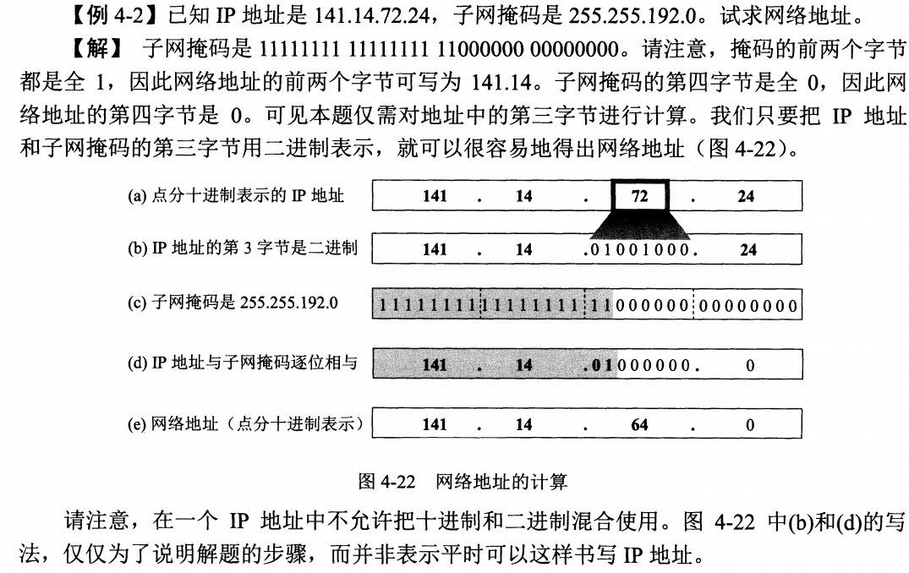
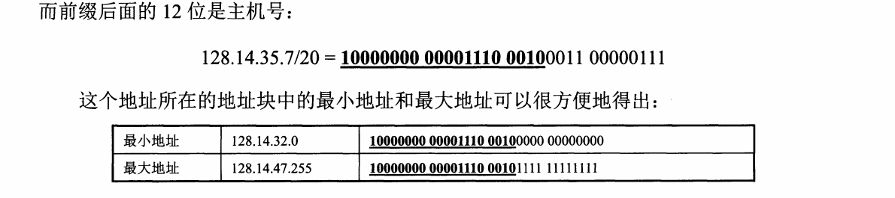
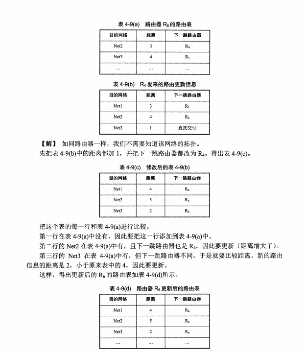
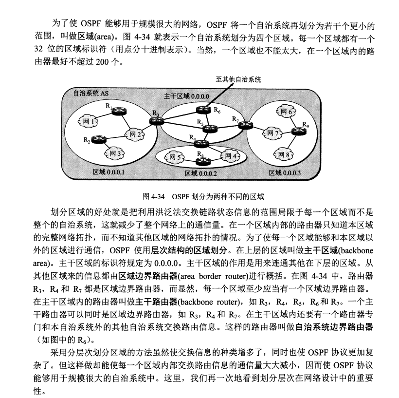
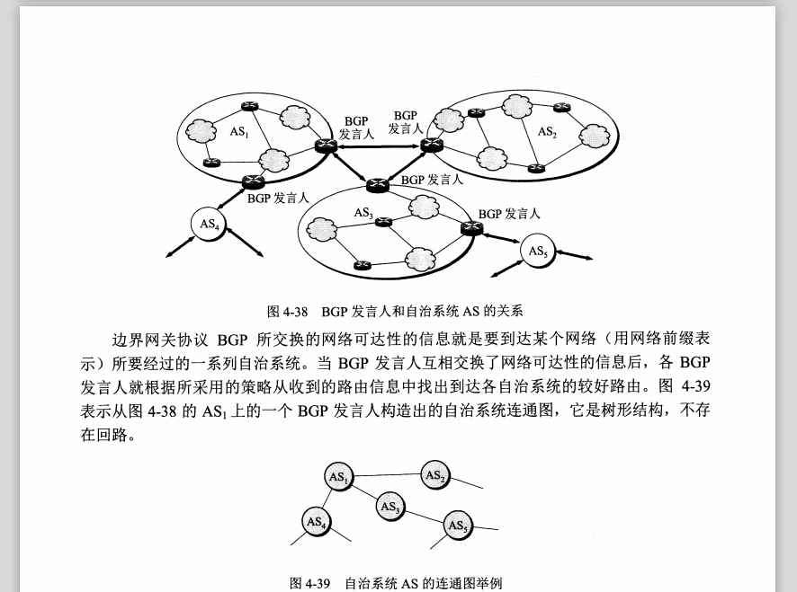

# 网络层

## 一、简述

网络层提供两种服务：虚电路服务（面向连接）、数据报服务（无连接服务）。

网络层向上值提供尽可能的、无连接的、不可靠的服务。

****

## 二、网际协议IP

### 2.1虚拟互联网络

​	在网络层中，互联网中的所有路由器组成可以看做一个虚拟的ip互联网络，不需要知道这个ip网络的具体拓扑图，只要知道这个网络能传送数据即可。

### 2.2分类IP地址

​	IP地址在网络中分成两个部分。网络号和地址号，一共32位二进制，ip地址的组成为

​									ip地址 = （<网络号><地址号>）

IP地址在网络中是有分类的，分成ABCDE五类，作用如下表：

| 名字    | 标识    | 解释                         | 应用 |
| ------- | ------- | ---------------------------- | ---- |
| A类地址 | 0开头   | 八位网络号，24位地址号       | 单播 |
| B类地址 | 10开头  | 16位网络号，16位地址号       | 单播 |
| C类地址 | 110开头 | 24位网络号，8位地址号        | 单播 |
| D类地址 | 1110    | 多播地址，不分网络号和主机号 | 多播 |
| E类地址 | 1111    | 保留为今后使用               |      |

### 2.3IP地址与硬件地址

​	IP地址是虚拟地址，存在于网络层的地址，是可以改变的。但是硬件地址（MAC）是不变的，是适配器中的地址，不会随着在不同的网络而改变，这个地址其实是在适配器中的ROM的地址，在适配器出厂的时候已经确定了的地址。

### 2.4地址解析协议ARP协议

​	ip数据报在网络中进行传输的时候，是需要通过网络层到达数据链路层的，而数据链路层进行传输时候是封装成MAC帧进行传输，也就是说需要有目的地址的MAC地址。那么在网络中是如何知道下一跳路由的MAC地址呢？这就需要使用到ARP协议，这个协议是通过发送广播，然后接收到的路由器的IP地址如果和广播中的IP地址相一致，就会进行回复。具体如下：

A需要Ip为xx的MAC地址，先进行广播，说我的IP是....我的MAC地址是...我想要这个ip的mac地址，然后广播出去

B刚好符合，所以发送一个单播的数据给A地址，回复，并且在ARP表中存放A的IP所在的MAC地址，A接收到回复也进行储存，这样下次使用的时候就不用去请求。

### 2.5IP数据报格式

​	ip数据报由首部和数据部分组成，首部有20位字节的固定部分还有可变部分。固定部分由数据报的总长度、原地址、目的地址、生存时间等等。

### 2.6IP层分组转发流程

​	流程：当路由器收到一个数据报的时候，从路由表得出下一跳路由器的ip地址后，并不是直接修改这个ip数据报，而是通过ARP协议将下一跳的地址的MAC地址取出来，从MAC中进行修改，也就是说从发送到接收时间内，目的地址iP总是不变的，变的地址只可能是MAC地址。

### ****

## 三、划分子网和构造超网

### 3.1划分子网

**从二级IP地址到三级IP地址**：三级IP地址的优点：灵活性强、对网段利用性强。

三级IP地址的构成：<网络号><子网号><主机号>

对外的话，还是显示为二级IP地址，对内需要则是三级IP地址，这个地址是通过子网掩码进行与运算解析出来将子网掩码用32位二进制表现出来，然后和ip地址进行与运算，这样就可以得出相应的网段。比如

| ip号        | 子网掩码      | 网段       |
| ----------- | ------------- | ---------- |
| 145.13.3.10 | 255.255.255.0 | 145.13.3.0 |
| 145.13.3.10 | 255.255.0.0   | 145.13.0.0 |
|             |               |            |

A类地址的默认子网掩码为 255.0.0.0

B类地址的默认子网掩码为255.255.0.0

C类地址的默认子网掩码为255.255.255.0

子网掩码是构造子网的重要属性。

### 3.2构造超网(CIDR)

特点：

- 消除了A类B类和C类地址以及划分子网概念。
- CIDR吧网络前缀都相同的连续IP地址组成一个地址块。

ip地址后面斜杆后是网络号的位数，如上图是20，则32位二进制前20位就是网络号，后面才是主机号。把前面20位组成的作为一个超网。

****

## 四、网际报文协议以及互联网路由选择协议

### 4.1网际报文协议ICMP

​	ICMP有两个功能：出错报告报文、询问报文

- 出错报告报文：当路由在传输数据的时候，可能会出现ip数据报超时、无法到达目的地、路由重定向等等，此时需要向原地址进行传输报文，则ICMP则充当这个角色。
- 询问报文：路由器之间需要进行询问是否可达、时间同步等等，也需要ICMP来进行。

应用：ICMP最大的应用是ping来查看是否可达目的地，这个ping只是在网络层中进行探寻，而不需要经过运输层。

### 4.2互联网路由选择协议

因为互联网中的局域网和广域网中的差别很大，所以互联网的路由选择协议分成两种：

- 内部网关协议：rip协议和ospf协议
- 外部网关协议：bgp协议

#### 4.2.1内部网关协议

##### rip协议：

rip协议中，路由之间的距离的定量单位是跳，相邻路由间的距离为一跳，在这个协议中，路由表存着目的网络与当前网络的最小通道的跳数、以及下一跳的地址。存放的数据如下：

| 目标网址    | 下一跳地址  | 距离 |
| ----------- | ----------- | ---- |
| 192.168.1.1 | 192.168.2.1 | 2    |

数据格式如上表，在这个协议中，由于存储的东西比较少，所以此协议是一个轻便简洁的协议。但是也正是记住距离太简单，并且规定距离超过16跳的为不可达，所以这个rip协议的适用范围比较小，适合规模比较小的局域网。

**交换数据**：

​	rip协议中，路由器仅和相邻的路由器进行数据交换，不和其他路由器进行数据交换。但这并不代表着这个局域网中的路由器具有的路由表是欠缺的。（由于信息不断与邻边交换数据，所以每一个路由器具有整个局域网的所有地址的一个距离以及要去这个地址下一跳要怎么走）。

**rip特点是：好消息传输的比较快、坏消息传输的比较慢，并且需要定期更新路由表**

​	rip协议中，进行数据更新的话是有路由更新算法，这个算法对于路径进行更新。

上面的例子就是对路由表进行更新的过程。

##### ospf协议：

​	ospf协议的名字是开放式最短路径优先OSPF，是克服了RIP协议的一些缺点。首先，ospf协议中距离的判定是比较多维化的，并不像rip协议那样子是只有根据跳数来进行判断的。它可以根据距离、传输时延等等进行判断。不同点如下：

- 发送信息方式不同：ospf在路由状态更新的时候，发送信息的方式的方式叫做“洪泛法”，这是由一个路由器发起的，然后每个路由器接收后改变路由表后，会继续向局域网进行广播（当然会进行防止重复传播的措施）
- 发送的信息是发起广播的路由相邻的所有路由的链路状态，链路状态度量是多维的。
- 只有在链路状态发生变化的时候才会向网络中进行洪泛法更新状态。这个跟rip协议很不同，rip协议是定期进行更新链路状态，而ospf协议则是当链路状态发生改变的时候才进行更新路由。这样比rip灵敏并且降低了网络开销。解决了rip协议中的一个好消息传输的比较快，坏消息传输的比较慢的问题。

由于各个路由器之间传播消息比较频繁，所以每个路由器都有当前网络的路径，最终所有的路由器构成这个网络的链路状态数据库。这个数据库实际上是**全网的结构拓扑图**。

​	为了让ospf能够适应比较大范围的网络，我们将网络进行分层，然后每一个层中各有一个ospf域，这样就能够较好地应用ospf协议。在这个方法中，在上层的区叫做主干区域，主干区域的标识符规定为0.0.0.0，每个区域应当有一个边界路由器，从其他区域过来的消息会经过边界路由器进行概括后发送到该层中。

ospf协议不是通过udp协议进行传输的，而是通过ip协议进行传输的，好处是传输的数据量比较小。

**ospf协议的组成**：由头部和数据部分组成。

ospf允许管理员为每条路进行指派不同的代价，可以根据代价进行选择最优路径，有时候最优路径并不一定是最短路径。

在数据部分，ospf分五组：

1.问候分组

2.数据库描述分组

3.链路状态分组

4.链路状态更新分组

5.链路状态确认分组

#### 4.2.2外部网关协议BGP协议

外部网管协议这是力求寻找一条能够到达目的网络的比较好的路由（不能兜圈子），并非寻找一条最佳路由，BGP采用的路径向量路由选择协议。

BGP协议是解决自治系统间连接的问题。如下图：

它具有四种报文：

- 打开（OPEN）：打开报文是进行建立。
- 更新（UPDATE）：更新报文是进行更新信息
- 保活（KEEPALIVE）：保持连接的存活
- 通知（NOTIFICATION）：发送检测到的错误

### 4.3路由器的组成

路由器组成可以分成两大部分：路由选择以及转发。

## 五、IPv6

IPv6是为了解决ipv4中地址不够用的情况，相比于IPv4，这个IPv6的优点有以下：

- 自动分配
- 容量大
- 不分abc类地址。

ipv6用16进制进行表示。表示法中可以用0压缩法。

### 5.1IPv4和IPv6之间的转换

#### 5.1.1双协议栈法

双协议法是通过对ip地址判断为哪种地址，然后根据相应的地址进行头部的转换，有一个缺点 就是ipv6用ipv4进行封装传输的时候会出现信息丢失的缺点。

#### 5.1.2隧道技术

将ipv6的整个数据报作为ipv4的数据报的数据部分，这样虽然增大的数据部分，但是可以保证协议不丢失信息。

****

## 六、VPN以及NAT

VPN全称是虚拟专有网络。普通的专有网络是通过专用的电信网络，不与互联网相连接，所以比较安全。但是这样物理成本比较高。而VPN则不需要建立专用电信网络，而是通过技术在互联网中独立出来的访问技术，这样大大减少了费用开支。

NAT则是将内部网络地址转为外部网络地址进行访问，实现网络地址的复用，但是服务器端不可以用这个技术，因为内部地址对于外部是不可见的。

