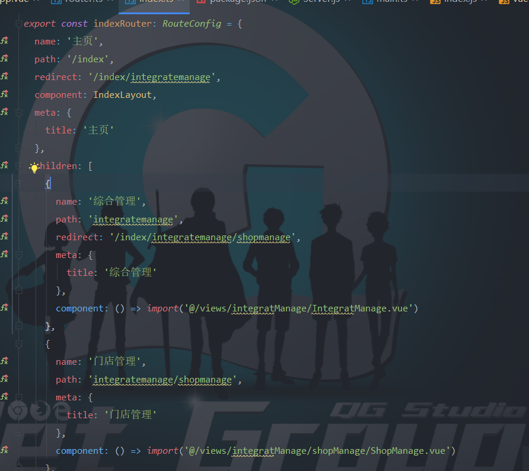
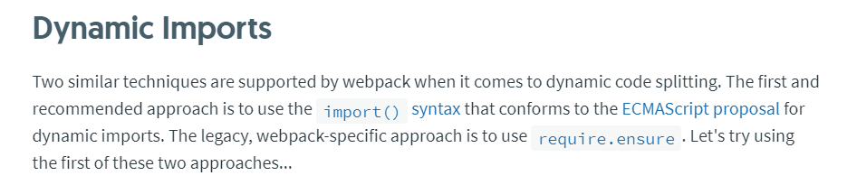
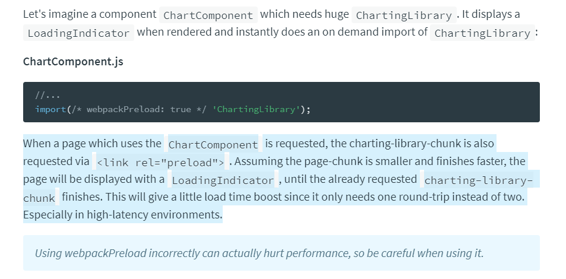

# Vue如何处理懒加载的异步组件

### 何处、如何使用异步懒加载组件？

Vue使用异步组件一般是在Router处进行使用，在Routes配置中采用函数的方式来进行处理，这样在进行初始化的时候，判断是一个函数，会处理成为异步组件，不过这样只是处理成为异步组件，但并不是懒加载的原理，懒加载是有webpack来进行处理的。具体使用方法如下：

### webpack怎么进行懒加载（代码分割）

webpack使用`() => import('abc');`这样的用法会自动处理成为单个文件，然后处理成为一个`Promise`对象，

在webpack的官方文档中，使用代码分割的话是有两种方式：

- `import()`方法
- `require.ensure`

`require.ensure`方法是处理成AMD规范的模块化技术。而`import`会处理成为`Promise`对象的形式。

那么`import`是怎么进行懒加载处理呢？我们首先看到webpack的图

使用`ensure`或者`import()`进行创建异步组件的时候，会在html文件中创建一个`script`标签和`linked`标签，前者是进行加载被分割的目标代码，而后者是增加目标的样式。不过我们可以对webpack进行配置，使其具有预加载的功能，就是在浏览器空闲的时候进行加载。不过这里不会进行解释。

