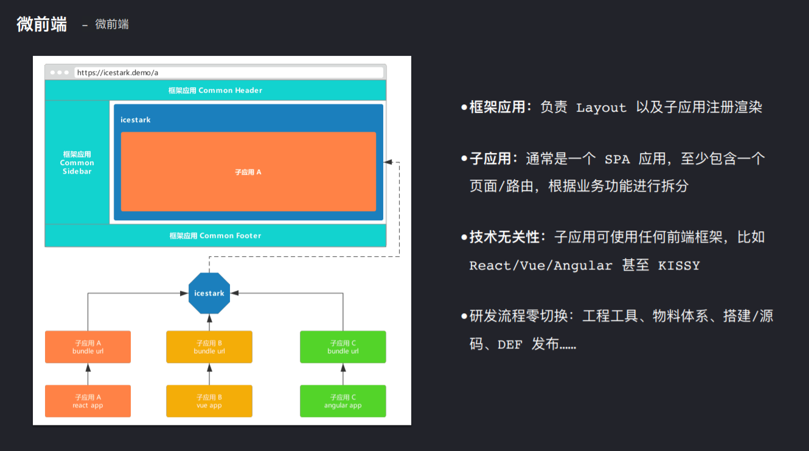

# 微前端思考

[TOC]

### 传统大型项目应用架构如何处理复杂的页面？

##### 1.巨石模式

使用原生开发（有使用模块化技术），整个页面放置在一个项目中，页面模块之间有千丝万缕的关系。缺点很明显，后期维护极为困难，基本只能扩展而不能够修改，修改的话可能牵一发而动全身。

##### 2.iframe实现

页面中通过内嵌`iframe`标签来嵌入不同的页面，优缺点如下：

- 优点：天然的隔离，父子页面之间变量什么的隔离开来。通信只能通过`postMessage`、`HashChange`等来进行通信。所以父子组件之间隔离做得非常好
- 缺点：内部的`iframe`也是一个网页应用，它也会存在与外部一样的变量实例，也会存在自己的滚动条等缺点。

##### 3.分项目，以layout公共组件为公共组件

大型项目的layout抽象成一个公共组件，然后将大型项目分割成多个单页面子项目。如果layout组件修改样式，那么需要全部项目进行更新打包。

- 优点：相比于`iframe`实现的，同一个项目中子父组件可以共享数据。并且组件化开发很容易实现代码复用。
- 缺点：
  - 存在代码冗余。如`layout`组件是抽离出来的，然后每个项目都需要引入；
  - 每个子项目都是单页面应用，但是整体看起来就是多页面应用；
  - 并且项目页面跳转的时候需要重新渲染页面，造成一定的资源浪费。

##### 4.微前端

将页面抽象成父子应用，`layout`层是一个父亲应用，不会很大，一般部署后，除非修改样式或者内容，否则长期不用重新部署，然后通过后端管理`Router`来实现子应用热部署到父应用中。

- 优点：
  - `layout`抽离成一个程序，然后通过动态加载路由确定子组件大体路由，如果访问到子应用，则动态进行加载子应用。这样将父应用和子应用分开。
  - 相比于分项目，这是一个真正的单页面应用，并且无需重新编译即可实现热插拔子应用。
  - 分层结构，子应用只需要按照父应用的接口来实现即可，并且可以实现技术无关性
- 缺点：
  - 需要开发一个该大型应用的管理应用，专门管理子应用。
  - 需要更加复杂的逻辑

### 微前端的架构长什么样子？

微前端是由父-子应用来进行分层解耦，根据业务将不同业务的子模块进行拆分，然后与父应用实现相同的接口调用关系即可。

而`Alibaba`的`icestark`则是作为中间人来规范接口，微前端有如下特征：

- 父子应用：父亲应用根据`Router`来动态加载子应用。
- 父子应用具有技术无关性：子应用可以是任意的前端框架，这样可以实现老项目使用最少代价微服务化。

### 实现微前端的技术基础是什么？

##### 1.动态路由

实现热插拔的基础就是前端的大体路由要实现动态加载，路由由后端统一储存，这样才能通过配置平台进行路由的配置。

##### 2.动态加载子应用

前端单页面动态加载子页面的实现技术基础是：**异步组件+webpack代码分割**，而如果是微前端架构下，父子应用则不能通过单页面动态加载子页面技术来实现，有如下原因：

- 由于子应用是允许使用任何前端框架的，那么有可能子应用是一个`Vue`应用，那么不能使用父应用的代码，只能自己编译并且使用自己编译后的代码，并不能实现和父应用方法的共享。
- 同样是React项目，由于不同的子应用的版本不同，那么实现代码公用的可能性也很小。

所以除非框架的公共代码是通过动态引进来的（不现实），否则基本上父子应用之间不会实现代码共享。

所以个人的实现动态加载子应用的思路是：

- 创建一个`div`标签，然后子应用通过单页面渲染来动态渲染进行这个div即可。

****

PS：这些是我没有查看iceStark之前的微服务思考，等待实习招聘完成后，我会学习React并且体验一下微前端然后再来修改！

