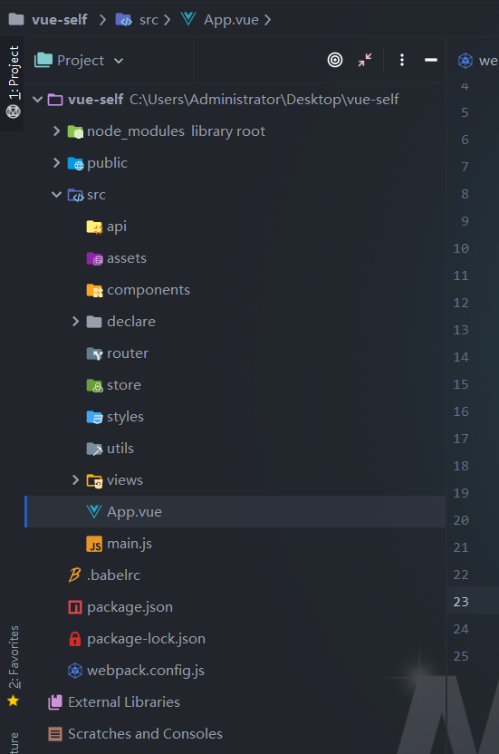

# Webpack的实现原理

[TOC]

### 基本概念

1. Entry：入口，webpack构建入口。
2. module：webpack中一个模块对应一个文件，其实是利用node的模块化。
3. chunk：代码块，一个chunk由多个模块组合而成，用于代码的合并与分割
4. loader：模块转换器，用于将模块的内容转换成新的内容
5. plugin：拓展插件。

#### loader和plugin的区别

1. loader：相当于一个转换器，将A文件转为B文件，loader让webpack能够处理不同的文件，loader将所有类型的文件通过转换规则转换成webpack能够处理的文件，然后webpack进行打包操作。
2. plugin：执行一些打包、优化压缩等等操作。

#### 实质

webpack的实质是一个Node程序。

#### Webpack的执行流程

1. 初始化入口，然后将用户配置的webpack配置项和shell命令进行合并，然后得到编译的参数
2. 创建编译实例
3. 从入口出发，用loader对文件进行编译，然后获取文件所引用的模块，进行递归编译
4. 完成编译模块后，得到每个模块被翻译之后的内容和他们对应的引用关系以及依赖关系
5. 输出资源，根据入口和模块之间的依赖关系，组装成一个个包含多个模块的chunk，再将chunk转为单独的文件
6. 输入完成后，根据配置确定输出路径和文件名，然后用fs将文件输出到系统中。

### 基本用法

##### 1.入口(entry)

```json
// entry选项可以用两种方式来使用
entry: 'path'  // 这种处理只有一个模块的方式

// 这种处理多个文件入口的模式，每个文件都会进行独立的处理，最后处理成不同的文件输出
entry: {
  app1: '',
  app2: ''
}
```

最后会处理成为相应的出口文件，不过如果是进行代码分割的话，遇到相同的模块会共享同一份代码。

##### 2.出口(output)

```json
output: {
    // 输出路径
    path: path.resolve(__dirname, './dist'),
    // 输出文件名称
    filename: '[name]-[hash].js'   // name代表着入口文件模块，hash代码着hash后缀
}
```

##### 3.mode

##### 4.使用source map

对于webpack处理后的文件，模块将模块处理成为字符串，在初始化的时候使用eval进行进行解析成为模块，如果使用

`devtool: "inline-source-map"`的时候，会将代码以源码的形式展示出来，此时有利于debug

##### 5.使用观察模式来进行实时打包

`webpack --watch`命令开启观察打包模式，在这个模式下，对webpack文件进行修改会触发webpack的打包功能，不过这种是直接打包的，我们需要刷新浏览器才能够看到效果，接下来介绍的是使用热更新，如果发生了修改会自动刷新页面。

##### 6.使用服务器来适用于开发环境

`npm install webpack-dev-server`命令安装开发环境服务器。通过使用命令

`webpack-dev-server --open`命令开启热更新模块。热更新模块的思路是将文件处理完毕后，先不处理成为文件，而是在内存中。通过node开启本地服务器，网页访问数据的时候，服务器直接将内存中的数据返回给浏览器即可。

如果热更新的时候，需要进行声明，如下：

- `module.hot.accept`：代表模块执行热更新
- `module.hot.decline`：当前模块更新时候一定要刷新页面

##### 7.webpack选项合并

`npm install webpack-merge`：此插件能够实现webpack选项的合并，这样的话，能够根据不同的mode来分不同的文件，然后使用合并的方式来进行合并选项。

##### 8.处理babel-loader使用import()报错的情况

这是因为babel-loader暂时没有能够处理代码分割的能力，需要使用到

`babel-plugin-dynamic-import-webpack`进行代码分割。

##### 9.预处理、预加载模块

webpack处理异步组件的时候，存在一个叫做魔术注释的东西，即可以使用注释来处理异步模块

```js
import(
	/* webpackPrefetch: true */
  'a.js'
)

import(
	/* webpackPreload: true */
  'a.js'
)
```

进行处理模块，会自动在html的linked进行加载操作。

##### 10.shim预置依赖

对于一些语法、内置模块，webpack是能够支持的，但是对于一些用户所导进来的包作为全局变量，则webpack是不会去理解的，如果处理不当可能会导致错误，可以使用webpack内置模块ProvidePlugin插件

```
new Webpack.ProvidePlugin({
  _: 'lodash'
})
```

还可以使用按需加载

```js
new Webpack.ProvidePlugin(
	['lodash', 'join']
)
```

这样的话可以使用treeshaking来删除不必要的代码。

这样处理的结果是我们在全局中，无需import语句即可使用。

##### 全局export

对于一些古老的lib模块，很多都没有导出语句，这时候我们可以通过export-loader来进行webpack配置上的导出。而不需要直接去修改古老的lib模块

##### 加载polyfill

`npm install babel-polyfill --save-dev`：使用polyfill来让浏览器支持一些ES6新语法，比如Promise等

```js
import 'babel-polyfill'
```

使用这些模块的时候，需要在所有模块之前同步导入，即在主文件头部里面进行导入。这样才能在所有的模块中使用。

### 使用Webpack搭建Vue框架（JS版本）

##### 1.初始化项目

```shell
npm init // 初始化项目
```

初始化项目目录：



首先初始化项目，创建如上图的项目目录，基于上面的项目目录来进行配置项目。

按照以往的情况进行创建基本的目录，并且写好App.vue、main.js等等

##### 2.需要的loader以及loader的作用

首先我们要确定需要处理什么文件

```
js、vue、css、scss
```

所以我们针对于以上文件来进行处理

- vue文件，需要有能够解析Vue文件、style标签文件、模板编译文件，所以需要用到的loader如下

  - vue-loader：处理vue文件
  - vue-template-compiler：处理vue的template标签内容。所以vue通过webpack项目进行预处理模板，而通过api调用的需要在运行时候进行处理模板，所以使用框架相对会快。
  - vue-loader-plugin：包含在vue-loader中的插件，专门处理vue文件的script内容
  - vue-style-loader：处理vue文件的style标签内容，处理成为内联的style，不过与mini-css-extract-plugin相冲突。

- scss和css

  - scss相比于css文件需要使用scss-loader处理一遍，变成css文件，然后接下来步骤和css一致

    以下和css文件一致

  - css-loader：解释 `@import` 和 `url()`，对里面的路径进行处理

  - vue-style-loader：功能类似于 `style-loader`，是将 `css-loader` 加载后的 `css`作为样式标签动态注入到文档中，是专门应用于 `vue` 模板环境下的样式表加载器。因此如果配置了 `vue-style-loader` 就不需要再配置 `style-loader`了。（**最后处理成为内联的style**）

  - 使用`Autoprefixer`插件进行前缀添加

- js

  跟普通的webpack配置一致，如果使用babel-loader的话，需要加入动态载入plugin来处理ES6的代码分割。

  - babel-loader：将ES6语法转为ES5，如箭头函数，let、const处理成var

  - 如果需要用到ES6的方法， 那么需要使用到babel-polyfill处理

    ```js
    {
      "plugins": [
        ["transform-runtime", {
          "helpers": true,
          "polyfill": true,
          "regenerator": true,
          "moduleName": "babel-runtime"
        }]
      ]
    }
    ```

##### 3.需要的plugin和plugin的作用

plugin是进行loader处理后，进行对js进行处理。需要用到的plugin如下：

- html文件处理：`html-webpack-plugin`：对html文件进行处理，自动挂载所需的js和css文件。
- 压缩css并且分包：`mini-css-extract-plugin`：需要进行配置名字规则， 并且在loader中设置处理
- 每次打包前进行清除输出文件：`clean-webpack-plugin`
- webpack.LoaderOptionsPlugin：在vue.config.js中一些选项，比如publicPath、chainWebpack进行配置
- webpack.HotModuleReplacementPlugin：进行热更新处理。需要在devServer设置hot处理true，则可以使用热更新。

### 热更新模块

webpack的热更新实现过程是监听本地文件是否发生改变，即监听文件描述符，如果发生改变，触发webpack重新编译，编译结果通过WebSocket，即利用服务器推送的方式告知客户端，客户端使用JSONP进行获取文件，然后通过hash对比删除旧版本的文件，然后进行重新部署新版本的模块。

### 打包优化

- 开启多进程并发打包，使用happyPack进行并发打包
- babel-loader?cacheDirectory：缓存，加快重新编译的速度
- 配置cache：true，是否启用缓存来提升构建速度。

### 常见问题

##### 1.常见的loader有哪些？

- file-loader：将文件输出到文件夹中，并且使用相对路径去引用
- url-loader：将文件处理成为base64编码嵌入到网页中
- babel-loader：将ES6的语法转为ES5的语法。但是不会将ES6的pollyfill录入
- style-loader：将样式以style标签嵌入到html中
- css-loader：将css进行处理，并且输出到文件中，用linked标签进行引用。
- image-loader：压缩图片
- eslint-loader：使用eslint检查代码
- vue-loader：处理vue文件
- vue-compiler-loader：将vue的模板进行编译处理。

##### 2.常见的plugin？

- html-webpack-plugin：处理html文件
- commons-chunk-plugin：处理公共代码
- hotModuleloadplugin：热更新模块。
- ugly

##### 3.如何构建多页面应用

- entry多个入口，并且将公共代码抽离开来，开始common-chunk-plugin，将公共代码统一处理。

##### 4.webpack的作用

- webpack是一个模块打包工具，对于模块所引用的文件会进行递归打包，最后输出成为文件。

##### 5.webpack-dev-server的两种模式

- 服务器模式：即访问服务器地址，会返回一个html文件，然后进行渲染引用。
- 第三方库调用模式：最后处理成为一个js文件，然后自己写一个html文件去引用。

##### 6.热更新流程

1. 使用webpack-dev-server创建一个express的服务器，并且开启一个WebSocket端口
2. 进行webpack编译，供用户访问网页
3. 浏览器访问html文件，并且加载js文件。与服务端进行WebSocket连接
4. 当服务器中的文件进行修改的时候，触发webpack监听文件的描述符（轮询方式），并重新进行编译处理，修改文件编译处理后的hash通过WebSocket发送给客户端。
5. 客户端通过判断是否更新还是说重新刷新页面
6. 如果是更新的话，需要用到ajax请求到express拿到修改后的文件的地址，通过jsonP的请求获取到相应模块
7. 进行模块替换。
8. 更改已经修改的文件，渲染页面。