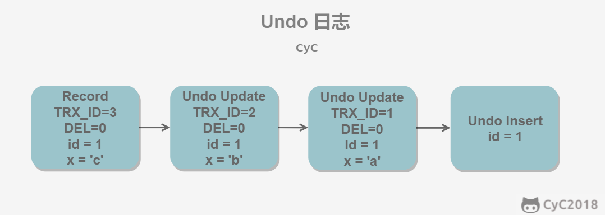

[TOC]

## MySQL基础

### MySQL基本数据类型

- int、Float、Double
- year、time、date
- char、varchar、binary、varbinary、text

### 检索

- 在检索结果中，如果按照多个条件进行排序的话，那么会按设定顺序排序：即如果前者有相同的项的话，后者会在这些相同的项中进行排序。
- 聚集函数：AVG、MAX、MIN、SUM、COUNT
- 分组查询：
  - group by：列名
  - having是对组别进行过滤：所以having放在group by后边
  - where是对行进行过滤，所以where放在group by前边。
- 相关子查询：涉及到外部查询的查询,内查询查询一次，外查询就查询一次。
- 不相关子查询：内查询只需要查询一遍即可。两者的区别就是相关子查询需要用到外查询的数据，而非相关子查询则不需要。
- 视图：

### 视图

视图是一种虚表，而不是实际存在的表。它是建立在视图之上的规则，每次使用视图的时候，都会用到视图规定的查询语句是查询真正的表。所以它并不会存储数据，而是简化用户的操作。

- Create View...
- Drop VIew....

### 触发器

对于表的操作，INSERT、UPDATE、DELETE都可以使用触发器，触发器是建立在表之上的操作，对于表可以规定，触发器的命名最好是在数据库中是唯一的。

- 只有基本表才能支持触发器，其他比如视图、临时表都不支持触发器。
- 有before和after两种

## 数据库理论基础

### 事务

- 对于数据库表的一组操作，要么全做，要么全不做。
- 命令语句：
  - `start transaction`：开始进入一个事务，在本事务内部对基本表进行修改操作，都可以使用`rollback`进行数据回滚，（仅仅可以对`Insert、delete、update`三种操作，不可对drop、create进行回滚）
  - `rollback`：事务回滚。
  - `commit`：事务提交。
  - `SAVEPOINT`：事务保留点，有些事务在写一半的时候，无论后面是否成功，都要保持前面的操作，那么可以设定一个保留点来将事务进行划分。
    - 在执行一个rollback或者commit的时候自动释放保留点
    - 可以使用release + 保留点名称来进行释放保留点。

### 角色/权限控制

- 数据库具有权限角色之分

### 数据库模型

- 概念模型：从用户的观点看到的数据
- 逻辑模型：数据库数据的组织形式。
- 物理模型：数据库的物理存储形式。

### 数据库安全设计

数据库的安全手段：

##### 1.数据库安全性控制

- 自主存取控制

- 强制存取控制：将数据库分为主体和客体，主体是应用、或者数据库角色。客体是数据库表。

  - 当主体的许可证级别大于客体的数据库密级的时候，可以读取客体的内容；
  - 当主体的许可证级别小于客体的数据库密级的时候，可以写入数据；

  前者很容易理解，但是后者的原因是：如果都是主体的许可证级别大于客体的密级的时候可以读写，那么主体可以将高加密级别的数据写入到低加密级别的数据中，从而没有加密级别的意义。

##### 2.视图控制

将数据库无关密级的数据通过视图展示出来，然后有关加密的数据不进行展示，从而实现数据安全。

##### 3.审计

通过用户的操作日志来进行记录用户的行为。当数据库出问题的时候，进行相对应的处理。

##### 4.数据加密

- 存储加密：采用加密算法对数据进行加密，这样能够防止数据被盗取后不被利用。
- 传输加密：由于mysql是CS的类型的数据库，中间需要通过网络来传输数据，我们可以采用https的形式在传输过程中进行加密操作。

### 数据库完整性

数据库的完整性是指数据库的相容性和正确性。

##### 1.实体完整性

对于数据表的每一行，都有唯一标识这一行的码，叫做主码。主码的检测规则如下：

- 如果该行的主码在其他行中出现，那么拒绝插入或者修改。
- 如果改行的主码不存在，那么拒绝插入或者修改。

##### 2.参照完整性

对于数据表的每一行，如果某个属性关联到外部表中的某个属性，那么该属性不能为空，并且该属性的值一定是所关联表的某个属性的值。

##### 3.用户定义完整性

用户可以自定义某个属性的值的范围。还可以定义CONSTRAINT别名，然后易于修改。

### 关系数据理论

#### 候选码

对于U，存在K，使得K->U，U完全函数依赖于K，把K成为U的候选码

- 如果候选码有多个，那么选择其中一个作为主码
- 在候选码中的属性叫做主属性，否则叫做非主属性

#### 范式

##### 1.1NF

所有属性都是原子属性，不可再分，也也不存在相同的属性列名。满足这样的才叫第一范式.

`字段是最小的单元，不可再分`

##### 2.2NF

在不存在多值属性的基础上。要求定义主属性。实体的属性们要完全依赖于主属性。不存在非主属性对主属性的部分依赖。

`在第一范式的基础上，然后每个非主键都完全函数依赖于主键`

##### 3.3NF

在不存在多值属性、不存在实体的属性部分依赖于主属性的基础上。要求任何非主属性不依赖于其他非主属性。这称之为消除传递依赖。

`在满足第二范式的基础上，非主键外的所有字段都必须互不相依赖`

##### 4.BCNF

不存在多值属性，所有非主属性都完全函数依赖于主属性，不存在非主属性依赖于其他非主属性，并且主属性要完全函数依赖于不包含它的码，即主属性内部不能有部分或者传递函数依赖，这样消除对主属性自己的依赖，使主属性保持最简。

### 事务

#### 1.什么是事务？

所谓事务，是指序列化的一组数据库操作，这些操作要么全做，要么全部做，是一个不可分割的工作单位。

#### 2.事务的ACID特性

##### 原子性（Atomicity）

事务是数据库逻辑工作单位，要么全做，要么全不做。

##### 一致性（Consistency）

事务的执行结果必须是将数据库从一个一致性状态转为另外一个一致性状态，如果执行错误，要返回给原始一致性状态

##### 隔离性（Isolation）

一个事务的执行不能够影响其他事务的执行，即事务的内部操作对其他并发事务是隔离的，并发执行的结果互不干扰。

##### 持续性（Durability）

持续性也称为永久性，即事务的操作应该是永久存在的。

事务ACID特性遭受破坏的情况有两种

- 多个事务并行运行时，不同事务操作交叉执行
- 事务在运行过程中被强行停止。

#### 3.什么是事务隔离，事务隔离的级别？

事务隔离定义了数据库中的一个操作的结果在何时以何种方式对其他并发操作可见。

数据库的隔离级别如下，一下是从低到高的级别。

首先看一下概念：

- 脏读：一个事务读取了另外一个事务中未提交的事务，读取完毕后另外一个事务可能采用回滚。
- 不可重复读：针对于读取的同一条数据，在一次事务中两次读取的内容不一致。也就是读取过程中，其他事务对这条数据进行修改（**针对于行**）
- 幻读：在同一个事务中，进行获取某个条件的数据的长度不一致，原因是其他事务在进行插入数据。（**针对于表**），也有可能是对数据进行修改导致获取的数据长度不一致，所以它是在不可重复读基础上添加了对插入、删除数据的限制。

**在MySQL中下面有可能是错的，因为MySQL不遵循SQL标准**

##### 1.读未提交

最低级别的数据库隔离级别，允许“脏读”存在，事务能够看到其他事务“尚未提交”的修改。但是不允许其他事务在本事务写数据的时候对数据进行修改（允许读），所以使用到了“排他写锁”

##### 2.读提交

不允许脏读，但允许不可重复读，分为两个方面：读取数据的事务允许其他事务继续访问该行数据，但是未提交的写事务将会禁止其他事务访问该行。“瞬间共享读锁”和“排他写锁”

- 不允许脏读：未提交的写事务不允许任何事务对数据进行操作，从而避免了数据脏读。
- 允许不可重复读：在读数据事务的时候允许其他事务对数据进行写入，如果该读取事务操作有两次读取数据，那么会产生读取的结果不一致。

##### 3.可重复读

禁止不可重复读和脏读，但是有时候可能产生幻读。可重复读可以通过“共享读锁”、“排它写锁”来实现，读取事务会禁止其他写事务（但允许读事务），写事务的时候不允许其他操作。

- SQL标准的处理方式
  - 不允许脏读：写事务禁止其他事务对数据进行操作
  - 禁止不可重复读：读数据事务的时候不允许写数据，所以在读数据事务中，数据不会被任何事务修改。
  - 可能会幻读：由于读数据的时候是锁某一行数据，而不是锁整个表，所以在获取数据事务的两条操作中可能会多出几条数据。
- MySQL处理方式：在Repeatable Read下采用Next-key-Lock算法，可以避免幻读的产生。

##### 4.序列化

提供最严格的事务隔离，要求事务必须序列化，然后一个接着一个进行执行，不能并发执行，仅仅通过“行级锁”是无法实现事务序列化，必须要有一个范围锁来进行限制。

### 并发控制

事务是并发控制的基本单位。而保证是事务的ACID特性是并发控制所需要进行的操作。

锁机制：

- 共享锁：也称为读锁，事务在加锁的时候，允许其他事务来进行读，但不允许修改
- 排它锁：在进行修改的时候，不允许其他事务的任何操作。

##### 1.封锁协议

- 一级封锁协议：事务T在修改数据R的时候必须加入X锁，直到事务结束后才释放。（结束有可能是commit或者rollback）
  - 可以防止修改丢失
  - 读数据没有锁机制，可能导致读脏数据
- 二级封锁协议：在一级封锁协议基础上增加事务T在读取R数据前必须对其加S锁，**读完后**可释放S锁
  - 可以防止读脏数据：：在加入X锁的时候，如果要进行读取数据的时候，必须加读锁，但是X锁是排他锁，所以加不了锁，即无法读。也就是说在事务结束前，其他事务不可读数据。
  - 无法防止不可重复读
- 三级封锁协议：在一级封锁协议基础上增加事务T在读取数据R之前必须先对其加S，直到事务结束后才释放。
  - 由于读取数据的时候，必须在事务结束前才能释放S锁，所以在此阶段中，数据并不能被修改，所以是不存在不可重复读，但是幻读的话是存在的。

##### 2.活锁和死锁

- 活锁：多个事务请求一个数据，然后具有先后到达顺序，但是锁是按照概率抢占式的。导致某个事务一直没有机会拿到锁（理论上能够拿到锁，但是由于概率问题），称为活锁。
  - 抢占时候采用算法，比如先来先服务算法。
- 死锁：A事务占有a数据，B事务占有b数据，并且A事务请求b数据，B事务请求a数据。这样造成环状请求数据锁。永远不能解除，叫做死锁。
  - 死锁的产生条件：
    - 互斥条件
    - 请求与保持条件
    - 不可剥夺条件
    - 循环等待条件
  - 死锁的预防：
    - 一次封锁法
    - 顺序封锁法
  - 死锁的诊断和解除
    - 超时法：设定超时时间，如果超过这个时间则判断产生了死锁。
    - 等待图法：判断图是否成环，如果成环的话，则发生死锁。图的点代表事务，图的指向代表引用方向。
    - 解除：选择处理死锁代价的最小业务加以撤销，以便造成最小的代价。

##### 3.并发调度的可串行性

- 一个并发调度是正确的条件是当且仅当事务按某一串行化执行的结果相同，成为并发事务的可串行化调度。
- 实现串行化调度的方法
  - 两段锁协议（2PL）：
    - 对任何数据进行读写操作的时候，要申请对该数据的锁。
    - 在释放一个锁之后，事务不再申请和获取任何锁。
  - ps：一次封锁协议和两端锁协议中，一次封锁要求拿到所有锁之后才执行，而段封锁协议则不需要等到拿到全部锁。

##### 4.封锁的粒度

封锁度与并发度和并发控制的开销密切相关。

首先定义一个**多粒度树**，多粒度树的根节点是真个数据库，表示最大的数据粒度，叶节点表示最小的数据粒度。

- 显示封锁：事务的要求直接加到数据对象上的锁；
- 隐式封锁：数据对象没有独立加锁，而是因为父亲结点被显示加锁才会被加锁。

显示封锁和隐式封锁都是一样加锁，对于一个数据进行加锁的时候，需要查看是否被显示封锁，如果没有的话，需要向上级结点查看是否被显示封锁。

- IS（意向共享锁）：表示子代全部加共享锁
- IX（意向排它锁）：表示自带全部全部加排他说
- SIX（共享意向排它锁）：表示加S锁，然后个别的子代元素为X锁

##### 5.MySQL的封锁粒度

MySQL提供了两种封锁粒度：行级锁和表级锁。

应该尽量封锁那些需要用到的数据，封锁的数据越少，产生的竞争就越少，系统的并发度就越高。但是进行封锁和解锁中，需要用到一定的资源，所以在进行封锁的时候，应当考虑到并发度和锁销耗。

##### 6.MVCC（多版本并发控制）

多版本控制的思路是针对于每个事务创建一个数据版本，然后相当于并发事务读取相同数据的副本，从而防止并发事务的读取问题。

而优化的MVCC是针对于读是共享读，而写的话是会创建新的版本进行写操作，然后写完毕后去查看读锁是否还在，如果不在的话会进行更新版本。这样就能实现真正的事务并发。

### InnoDB引擎简介

#### 后台线程

##### 1.Master Thread

主线程，工作主要是将数据异步刷新至磁盘、保证数据一致性、合并插入缓冲等等。

##### 2.IO Thread

主要负责缓冲池数据刷新至磁盘的AIO（异步IO）的回调函数

##### 3.Purge Thread

事务提交后，其undo日志可能不需要了，主要负责清除工作。

#### InnoDB架构

```
-------------
后台线程---后台线程---。。。
-------------
内存缓冲池，后台对数据的检索等等都在缓冲池中完成，由特殊的LRU队列来管理
LRU算法淘汰出来的脏页，放到flush Queue
flush Queue 处理脏页
-------------
异步IO将数据写回去磁盘
-------------
磁盘
```

### MySQL锁机制

##### 1.一致性非锁定读

##### 2.一致性锁定读

### 索引

MySQL的InnoDB表是一个索引组织表，表中的所有数据行都放在这个表上，这就约定了数据是严格按照顺序存放的，所以数据在索引组织表上的位置和数据的插入顺序是无关的。

##### 1.聚集索引

- 叶子节点存放的是整一行的数据，通过叶子节点的key值可以直接找到对应行的数据
- 数据的物理存放顺序和索引的顺序一致，即相邻索引的数据在磁盘上存放顺序是相邻的
- 数据行和相邻的键值紧凑的储存在一起，因为无法将数据存放在不同的位置，所以一个表只能有一个聚集索引。

##### 2.非聚集索引

- 叶子节点存放的不是数据，而是数据的键值，然后首先通过非聚集索引找到数据的主键值，然后通过聚集索引来找到数据真正的值，所以**非聚集索引相当于一本书的目录，而聚集索引相当于这本书的内容**
- 非聚集索引一般是数据非主键的属性，然后通过非聚集索引来找到主键，才能进行操作。
- 非聚集索引可以有多个。

### Undo日志

MVCC的多版本控制是指将数据库的快照存储在Undo日志中，该日志使用ROLL_PTR将所有的版本连接起来。

例如在 MySQL 创建一个表 t，包含主键 id 和一个字段 x。我们先插入一个数据行，然后对该数据行执行两次更新操作。

```
INSERT INTO t(id, x) VALUES(1, "a");
UPDATE t SET x="b" WHERE id=1;
UPDATE t SET x="c" WHERE id=1;
```

因为没有使用 `START TRANSACTION` 将上面的操作当成一个事务来执行，根据 MySQL 的 AUTOCOMMIT 机制，每个操作都会被当成一个事务来执行，所以上面的操作总共涉及到三个事务。快照中除了记录事务版本号 TRX_ID 和操作之外，还记录了一个 bit 的 DEL 字段，用于标记是否被删除。



所以Undo日志中是根据事务来进行存放记录的，一个Undo日志存储内容如下：

```js
{
  TRX_ID  // 事务号
  DEL     // 标志位:查看是否删除
  ...
}
```

INSERT、UPDATE、DELETE 操作会创建一个日志，并将事务版本号 TRX_ID 写入。DELETE是一种特殊的更新，它会将DEL标志为true，表示删除记录

**TRX_ID**代表最近修改某一行数据的ID

### ReadView

首先讲一下InnoDB在每一行数据都有隐藏的列：


其中的含义如下：

- DATA_TRX_ID：代表着最近修改该列的事务
- DATA_ROLL_PTR：则表示指向该行回滚段的指针，该行上所有旧的版本，在undo中都通过链表的形式组织，而该值，正式指向undo中该行的历史记录链表

InnoDB靠着这两个列数据来进行MVCC控制。

InnoDB在内存中会维持着一个链式结构，这个接口存放着当前表中未提交的事务，格式如下：


这个链表有两个指针，存放着整个链表的最低id的链表节点和最高id的链表节点。

如果SELECT的数据DATA_TRX_ID在这个链表中，存在如下情况：

- 如果TRX_ID < TRX_ID_MIN，表示修改的事务已经提交了，所以可以直接使用。
- 如果TRX_ID > TRX_ID_MAX，表示修改的事务在读取事务启动之后被更改，不可以使用。

- 如果TRX_ID_MIN < TRX_ID < TRX_ID_MAX，有如下情况：
  - 提交读：如果TRX_ID在TRX_IDs列表中，表示该行快照对应的事务还没提交，所以不能读取数据，如果不在列表中，代表事务已经提交了，那么就可以进行读取数据。
  - 可重复读：都不可以使用。如果可以使用的话，在读取数据之后，其他事务可能会进行修改，那么就会产生两次读取的数据不一致。

如果数据行快照不符合上面的要求导致不可读的情况下，会使用ROLL_PTR指针指向Undo日志下一个节点，然后再进行以上判断。

### 快照读和当前读

##### 1.快照读

快照读是不需要对数据进行加锁操作的。

```SQL
Select * from ...
```

##### 2.当前读

MVCC是对数据进行修改操作的时候（Insert、Update、Delete）的时候，是会进行加锁操作的，从而读取最新的数据。可以看到 MVCC 并不是完全不用加锁，而只是避免了 SELECT 的加锁操作。

```
INSERT;
UPDATE;
DELETE;
```

在进行 SELECT 操作时，可以强制指定进行加锁操作。以下第一个语句需要加 S 锁，第二个需要加 X 锁。

```
SELECT * FROM table WHERE ? lock in share mode;
SELECT * FROM table WHERE ? for update;
```

前者加共享锁，即可以共享读，后者添加排他锁，即其他事务不能读取。

### Next-Key-Lock

Next-Key Locks 是 MySQL 的 InnoDB 存储引擎的一种锁实现。

MVCC 不能解决幻影读问题（因为MVCC只能对数据库已有的数据进行限制，对添加的数据不能限制），Next-Key Locks 就是为了解决这个问题而存在的。在可重复读（REPEATABLE READ）隔离级别下，使用 **MVCC + Next-Key Locks** 可以解决幻读问题。

##### 1.Record Locks

锁定一个记录上的索引，而不是记录本身。

如果表没有设置索引，InnoDB 会自动在主键上创建隐藏的聚簇索引，因此 Record Locks 依然可以使用。

##### 2.Gap Locks

锁定索引之间的间隙，但是不包含索引本身。例如当一个事务执行以下语句，其它事务就不能在 t.c 中插入 15。

```
SELECT c FROM t WHERE c BETWEEN 10 and 20 FOR UPDATE;
```

##### 3.Next-Key Locks

它是 Record Locks 和 Gap Locks 的结合，不仅锁定一个记录上的索引，也锁定索引之间的间隙。它锁定一个前开后闭区间，例如一个索引包含以下值：10, 11, 13, and 20，那么就需要锁定以下区间：

```
(-∞, 10]
(10, 11]
(11, 13]
(13, 20]
(20, +∞)
```

MVCC来限制对数据的修改，Next-Key-Locks来限制对数据行的增加或删除。