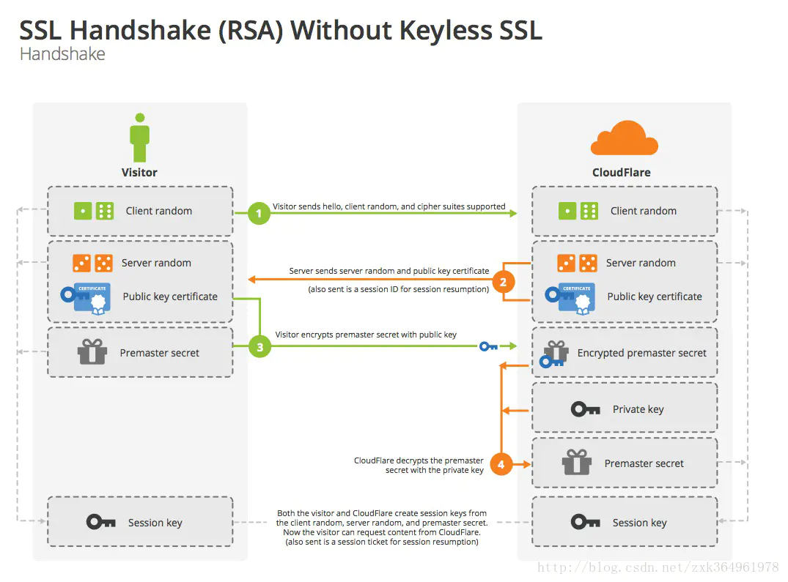

# HTTPS

### 默认端口

HTTPS的默认端口是443

### 与HTTP的区别

HTTPS是为了解决HTTP存在的安全性问题，所以我们先讲一下HTTP存在的安全问题。

1. 明文传输，这是最大的问题
2. 无法验证服务器的身份，因此可能被伪装。
3. 无法检验传输内容是否被篡改过

接下来讲一下HTTPS针对于上述存在的问题的解决方式：

HTTPS协议在运输层和应用层之间有一层加密协议层，由SSL或者TLS组成，这一层的功能有三个：

- 加密传输：将明文加密成密文
- 校验机制：检验传输的数据是否被篡改过
- 身份验证：配置验证证书

#### 1.加密

HTTPS的加密采用非对称加密匹配堆成加密的方式。

- 非对称加密：在开始进行加密的操作的时候，先进行对称加密秘钥的协商。具体流程是首先服务端选择一种非对称加密算法，将公钥发送到客户端（自己存放私钥）。客户端首先生成随机字符串，用公钥进行加密，然后传输到服务端，服务端通过私钥进行解密，得到的结果就是作为对称加密的秘钥。
- 对称加密：在传输数据的时候通过协商得到的秘钥进行加密传输。

特点：

- 秘钥动态生成，可以大大减少被破解的可能。

#### 2.身份验证

HTTPS需要进行配置身份验证，由比较高安全性的中间商进行颁发证书。具体身份认证流程如下：

通常使用Web的时候使用单向验证的方式，那么就讲一下单向验证的整体流程：

1. 浏览器发送验证的SSL版本等信息
2. 服务端返回SSL证书
3. 浏览器请求CA进行验证是否过期等等。
4. 发送可支持的秘钥方式给服务端，服务端选择安全性等级最高的算法给客户端，并且携带公钥
5. 客户端随机生成字符串使用公钥进行加密，传回服务端
6. 服务端使用私钥进行解密，这就是传输数据的对称加密算法秘钥。接下来就是加密的流程。

#### 3.校验传输数据是否被篡改

虽然有使用 HTTP 协议确定报文完整性的方法，但事实上并不便捷、可靠。其中常用的是 **MD5** 和 **SHA-1** 等**散列值校验**的方法，以及用来确认文件的**数字签名**方法。

提供文件下载服务的 Web 网站也会提供相应的以 PGP（Pretty Good Privacy，完美隐私）创建的数字签名及 MD5 算法生成的散列值。**PGP 是用来证明创建文件的数字签名，MD5 是由单向函数生成的散列值**。不论使用哪一种方法，都需要操纵客户端的用户本人亲自检查验证下载的文件是否就是原来服务器上的文件。浏览器无法自动帮用户检查。

数字签名：使用**私钥**进行加密，使用公钥进行**解密**。

#### 4.HTTPS的四次握手

1. 浏览器（客户端）随机数字，发送到服务端，并且发送ssl/tls版本等信息（第一次握手）
2. 服务端通过ssl/tls等信息，选择安全度最高的算法， 并且产生随机数。最后连同公钥发送给客户端（第二次握手）
3. 客户端接收到数字证书等信息，去验证是否过期。然后生产成随机字符串，然后将字符串通过公钥加密一起发送到服务端。
4. 最后客户端通过字符串+客户端随机数+服务端随机数根据加密算法进行加密。服务端也是这么加密。这样就要有了对称加密的秘钥。

##### 问：https四次握手就不需要TCP三次握手了嘛？

不，还是需要的，TCP三次握手的目的是保证打开服务器端口，从而进行传输数据。而https是在应用层面的握手。还是需要先进行TCP握手才能传输数据。