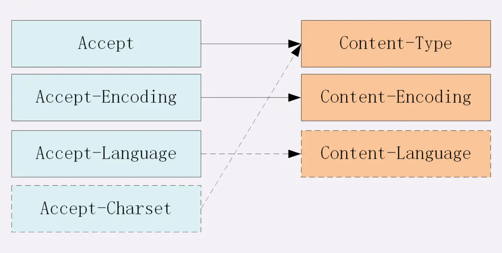

[TOC]

### http基础知识

##### 1.请求头部以及响应头部

常见的请求头部字段：

| 字段名            | 含义                       | 常见值                                                       |
| ----------------- | -------------------------- | ------------------------------------------------------------ |
| Accept            | 表示能够接受的文本类型     | 一般是\*/\*表示接受所有的类型，如果只是接受html的话，那就是text/html |
| Accept-language   | 接受的语言                 | zh-CN,zh表示接受的语言                                       |
| Accept-Encoding   | 接受的编码，一般是压缩算法 | Gzip，deflate等                                              |
| Connection        | 表示连接的方式             | Keep-alive（保持TCP连接） Close（表示关闭连接） Upgrade（表示升级，一般升级为WebSocket） |
| If-Modified-Since | 协商缓存字段               | 发送哪个时间点进行缓存                                       |
| Host              | 发送请求的域名或主机号     |                                                              |
| Referer           | 发送请求的连接url          |                                                              |
| Origin            | 发送请求的域源             | 只有复杂请求才会发送，简单请求是允许跨域的，发送的内容是协议+主机号+端口号 |
| User-Agent        | 用户代理                   | 告诉服务端客户端的信息                                       |
| Content-Type      | 文本类型                   | application\json等，并且可以规定字符集：charset：utf-8       |
| Keep-alive        |                            |                                                              |

响应头部

| 字段名                      | 含义                                       | 常见值                                                 |
| --------------------------- | ------------------------------------------ | ------------------------------------------------------ |
| Cache-Control               | 缓存字段                                   | max-age、public、private、no-cache、no-store           |
| 缓存字段，ETag、Last-Modify |                                            |                                                        |
| Content-Encoding            | 编码方式，即压缩方式。                     |                                                        |
| Transfer-Encoding           | 传输内容是分块的，所以传输的时候不知道大小 | 当传输最后一块长度为0的时候，代表传输完毕 chunked |
| Expires                     |                                            |                                                        |
| Connection                  | 保持连接                                   | keep-alive                                             |
| Refresh                     | **Refresh: 5; url=http://baidu.com**       | 5秒后会重定向                                          |
| Access-Control-Allow-Origin | 跨域控制字段                               |                                                        |
| Content-Length              | 响应内容长度                               |                                                        |
| Set-Cookie                  | 设置cookie内容                             |                                                        |

##### 2.请求方式

- GET
- POST
- DELETE
- PUT
- HEAD：只请求资源的首部，可以检查连接的有效性，检查网页是否被修改。
- OPTIONS：1.检查服务器所支持的所有请求方式；2.预检请求，判断服务器是否支持请求。

1. GET和POST的区别
   1. GET可以是简单请求，POST不行
   2. GET请求可以被缓存，而POST不行
   3. 参数存放方式：GET只能放在URL上，而POST参数能放URL和BODY中
   4. GET一般用于获得资源，而不是修改，而POST则是用来修改、确认等操作

##### 3.状态码

1xx：请求已经接收，继续处理

2xx：请求成功

3xx：发生重定向

4xx：客户端错误

5xx：服务端错误

##### 4.特点和缺点

特点：

1. 无状态
2. 可靠传输
3. 请求-应答
4. 灵活性

缺点：

1. 明文传输
2. 没有校验对方身份
3. 没有校验数据是否被修改。

### http1和http2的区别

在讲述http1和http2的区别之前，先要讲一下http2的特性：

1. 分片多路复用
2. 服务器推送
3. 二进制分帧
4. 头部压缩

##### 1.分片多路复用

多路复用的是复用TCP连接。

- 在http1中，复用tcp是串行复用，即前一个http连接还未结束，那么下一个http连接就要阻塞。
- http2中实现的是真正的多路复用，即多个连接可以同时使用tcp连接。

##### 2.服务器推送

在请求一个资源后，服务器可以推送其它与本资源无关的内容。

##### 3.二进制分帧

http是超文本传输协议，之前是以文本形式传输的，而http2是使用二进制分帧来传输的。

##### 4.头部压缩

http1每次传输，就算只传输一个字节内容，也是需要传输头部的，而http2的头部是可以复用前面的头部，也就是说像版本一样，每次只需要传输修改的内容即可。

##### http2的缺点

1. 包丢失影响全部http连接：http2的多路复用是多个http请求复用一个TCP连接，并且是同时请求的，这在http层面上是没有多大问题的，但是到了TCP层面，就会有问题。如果到一个连接中，出现丢包问题，并且超时，那么复用这条TCP连接的所有http连接都会受到影响。

   这是因为http2可以在应用层层面上隔离所有的http流，但是到了TCP层面，TCP并不清楚抽象流的意义，所以tcp误以为是同一条连接，那么就会受到影响。这个问题叫做“前端阻塞”

### http3

http1和http2在运输层使用TCP协议提供可靠传输。而http3放弃了TCP协议，转而使用了QUIC运输层协议。QUCI协议的底层是UDP协议。那么有很多人会有疑惑？UDP的话，怎么提供可靠传输呢？

那么我们就来探讨一下UDP怎么提供可靠传输？

UDP提供可靠传输，那么要弄清楚为什么TCP可以提供可靠传输：

1. 超时重传
2. 滑动窗口等流量控制
3. 应答机制

那么QUIC就要提供以上的方式实现可靠传输。

那么HTTP3如何来避免HTTP2中的缺点呢？

首先分析一下http2为什么有这种缺点，这是因为http2虽然是多路复用TCP，但是分割不同的请求却是在应用层的，在运输层则不会去分割，导致运输层无法鉴别不同的请求，所以会导致以上问题。所以http3分割不同的请求是在运输层，即QUIC协议中，每个请求都是独立的数据流，这样的话，不能保证数据流之间到达的顺序，但是能够保证一个数据流内部数据的到达顺序。并且，**数据流之间是不会有任何影响的**，这也就解决了复用TCP协议中的问题。

http3的其他特点：

- 没有传输不加密版本
- 0-RTT：类似于TCP快速握手，即不需要建立连接即可发送数据。
- 在同一条物理连接上可以有多条逻辑连接

##### http3和http2的区别

1. 数据流控制：
   - http2由应用层控制
   - http3由运输层控制
2. 握手速度：
   - QUIC的握手速度比TCP+TLS更快
3. 安全与否版本
   - http2是不安全版本，需要https才是安全版本
   - http3没有不安全版本
4. 数据流
   - http3每个请求的数据流都是分开的，这样数据流之间不会互相影响。
   - http2中虽然分片多路复用，但是在TCP层面是无感知的。在窗口中，包的丢失重传势必会对还没有完成传输的http请求进行阻塞。

##### http3和http2的相同点

1. 可以控制请求的优先级
2. 都有进行头部压缩
3. 都支持服务器推送

### https

#### 默认端口

HTTPS的默认端口是443

#### 与HTTP的区别

HTTPS是为了解决HTTP存在的安全性问题，所以我们先讲一下HTTP存在的安全问题。

1. 明文传输，这是最大的问题
2. 无法验证服务器的身份，因此可能被伪装。
3. 无法检验传输内容是否被篡改过

接下来讲一下HTTPS针对于上述存在的问题的解决方式：

HTTPS协议在运输层和应用层之间有一层加密协议层，由SSL或者TLS组成，这一层的功能有三个：

- 加密传输：将明文加密成密文
- 校验机制：检验传输的数据是否被篡改过
- 身份验证：配置验证证书

#### 1.加密

HTTPS的加密采用非对称加密匹配堆成加密的方式。

- 非对称加密：在开始进行加密的操作的时候，先进行对称加密秘钥的协商。具体流程是首先服务端选择一种非对称加密算法，将公钥发送到客户端（自己存放私钥）。客户端首先生成随机字符串，用公钥进行加密，然后传输到服务端，服务端通过私钥进行解密，得到的结果就是作为对称加密的秘钥。
- 对称加密：在传输数据的时候通过协商得到的秘钥进行加密传输。

特点：

- 秘钥动态生成，可以大大减少被破解的可能。

#### 2.身份验证

HTTPS需要进行配置身份验证，由比较高安全性的中间商进行颁发证书。具体身份认证流程如下：

通常使用Web的时候使用单向验证的方式，那么就讲一下单向验证的整体流程：

1. 浏览器发送验证的SSL版本等信息
2. 服务端返回SSL证书
3. 浏览器请求CA进行验证是否过期等等。
4. 发送可支持的秘钥方式给服务端，服务端选择安全性等级最高的算法给客户端，并且携带公钥
5. 客户端随机生成字符串使用公钥进行加密，传回服务端
6. 服务端使用私钥进行解密，这就是传输数据的对称加密算法秘钥。接下来就是加密的流程。

#### 3.校验传输数据是否被篡改

虽然有使用 HTTP 协议确定报文完整性的方法，但事实上并不便捷、可靠。其中常用的是 **MD5** 和 **SHA-1** 等**散列值校验**的方法，以及用来确认文件的**数字签名**方法。

提供文件下载服务的 Web 网站也会提供相应的以 PGP（Pretty Good Privacy，完美隐私）创建的数字签名及 MD5 算法生成的散列值。**PGP 是用来证明创建文件的数字签名，MD5 是由单向函数生成的散列值**。不论使用哪一种方法，都需要操纵客户端的用户本人亲自检查验证下载的文件是否就是原来服务器上的文件。浏览器无法自动帮用户检查。

数字签名：使用**私钥**进行加密，使用公钥进行**解密**。

#### 4.HTTPS的四次握手

1. 浏览器（客户端）随机数字，发送到服务端，并且发送ssl/tls版本等信息（第一次握手）
2. 服务端通过ssl/tls等信息，选择安全度最高的算法， 并且产生随机数。最后连同公钥发送给客户端（第二次握手）
3. 客户端接收到数字证书等信息，去验证是否过期。然后生产成随机字符串，然后将字符串通过公钥加密一起发送到服务端。
4. 最后客户端通过字符串+客户端随机数+服务端随机数根据加密算法进行加密。服务端也是这么加密。这样就要有了对称加密的秘钥。

##### 问：https四次握手就不需要TCP三次握手了嘛？

不，还是需要的，TCP三次握手的目的是保证打开服务器端口，从而进行传输数据。而https是在应用层面的握手。还是需要先进行TCP握手才能传输数据。

