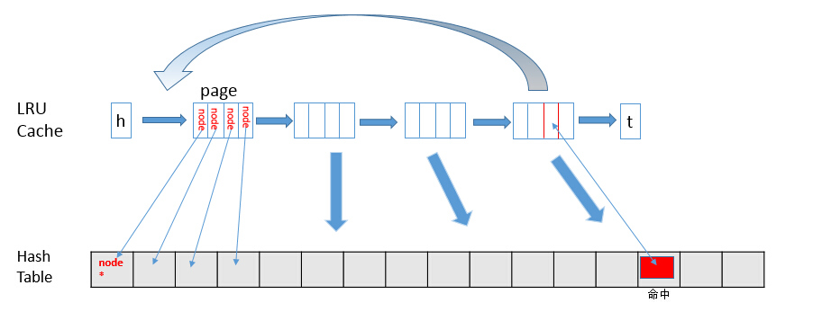

# JS使用Map来实现LRU算法

### 0.LRU缓存淘汰算法是什么？

​	掘金中提到的LRU算法的定义如下：

​	操作系统中进行内存管理中时采用一些页面置换算法，如LRU、LFU和FIFO等。其中LRU应用较为广泛。LRU的全称是Least Recently Used，即最近最少使用算法。

​	大家都知道在缓存的大小是有限的，那么我们应该基于什么策略进行缓存数据呢？LRU提供的思路是将最近没有使用的数据从缓存中移除，这样的思路在实际的环境中比较符合常识。

​	那么怎么来实现这样子的算法呢？首先我们要记住缓存按时间顺序来进行访问或者修改的次序，然后一旦缓存满了，又有新的内存进来的时候，就要进行淘汰队列尾部。所以我们至少需要一种链式数据结构：链表。并且如果是双向链表的话，那么操作时间复杂度可以降为O(1)。

​	那么如果快速获得我们想要知道的值呢？快速获得数据的话，我们需要有一个HashMap的数据结构。所以综合起来，我们需要两个数据结构：Map和LinkedList。



### 1.普通的LRU算法的实现

根据以上的特点，我们可以得到如下的算法。我使用Java来进行编写代码是为了更好得理解，其实看java代码不难。

```java
public class LRU {
  private class ListNode {
    int val;
    int key;
    ListNode next;
    ListNode pre;

    public ListNode(int key, int val) {
      this.val = val;
      this.key = key;
    }
  }

  HashMap<Integer, ListNode> cache;
  ListNode head;
  ListNode tail;
  int count;
  int cap;

  public LRU(int capacity) {
    this.cache = new HashMap<>();
    this.cap = capacity;
    this.count = 0;
  }

  public int get(int key) {
    if (!cache.containsKey(key)) {
      return -1;
    }

    // 进行调整
    ListNode temp = this.head;
    ListNode tar = cache.get(key);

    if (temp == tar) {
      return tar.val;
    }

    while (temp != tar) {
      temp = temp.next;
    }

    temp.pre.next = temp.next;

    head.pre = temp;
    temp.next = head;
    head = temp;

    return tar.val;
  }

  public void put(int key, int value) {
    ListNode tar = cache.get(key);

    if (tar == null) {
      // 如果不存在，则进行创建节点
      if (count == cap) {
        cache.remove(tail.key);
        tail = tail.pre;
        tail.next = null;
        count--;
      }

      tar = new ListNode(key, value);
      cache.put(key, tar);

      count++;
    } else {
      // 如果存在节点的话，那么要进行处理
      if (tar == tail) {
        tail = tail.pre;
        tail.next = null;
      } else {
        tar.pre.next = tar.next;
        tar.next.pre = tar.pre;
      }
      tar.val = value;
    }

    if (head == null) {
      tail = head = tar;
    } else {
      tar.val = value;
      tar.next = head;
      head.pre = tar;
      head = tar;
    }
  }
}
```

### 2.Java中天然支持LRU算法实现的数据结构

​	不过，Java中有一种数据结构是以链表形式存在，并且还继承于HashMap，它就是LinkedHashMap，它是继承于ＨashMap，并且里面的Node节点继承于HashNode，然后进行添加pre和next指针。它的设计目的是为了按照插入的顺序来迭代map，这样我们就能够进行迭代，然后拿到数据。

```java
public class LRUCache extends LinkedHashMap<Integer, Integer> {
  private int capacity;
  private LRU lru;

  public LRUCache(int capacity) {
    this.capacity = capacity;
    this.lru = new LRU(0, 0.75f, true);
  }

  public int get(int key) {
    return lru.getOrDefault(key,-1);
  }

  public void put(int key, int value) {
    lru.put(key, value);
  }

  class LRU extends LinkedHashMap<Integer, Integer> {
    public LRU(int initialCapacity, float loadFactor, boolean accessOrder) {
      super(initialCapacity, loadFactor, accessOrder);
    }

    @Override
    protected boolean removeEldestEntry(Map.Entry<Integer, Integer> eldest) {
      return super.size() > capacity;
    }
  }
}
```

### 3.为什么Map能够天然支持LRU算法实现

ES6的Map数据结构以及ES5中的对象，有两个特征：

- 键值对存储，所以是一个Map结构
- 可以根据存放的顺序进行取出数据，所以具有顺序关系，这个跟java中的LinkedHashMap一致，所以可以用来实现LRU算法。

思路如下：

1. 设置值的时候，判断是否存在该值
   1. 如果不存在值进行插入操作，判断当前容量是否满了
      - 满了：淘汰最后的一个，然后插入
      - 未满：直接插入数据
   2. 如果存在值，那么进行更新操作，并且
2. 