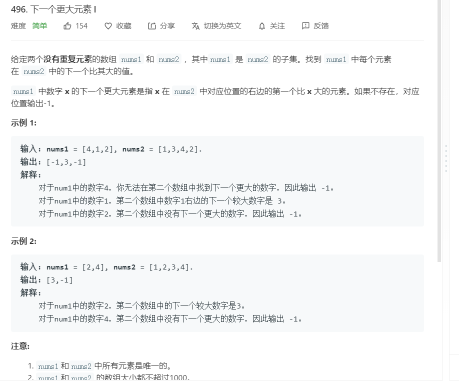
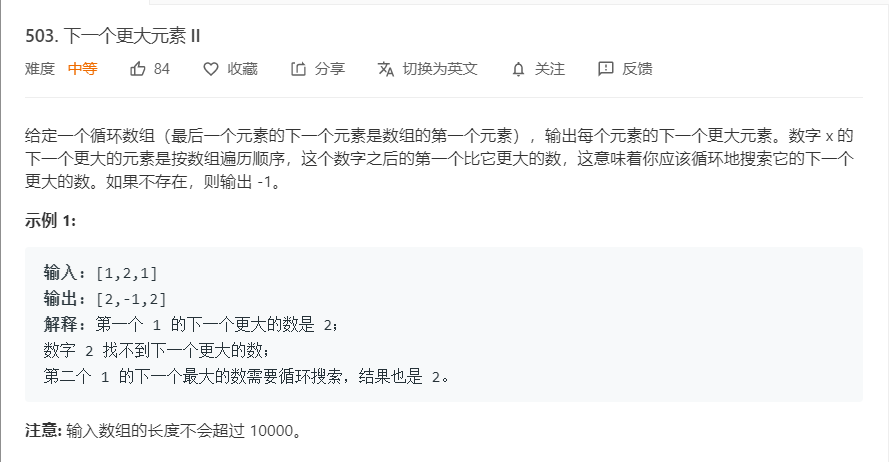

# 单调栈

### 特征

对于一些处理数组的问题，我们只需要拿到从头到尾或者从尾到头的单调递增或者递减的情况。对于一些不是递增或者递减的元素我们不需要的时候，我们可以利用单调栈来进行解决问题。

### 例题1

- 题目：设计一个含有min的栈，要求有普通栈的功能，并且能够得到当前栈内的最小值。
- 解题思路：
  - 我们可以创建两个栈，一个是普通栈的作用，一个是最小栈的作用
  - 在入栈和出栈操作增加对最小栈的操作，这样我们可以在O(1)时间复杂度内处理两件事情。

```java
/**
 * @author Weybn
 * @motto Rare in the world you're worth it.
 * @time 2020/2/17 15:40
 */
public class MinStack<T extends Comparable<T>> {
  Stack<T> normal;
  Stack<T> minStack;

  public MinStack() {
    this.normal = new Stack<>();
    this.minStack = new Stack<>();
  }

  public T pop() {
    if (normal.isEmpty()) {
      throw new EmptyStackException();
    }

    T item = normal.pop();
    if (minStack.peek().equals(item)) {
      minStack.pop();
    }

    return item;
  }

  public T getMin() {
    return minStack.peek();
  }

  public void push(T elem) {
    while (!minStack.isEmpty() && elem.compareTo(minStack.peek()) < 0) {
      minStack.pop();
    }

    normal.push(elem);
    minStack.push(elem);
  }
}
```

### 例子2

- 问题：小Q在周末的时候和他的小伙伴来到大城市逛街，一条步行街上有很多高楼，共有n座高楼排成一行。小Q从第一栋一直走到了最后一栋，小Q从来都没有见到这么多的楼，所以他想知道他在每栋楼的位置处能看到多少栋楼呢？（当前面的楼的高度大于等于后面的楼时，后面的楼将被挡住） 。

- 思路1：如果用普通的暴力解法，那么时间复杂度是n * n。这里就不进行解释了

- 思路2：由题意我们可以知道，楼能看多少栋楼分为向前能看到多少栋楼，向后能看到多少栋楼。我们以向前为例子来说。向前的话，我们是不是只能看到递增序列的楼，也就是把前面的楼的高度看作一个数组，那么我们看到的只是这个数组的递增部分，其他的不会看到，所以有个关键点是**递增**，也就是单调。我们可以用一个只能容纳比上一个入栈数字小的栈来进行表示从右往左能看到的楼层的数量，即如图：

  

这样我们就可以用栈的容量来表示一个方向中每栋楼所能看到的房子的数量。然后依样画葫芦来使用一个栈从左到右单调递减，这样我们就能得到从左到右的数据。

```js
let stack = [];
let len = builderArray.length;
let resultArray = new Array(len).fill(0);

for (let i = len - 1; i >= 0; i--) {
  resultArray[i] = stack.length;

  while (stack.length && builderArray[stack[stack.length - 1]] <= builderArray[i]) {
    stack.pop();
  }

  stack.push(i);
}
stack = [];

for (let i = 0; i < len; i++) {
  resultArray[i] += stack.length + 1;

  while (stack.length && builderArray[stack[stack.length - 1]] <= builderArray[i]) {
    stack.pop();
  }

  stack.push(i);
}

let output = '';
for (let i = 0; i < resultArray.length; i++) {
  output += resultArray[i] + ' ';
}
```

### 例子3

根据每日 气温 列表，请重新生成一个列表，对应位置的输入是你需要再等待多久温度才会升高超过该日的天数。如果之后都不会升高，请在该位置用 0 来代替。

例如，给定一个列表 temperatures = [73, 74, 75, 71, 69, 72, 76, 73]，你的输出应该是 [1, 1, 4, 2, 1, 1, 0, 0]。

提示：气温 列表长度的范围是 [1, 30000]。每个气温的值的均为华氏度，都是在 [30, 100] 范围内的整数。

```java
public class FindDaysToHighT {
  public static int[] dailyTemperatures(int[] T) {
    if (T == null || T.length == 0) {
      return new int[0];
    }

    Stack<Integer> singleStack = new Stack<>();
    int[] resultArray = new int[T.length];

    Arrays.fill(resultArray, 0);

    for (int i = T.length - 1; i >= 0; i--) {
      while (!singleStack.isEmpty() && T[singleStack.peek()] <= T[i]) {
        singleStack.pop();
      }

      resultArray[i] = singleStack.isEmpty() ? 0 : singleStack.peek() - i;

      singleStack.push(i);
    }

    return resultArray;
  }
}

```

### 例子4



来自`Leetcode`[下一个更大的数](https://leetcode-cn.com/problems/next-greater-element-i/)

解法如下：

```java
public class NextBiggerNumber {
  public static int[] nextGreaterElement(int[] nums1, int[] nums2) {
    if (nums1 == null || nums1.length == 0) {
      return null;
    }

    if (nums2 == null || nums2.length == 0) {
      return new int[0];
    }

    Stack<Integer> singleStack = new Stack<>();
    int[] result = new int[nums2.length];

    for (int i = nums1.length - 1; i >= 0; i--) {
      while (!singleStack.isEmpty() && nums1[singleStack.peek()] <= nums1[i]) {
        singleStack.pop();
      }

      for (int j = 0; j < nums2.length; j++) {
        if (nums2[j] == nums1[i]) {
          result[j] = singleStack.isEmpty() ? -1 : nums1[singleStack.peek()];
        }
      }

      singleStack.push(i);
    }

    return result;
  }
}

```

### 例子5：升级，如何处理循环的情况（可以像循环队列一样）



